# SOC Analyst Portfolio

This repository documents hands-on security operations work performed in a controlled home lab. The project focuses on alert triage, evidence-based investigation, event correlation, incident scoping, severity assessment, response recommendations, and escalation decisions.

## Current Status

**Core endpoint and network telemetry operational — detection engineering and incident execution are next.**

The Active Directory environment, endpoint audit policies, PowerShell logging, Sysmon deployment, and centralized Windows ingestion in Splunk have been completed. The lab also includes an isolated attacker network protected by pfSense, centralized firewall logging in Splunk, search-time pfSense field extractions, and a validated scheduled detection for TCP port scanning.

| Component | Status |
| --- | --- |
| Active Directory foundation | Complete |
| Advanced Audit Policy and PowerShell logging | Complete |
| Sysmon deployment | Complete |
| Windows endpoint forwarding to Splunk | Complete |
| pfSense network segmentation | Complete |
| pfSense ingestion and field extraction in Splunk | Complete |
| `PF-001` port-scan detection | Validated |
| Detection engineering and portfolio investigations | Next |

## Lab Architecture

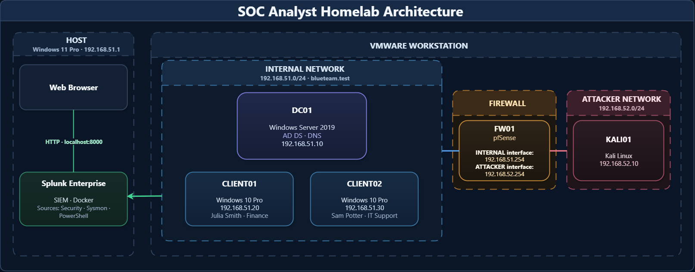

The environment separates protected Windows systems from a controlled attacker network. The Windows 11 host can administer the internal segment but has no virtual adapter connected to the attacker segment.

| System | Role | Address |
| --- | --- | --- |
| Windows 11 Host | VMware Workstation and Splunk Docker host | `192.168.51.1` |
| `FW01` | pfSense firewall and network boundary | `192.168.51.254` / `192.168.52.254` |
| `DC01` | Active Directory Domain Services and DNS | `192.168.51.10` |
| `CLIENT01` | Windows 10 Finance workstation | `192.168.51.20` |
| `CLIENT02` | Windows 10 IT Support workstation | `192.168.51.30` |
| `KALI01` | Isolated attacker and validation system | `192.168.52.10` |

- **Domain:** `blueteam.test`
- **INTERNAL network:** `192.168.51.0/24` (`VMnet1`)
- **ATTACKER network:** `192.168.52.0/24` (`VMnet2`)
- **Time standard:** `UTC`
- **Splunk Web:** Windows 11 host, TCP `8000`
- **pfSense syslog destination:** `192.168.51.1:5514/UDP`

## Active Directory Foundation

The lab uses a small Windows domain to provide realistic users, endpoints, authentication activity, and centrally managed security policies.

<details>
<summary><strong>View Active Directory configuration evidence</strong></summary>

### Domain Users

The domain contains two fictional user accounts representing Finance and IT Support roles.


### Domain Workstations

Both Windows 10 endpoints are joined to `blueteam.test` and placed in the `Workstations` organizational unit.


</details>

## Endpoint Logging and Centralized Ingestion

Advanced Audit Policy, PowerShell logging, and Sysmon provide complementary visibility across `DC01`, `CLIENT01`, and `CLIENT02`. Splunk receives and correlates telemetry from all three Windows systems using UTC timestamps.

<details>
<summary><strong>View endpoint telemetry evidence</strong></summary>

### Windows Process Creation — Event ID 4688

Process creation auditing records newly launched processes and their command lines.

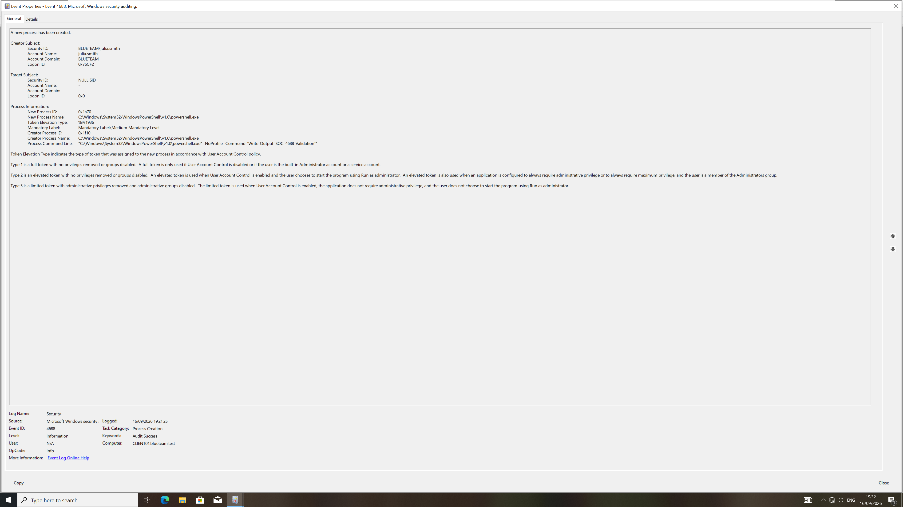

### PowerShell Module Logging — Event ID 4103

PowerShell module logging captures pipeline execution details.

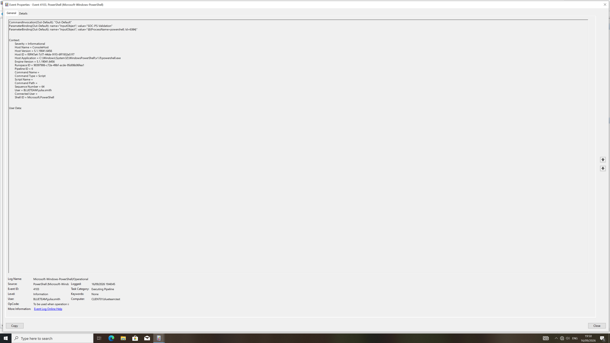

### PowerShell Script Block Logging — Event ID 4104

Script block logging records the content executed by the PowerShell engine.

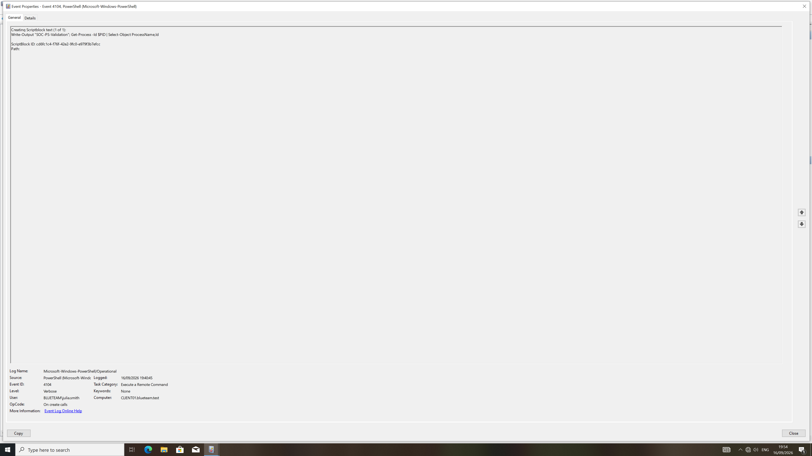

### Sysmon Process Creation — Event ID 1

Sysmon adds enriched process metadata, including hashes, image paths, parent processes, and command lines.

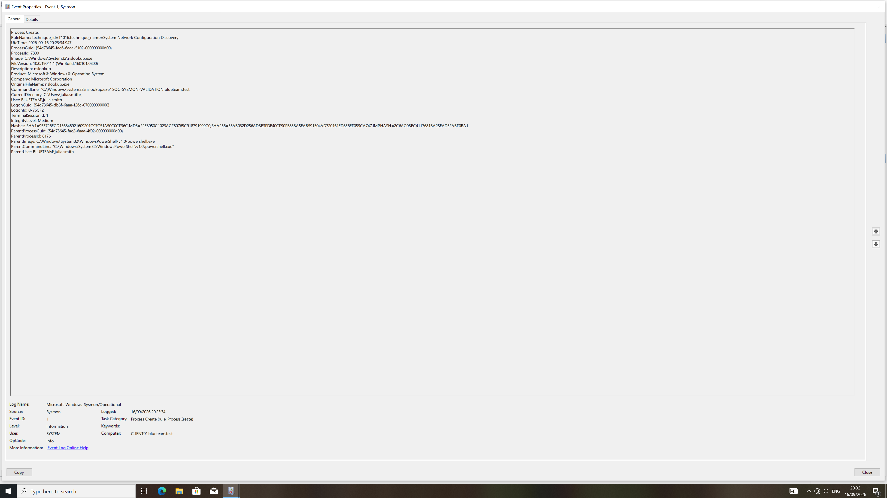

### Splunk Endpoint Ingestion

Telemetry from `CLIENT01` was first validated individually and then confirmed across all three Windows systems.

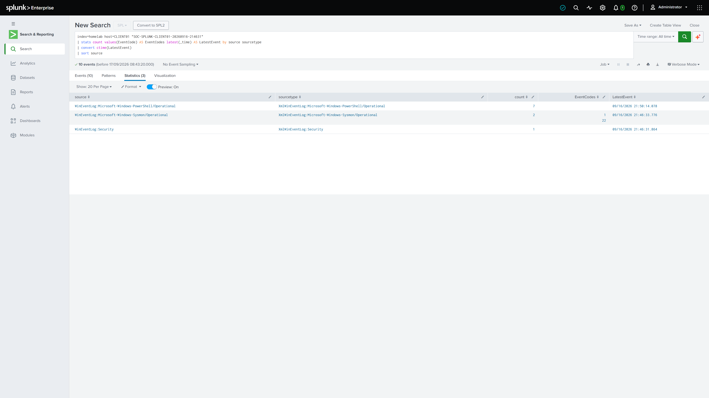

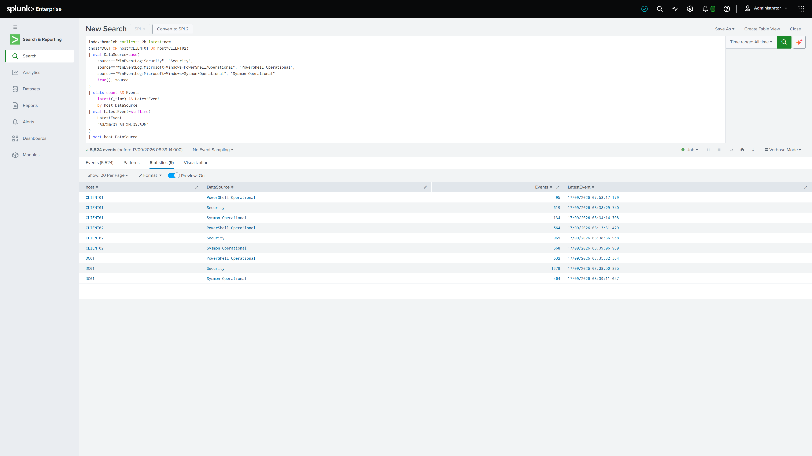

</details>

## Network Security and Firewall Telemetry

`FW01` provides the controlled boundary between the protected Windows environment and `KALI01`. VMware DHCP is disabled on both lab segments, pfSense uses static addressing, and the Windows host is deliberately disconnected from `VMnet2`.

| pfSense interface | Device | Address | Purpose |
| --- | --- | --- | --- |
| `INTERNAL` | `em1` | `192.168.51.254/24` | Protected Windows network and firewall administration |
| `ATTACKER` | `em0` | `192.168.52.254/24` | Isolated network used for controlled attack simulations |

pfSense forwards firewall and system events to Splunk over UDP `5514`. Splunk stores these events in the `pfsense` index and separates them into two sourcetypes:

| Sourcetype | Content |
| --- | --- |
| `pfsense:filterlog` | Firewall traffic decisions |
| `pfsense:syslog` | pfSense operating system and service messages |

Search-time extractions provide fields including `interface`, `action`, `direction`, `protocol`, `src_ip`, `dest_ip`, `src_port`, `dest_port`, `icmp_type`, `tcp_flags`, `rule_number`, and `tracker`.

<details>
<summary><strong>View network telemetry evidence</strong></summary>

### pfSense Interfaces

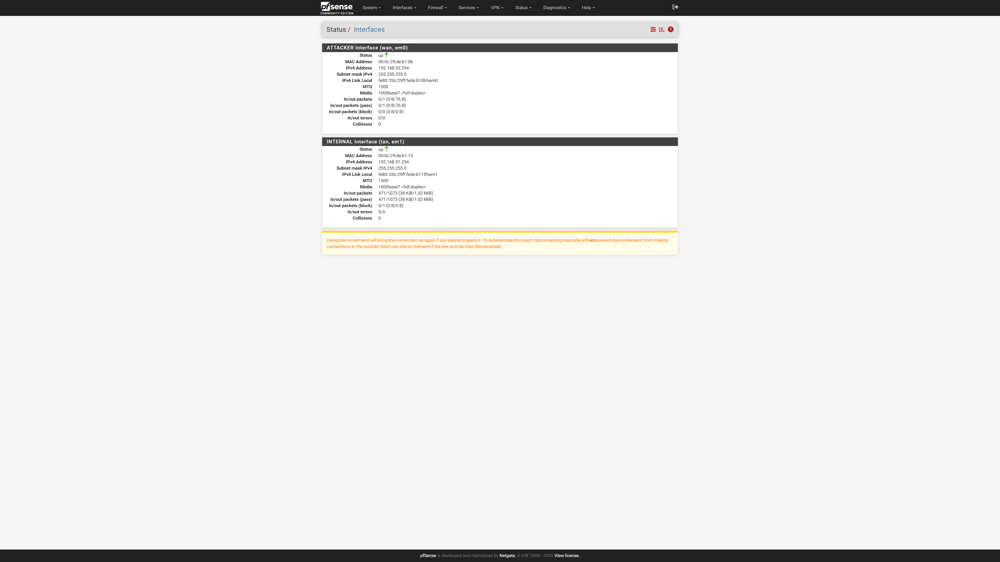

### Controlled Nmap Validation

`KALI01` generated a controlled SYN scan against the pfSense attacker interface. The firewall blocked all tested ports.

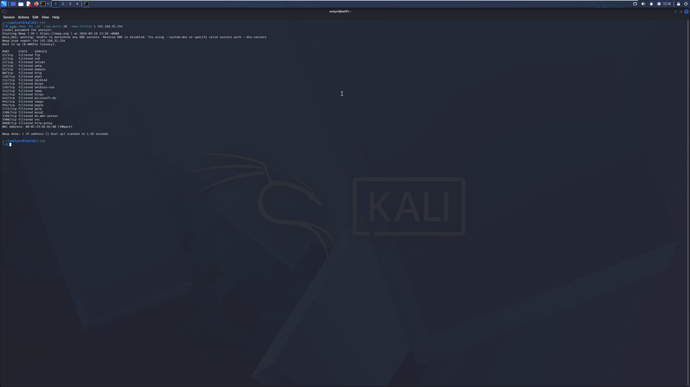

### Parsed Firewall Events

Splunk received the blocked connections and populated the extracted firewall fields.

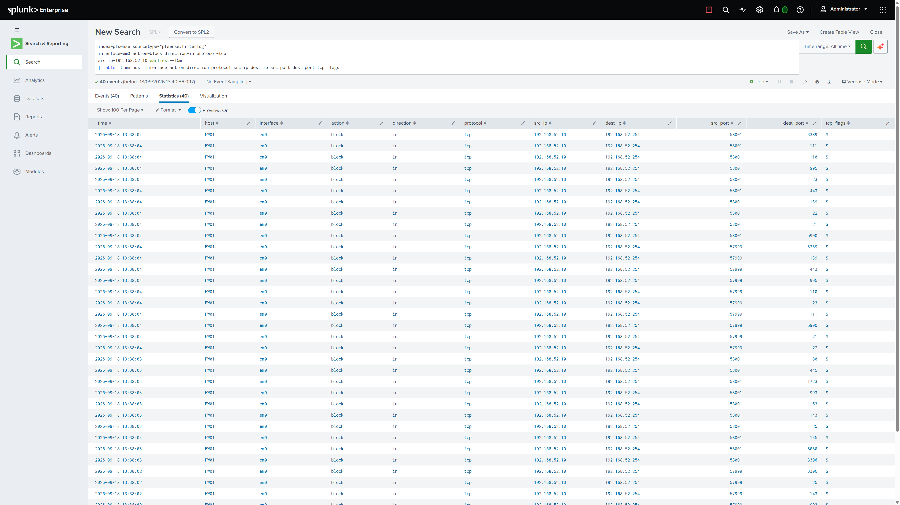

### Triggered Detection

The scheduled Splunk alert detected the controlled scan and created a medium-severity triggered alert.

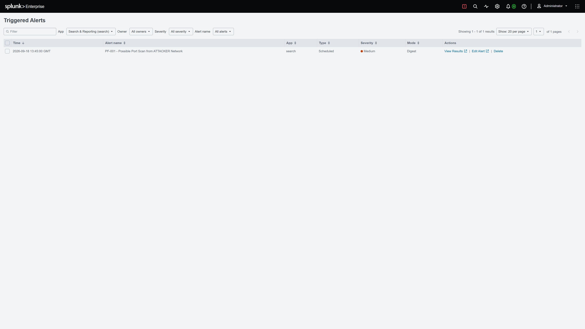

</details>

## Detection Engineering Validation

| Detection | Data source | Logic | Severity | Status |
| --- | --- | --- | --- | --- |
| `PF-001` — Possible Port Scan from ATTACKER Network | `pfsense:filterlog` | At least 10 distinct blocked TCP destination ports from one source within five minutes | Medium | Validated |

This validation confirmed the complete telemetry path:

```text
KALI01 → FW01 → Syslog UDP 5514 → Splunk → Field extraction → Scheduled alert
```

The test produced 40 blocked connection events across 20 distinct destination ports. The duplicated attempts were expected because Nmap was configured with one retry per port.

## Investigation Portfolio

| Case | Investigation | Status |
| --- | --- | --- |
| `INC-001` | Brute Force to Successful Authentication | Planned |
| `INC-002` | Phishing Email Investigation | Planned |
| `INC-003` | Suspicious PowerShell and Persistence | Planned |
| `INC-004` | Suspicious Sign-in in Microsoft Sentinel | Planned |
| `INC-005` | Endpoint Compromise | Planned |
| `INC-006` | Network and C2 Investigation | Planned |

Each investigation will include the evidence and reasoning required to support:

- A reconstructed timeline
- A defined scope
- An evidence-based verdict and severity
- Recommended response actions
- An escalation or closure decision
- Detection opportunities and possible false positives

## Investigation Methodology

Each case follows a consistent SOC workflow:

1. Review the alert or initial trigger
2. Identify the questions the investigation must answer
3. Examine the relevant logs and evidence
4. Reconstruct the event timeline
5. Determine the affected scope and entities
6. Assign a justified verdict and severity
7. Recommend containment, response, or escalation
8. Document detection improvements and lessons learned

Queries, commands, screenshots, results, and interpretations are documented together so that every conclusion can be traced back to supporting evidence.

## Repository Structure

```text
soc-analyst-portfolio/
├── README.md
├── images/
│   ├── 01-active-directory-users.png
│   ├── 02-active-directory-workstations.png
│   ├── 03-process-creation-4688.png
│   ├── 04-powershell-module-4103.png
│   ├── 05-powershell-script-block-4104.png
│   ├── 06-sysmon-process-1.png
│   ├── 07-splunk-client01-ingestion.png
│   ├── 08-splunk-three-host-ingestion.png
│   ├── 09-pfsense-interfaces.png
│   ├── 10-kali-nmap-validation.png
│   ├── 11-splunk-pfsense-fields.png
│   ├── 12-pf001-triggered-alert.png
│   └── lab-architecture.png
└── incidents/
    ├── INC-001-brute-force/
    ├── INC-002-phishing/
    ├── INC-003-powershell/
    ├── INC-004-suspicious-signin/
    ├── INC-005-endpoint-compromise/
    └── INC-006-network-c2/
```

Each incident directory will contain its own report and supporting images.

## Tools and Technologies

### Implemented

- Splunk Enterprise
- pfSense Community Edition
- Kali Linux and Nmap
- Windows Event Logs
- Sysmon
- PowerShell logging
- Active Directory
- VMware Workstation
- Docker

### Planned for Investigations

- Microsoft Sentinel
- Wireshark

## Security and Privacy

All activity is generated inside a controlled laboratory environment. User identities are fictional, private IP addressing is used, and credentials, tokens, configuration backups, password hashes, and sensitive host information are excluded from the public repository.
