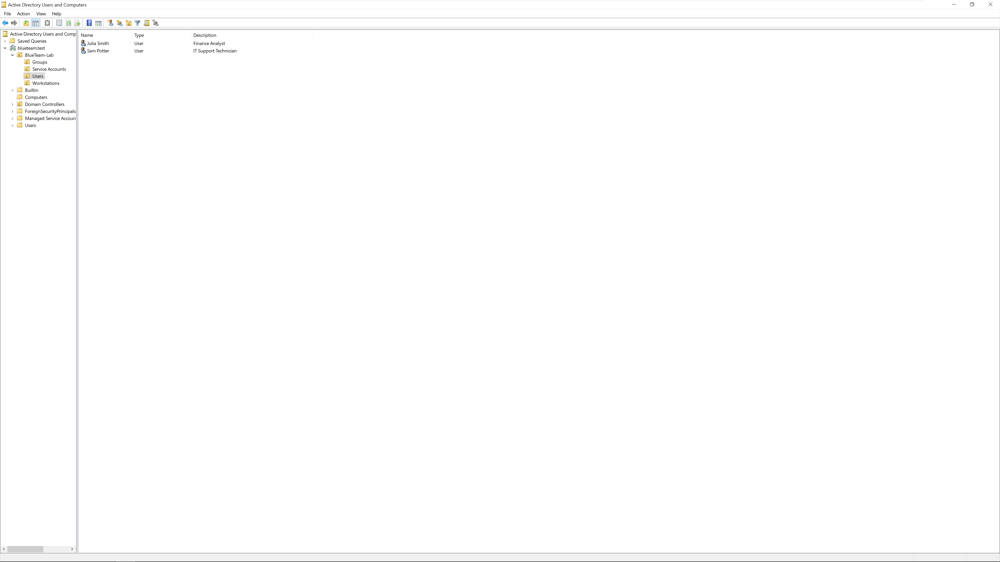
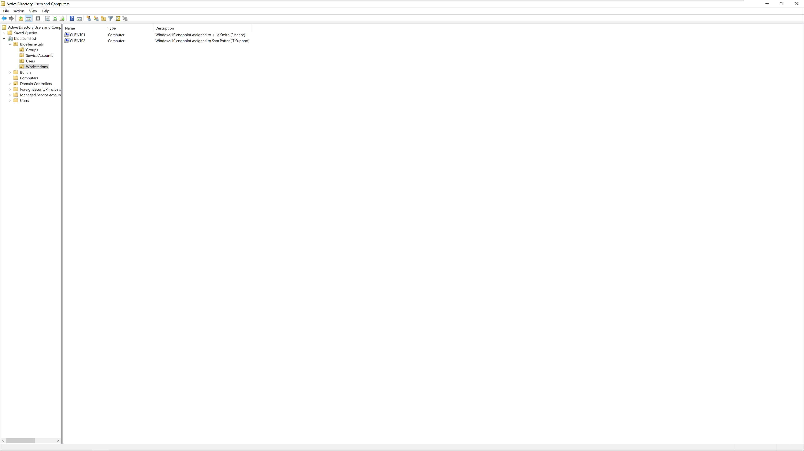

# SOC Analyst Portfolio

This repository documents hands-on security operations work performed in a controlled home lab. The project focuses on alert triage, evidence-based investigation, event correlation, incident scoping, severity assessment, response recommendations, and escalation decisions.

## Current Status

**Lab foundation complete — telemetry deployment in progress.**

The Active Directory environment and Windows endpoints are configured. The next phase covers Windows auditing, PowerShell logging, Sysmon deployment, and forwarding endpoint telemetry to Splunk.

## Lab Environment

| System          | Role                                      | Address         |
| --------------- | ----------------------------------------- | --------------- |
| Windows 11 Host | VMware Workstation and Splunk Docker host | `192.168.51.1`  |
| `DC01`          | Active Directory Domain Services and DNS  | `192.168.51.10` |
| `CLIENT01`      | Windows 10 Finance workstation            | `192.168.51.20` |
| `CLIENT02`      | Windows 10 IT Support workstation         | `192.168.51.30` |

- **Domain:** `blueteam.test`
- **Lab network:** `192.168.51.0/24`
- **Time standard:** `UTC`

## Active Directory Foundation

The lab uses a small Windows domain to provide realistic users, endpoints, authentication activity, and centrally managed security policies.

<details>
<summary><strong>View Active Directory configuration evidence</strong></summary>

### Domain Users

The domain contains two fictional user accounts representing Finance and IT Support roles.



### Domain Workstations

Both Windows 10 endpoints are joined to `blueteam.test` and placed in the `Workstations` organizational unit.



</details>

## Investigation Portfolio

| Case      | Investigation                            | Status  |
| --------- | ---------------------------------------- | ------- |
| `INC-001` | Brute Force to Successful Authentication | Planned |
| `INC-002` | Phishing Email Investigation             | Planned |
| `INC-003` | Suspicious PowerShell and Persistence    | Planned |
| `INC-004` | Suspicious Sign-in in Microsoft Sentinel | Planned |
| `INC-005` | Endpoint Compromise                      | Planned |
| `INC-006` | Network and C2 Investigation             | Planned |

Each investigation will include the evidence and reasoning required to support:

* A reconstructed timeline
* A defined scope
* An evidence-based verdict and severity
* Recommended response actions
* An escalation or closure decision
* Detection opportunities and possible false positives

## Investigation Methodology

Each case follows a consistent SOC workflow:

1. Review the alert or initial trigger
2. Identify the questions the investigation must answer
3. Examine the relevant logs and evidence
4. Reconstruct the event timeline
5. Determine the affected scope and entities
6. Assign a justified verdict and severity
7. Recommend containment, response, or escalation
8. Document detection improvements and lessons learned

Queries, commands, screenshots, results, and interpretations are documented together so that every conclusion can be traced back to supporting evidence.

## Repository Structure

```text
soc-analyst-portfolio/
├── README.md
├── images/
│   ├── 01-active-directory-users.png
│   ├── 02-active-directory-workstations.png
│   └── lab-architecture.png
└── incidents/
    ├── INC-001-brute-force/
    ├── INC-002-phishing/
    ├── INC-003-powershell/
    ├── INC-004-suspicious-signin/
    ├── INC-005-endpoint-compromise/
    └── INC-006-network-c2/
```

Each incident directory will contain its own report and supporting images.

## Tools and Technologies

* Splunk Enterprise
* Microsoft Sentinel
* Windows Event Logs
* Sysmon
* PowerShell logging
* Active Directory
* Wireshark
* VMware Workstation
* Docker

## Security and Privacy

All activity is generated inside a controlled laboratory environment. User identities are fictional, private IP addressing is used, and credentials or sensitive host information are excluded from the repository.
