# SOC Analyst Portfolio

This repository documents hands-on security operations work performed in a controlled homelab. The portfolio covers alert triage, evidence-based investigation, detection engineering, event correlation, incident scoping, severity assessment, escalation, forensic analysis, containment, eradication, recovery, and post-incident validation across endpoint, identity, network, and cloud telemetry.

## Contents

- [Current Status](#current-status)
- [Lab Architecture](#lab-architecture)
- [Active Directory Foundation](#active-directory-foundation)
- [Endpoint Logging and Centralized Ingestion](#endpoint-logging-and-centralized-ingestion)
- [Network Security and Firewall Telemetry](#network-security-and-firewall-telemetry)
- [Detection Engineering Validation](#detection-engineering-validation)
- [Investigation Portfolio](#investigation-portfolio)
- [Investigation Methodology](#investigation-methodology)
- [Repository Structure](#repository-structure)
- [Tools and Technologies](#tools-and-technologies)
- [Security and Privacy](#security-and-privacy)

## Current Status

**Portfolio v1.0 complete — all six planned investigations are finished.**

The core lab is fully operational: Active Directory, Advanced Audit Policy, PowerShell logging, Sysmon, centralized Windows ingestion in Splunk, pfSense segmentation, centralized firewall telemetry, and scheduled network detection have all been validated.

Microsoft Sentinel is also operational for custom authentication-log ingestion through the Azure Monitor Logs Ingestion API, KQL analytics, scheduled detection, entity mapping, and Microsoft Defender case investigation.

The portfolio progresses from Tier 1 investigation and detection engineering into a linked Domain Controller compromise and response scenario. `INC-005` establishes the compromise and Tier 1 escalation; `INC-006` continues the same case at Tier 2 / CSIRT level with network containment, evidence preservation, memory and file analysis, broader IOC scoping, eradication, recovery, and post-recovery validation.

| Component | Status |
| --- | --- |
| Active Directory foundation | Complete |
| Advanced Audit Policy and PowerShell logging | Complete |
| Sysmon deployment | Complete |
| Windows endpoint forwarding to Splunk | Complete |
| pfSense network segmentation | Complete |
| pfSense ingestion and field extraction in Splunk | Complete |
| `PF-001` port-scan detection | Validated |
| Microsoft Sentinel ingestion and analytics workflow | Validated |
| Investigation portfolio | **6 / 6 complete** |
| Tier 2 / CSIRT response and forensic workflow | Complete |

## Lab Architecture

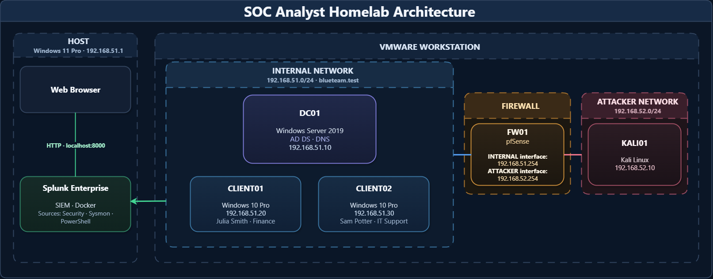

The environment separates protected Windows systems from a controlled attacker network. The Windows 11 host can administer the internal segment but has no virtual adapter connected to the attacker segment.

| System | Role | Address |
| --- | --- | --- |
| Windows 11 Host | VMware Workstation and Splunk Docker host | `192.168.51.1` |
| `FW01` | pfSense firewall and network boundary | `192.168.51.254` / `192.168.52.254` |
| `DC01` | Active Directory Domain Services and DNS | `192.168.51.10` |
| `CLIENT01` | Windows 10 Finance workstation | `192.168.51.20` |
| `CLIENT02` | Windows 10 IT Support workstation | `192.168.51.30` |
| `KALI01` | Isolated attacker and validation system | `192.168.52.10` |

- **Domain:** `blueteam.test`
- **INTERNAL network:** `192.168.51.0/24` (`VMnet1`)
- **ATTACKER network:** `192.168.52.0/24` (`VMnet2`)
- **Time standard:** `UTC`
- **Splunk Web:** Windows 11 host, `TCP 8000`
- **pfSense syslog destination:** `192.168.51.1:5514/UDP`

## Active Directory Foundation

The lab uses a small Windows domain to provide realistic users, endpoints, authentication activity, and centrally managed security policies.

<details>

<summary><strong>View Active Directory configuration evidence</strong></summary>

### Domain Users

The domain contains two fictional user accounts representing Finance and IT Support roles.

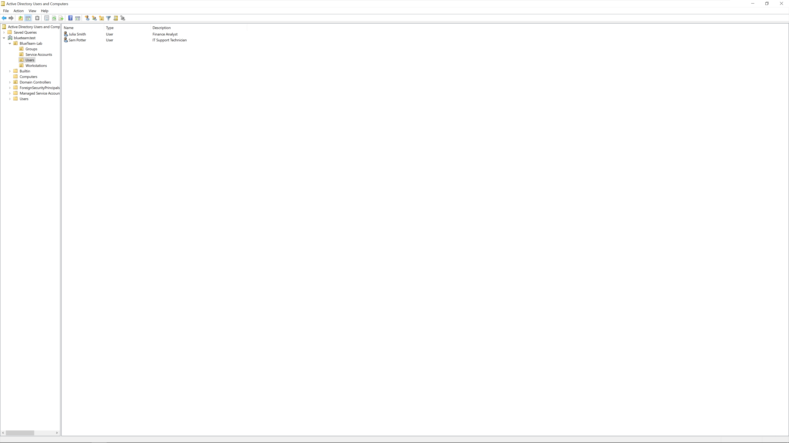

### Domain Workstations

Both Windows 10 endpoints are joined to `blueteam.test` and placed in the `Workstations` organizational unit.

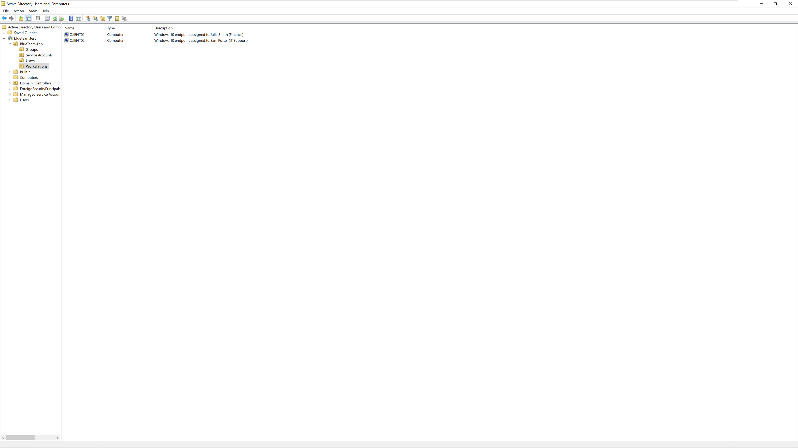

</details>

## Endpoint Logging and Centralized Ingestion

Advanced Audit Policy, PowerShell logging, and Sysmon provide complementary visibility across `DC01`, `CLIENT01`, and `CLIENT02`. Splunk receives and correlates telemetry from all three Windows systems using UTC timestamps.

<details>

<summary><strong>View endpoint telemetry evidence</strong></summary>

### Windows Process Creation — Event ID 4688

Process creation auditing records newly launched processes and their command lines.

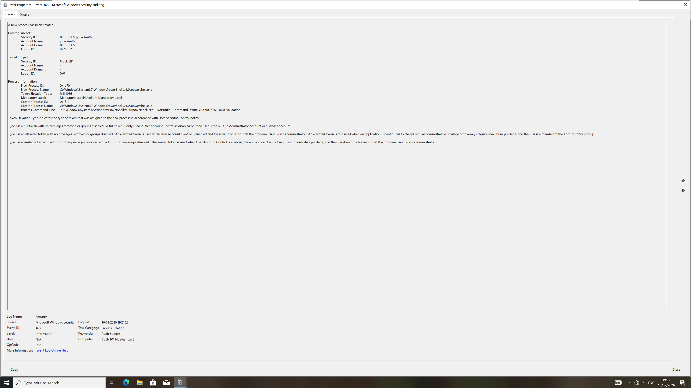

### PowerShell Module Logging — Event ID 4103

PowerShell module logging captures pipeline execution details.

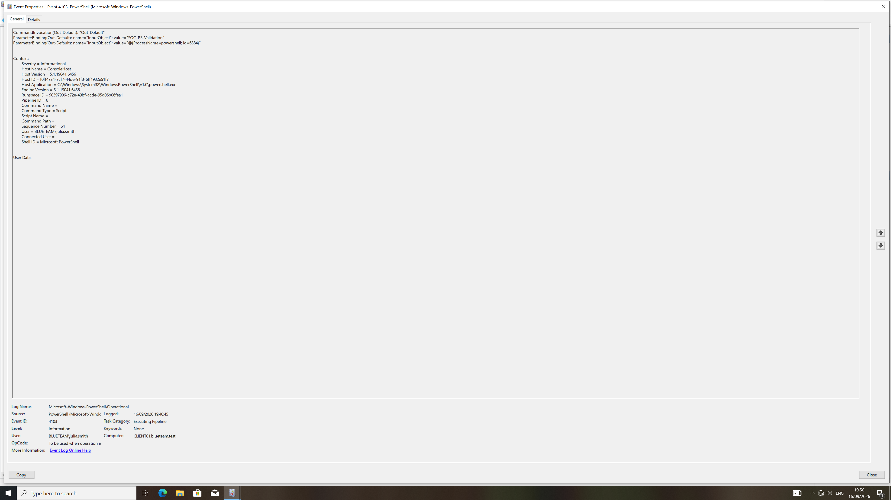

### PowerShell Script Block Logging — Event ID 4104

Script block logging records the content executed by the PowerShell engine.

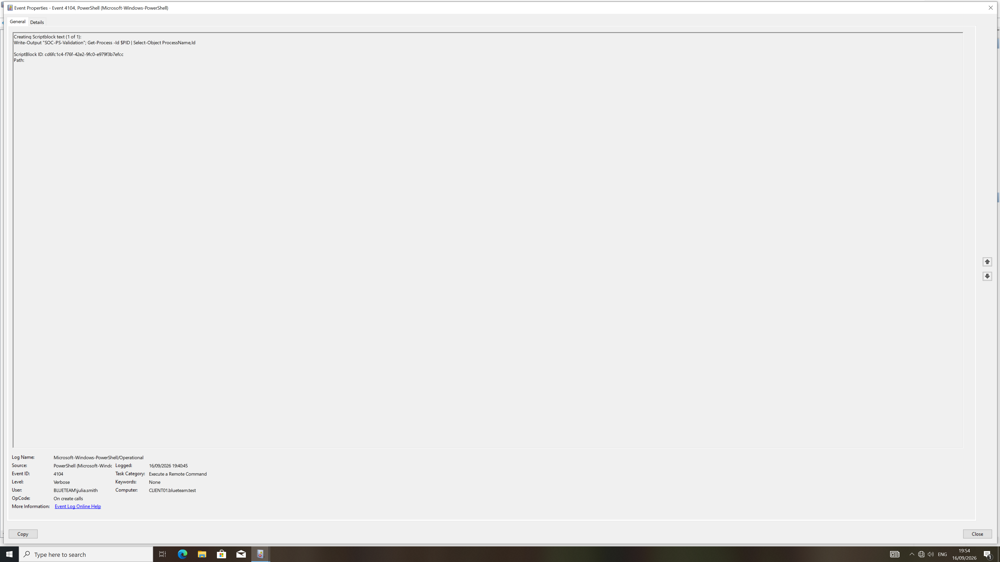

### Sysmon Process Creation — Event ID 1

Sysmon adds enriched process metadata, including hashes, image paths, parent processes, and command lines.

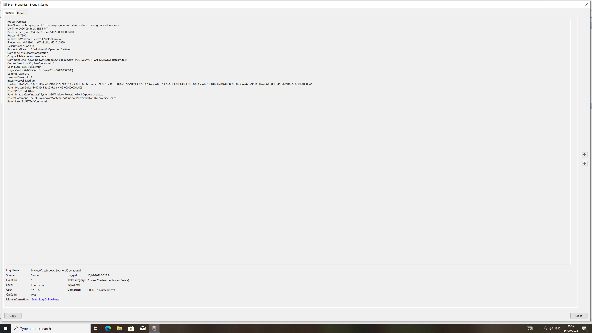

### Splunk Endpoint Ingestion

Telemetry from `CLIENT01` was first validated individually and then confirmed across all three Windows systems.

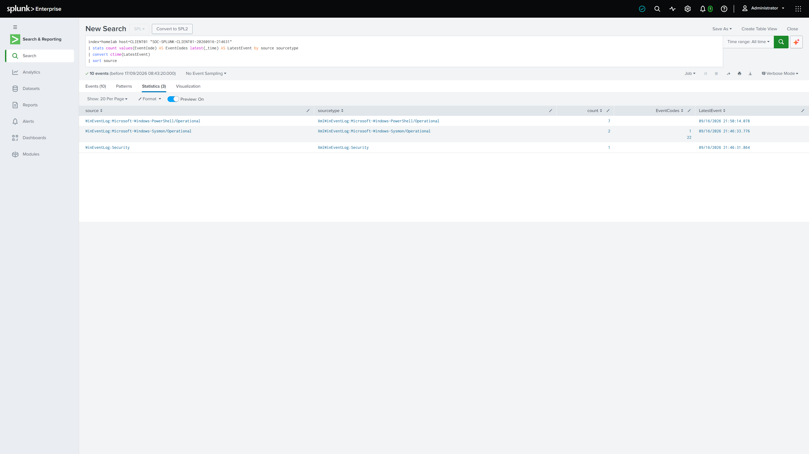

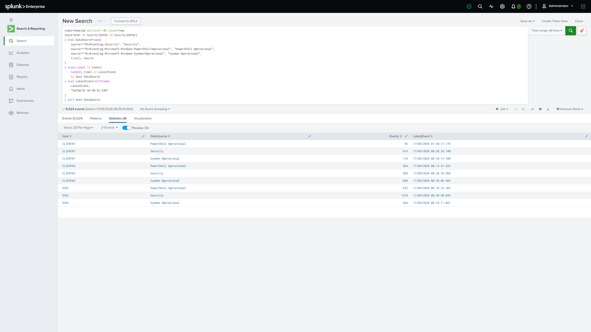

</details>

## Network Security and Firewall Telemetry

`FW01` provides the controlled boundary between the protected Windows environment and `KALI01`. VMware DHCP is disabled on both lab segments, pfSense uses static addressing, and the Windows host is deliberately disconnected from `VMnet2`.

| pfSense interface | Device | Address | Purpose |
| --- | --- | --- | --- |
| `INTERNAL` | `em1` | `192.168.51.254/24` | Protected Windows network and firewall administration |
| `ATTACKER` | `em0` | `192.168.52.254/24` | Isolated network used for controlled attack simulations |

pfSense forwards firewall and system events to Splunk over UDP `5514`. Splunk stores these events in the `pfsense` index and separates them into two sourcetypes:

| Sourcetype | Content |
| --- | --- |
| `pfsense:filterlog` | Firewall traffic decisions |
| `pfsense:syslog` | pfSense operating system and service messages |

Search-time extractions provide fields including `interface`, `action`, `direction`, `protocol`, `src_ip`, `dest_ip`, `src_port`, `dest_port`, `icmp_type`, `tcp_flags`, `rule_number`, and `tracker`.

<details>

<summary><strong>View network telemetry evidence</strong></summary>

### pfSense Interfaces

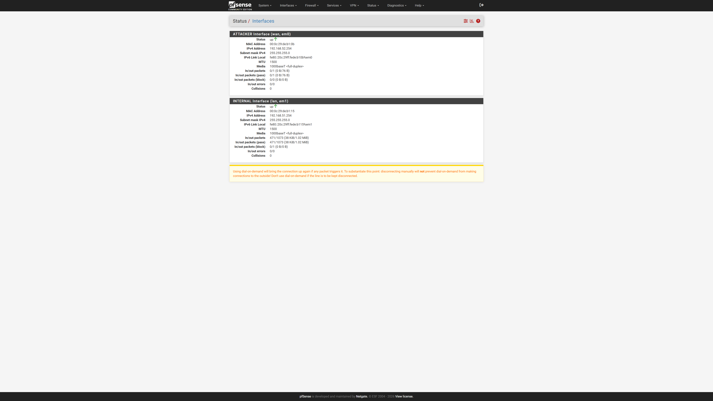

### Controlled Nmap Validation

`KALI01` generated a controlled SYN scan against the pfSense attacker interface. The firewall blocked all tested ports.

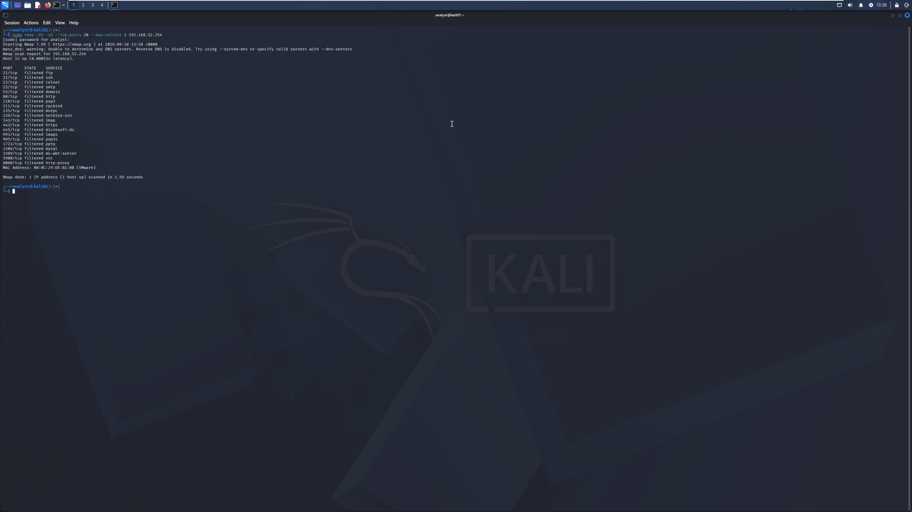

### Parsed Firewall Events

Splunk received the blocked connections and populated the extracted firewall fields.

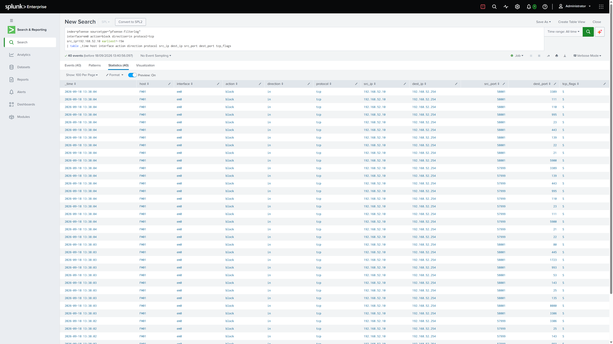

### Triggered Detection

The scheduled Splunk alert detected the controlled scan and created a medium-severity triggered alert.

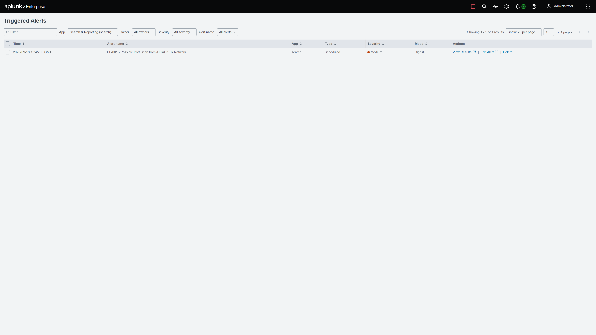

</details>

## Detection Engineering Validation

| Detection | Data source | Logic | Severity | Status |
| --- | --- | --- | --- | --- |
| `PF-001` — Possible Port Scan from ATTACKER Network | `pfsense:filterlog` | At least 10 distinct blocked TCP destination ports from one source within five minutes | Medium | Validated |
| Suspicious Cross-Workstation Authentication | `HomelabAuth_CL` | Successful domain authentication from a source IP different from the configured account/workstation baseline, enriched with preceding Kerberos failures | Medium | Validated |

This validation confirmed the complete telemetry path:

```text
KALI01 → FW01 → Syslog UDP 5514 → Splunk → Field extraction → Scheduled alert
```
The test produced 40 blocked connection events across 20 distinct destination ports. The duplicated attempts were expected because Nmap was configured with one retry per port.

`INC-004` separately validated an end-to-end Microsoft Sentinel workflow:

```text
Windows Security → Splunk collection → CSV normalisation → Logs Ingestion API → HomelabAuth_CL → KQL analytics rule → Sentinel alert → Microsoft Defender Case
```

## Investigation Portfolio

All six planned investigations are complete. Selecting a case identifier opens the full incident report.

| Case | Investigation | Status |
| --- | --- | --- |
| [`INC-001`](incidents/INC-001-brute-force/README.md) | RDP Password Guessing and Credential Compromise | Complete |
| [`INC-002`](incidents/INC-002-phishing/README.md) | Phishing Email Investigation and Redirect Analysis | Complete |
| [`INC-003`](incidents/INC-003-powershell/README.md) | Suspicious PowerShell and Scheduled Task Persistence | Complete |
| [`INC-004`](incidents/INC-004-suspicious-signin/README.md) | Suspicious Cross-Workstation Authentication in Microsoft Sentinel | Complete |
| [`INC-005`](incidents/INC-005-endpoint-compromise/README.md) | Domain Controller Compromise: C2, Persistence and Privileged Access | Complete |
| [`INC-006`](incidents/INC-006-dc-incident-response/README.md) | Domain Controller Incident Response: Containment, Forensics, Scope and Recovery | Complete |

`INC-005` and `INC-006` form a linked two-stage investigation. `INC-005` documents Tier 1 detection, confirmation and escalation of the Domain Controller compromise; `INC-006` documents the Tier 2 / CSIRT response through containment, forensic preservation and analysis, scope investigation, eradication, recovery, and final validation.

Across the portfolio, reports document the evidence and reasoning needed to support, where applicable:

- reconstructed timelines;
- defined scope and affected entities;
- evidence-based verdicts and severity;
- containment, response, escalation, or closure decisions;
- detection opportunities and false-positive considerations;
- forensic limitations and confidence boundaries;
- eradication and recovery validation.

## Investigation Methodology

The portfolio follows a consistent evidence-driven SOC workflow, adapted to the needs of each case:

1. Review the alert, trigger, or investigative handoff.
2. Define the questions the investigation must answer.
3. Establish an appropriate baseline where benign context is required.
4. Examine relevant endpoint, identity, network, email, or cloud evidence.
5. Correlate events across sources and reconstruct the timeline.
6. Determine affected scope, entities, and incident-specific indicators.
7. Assign a justified verdict and severity.
8. Recommend or perform containment, escalation, and evidence preservation where required.
9. Perform eradication and recovery validation when the case progresses into incident response.
10. Document limitations, detection improvements, and lessons learned.

Queries, commands, screenshots, results, and interpretations are documented together so that conclusions can be traced back to supporting evidence.

The Tier 2 / CSIRT workflow demonstrated in `INC-006` extends this methodology with volatile-memory acquisition, targeted file preservation, Autopsy and Volatility analysis, IOC sweeping across multiple systems, eradication, reboot validation, and post-recovery network verification.

## Repository Structure

```text
soc-analyst-portfolio/
├── README.md
├── images/
└── incidents/
    ├── INC-001-brute-force/
    │   ├── README.md
    │   └── images/
    │
    ├── INC-002-phishing/
    │   ├── README.md
    │   ├── images/
    │   └── cristian-clarinete Unread video from Elena (expires in 5 mins).eml
    │
    ├── INC-003-powershell/
    │   ├── README.md
    │   └── images/
    │
    ├── INC-004-suspicious-signin/
    │   ├── README.md
    │   └── images/
    │
    ├── INC-005-endpoint-compromise/
    │   ├── README.md
    │   └── images/
    │
    └── INC-006-dc-incident-response/
        ├── README.md
        ├── images/
        ├── VolatilityWorkbenchLogNETSCAN.txt
        └── VolatilityWorkbenchLogPSTREE.txt
```

Each incident directory contains its final report and supporting evidence images.

## Tools and Technologies

| Area | Tools and technologies |
| --- | --- |
| SIEM and cloud security | Splunk Enterprise, Microsoft Sentinel, Kusto Query Language (KQL), Azure Monitor Logs Ingestion API, Microsoft Defender Cases |
| Endpoint and identity telemetry | Windows Event Logs, Sysmon, PowerShell logging, Advanced Audit Policy, Active Directory Domain Services, Microsoft Defender Antivirus |
| Network security | pfSense Community Edition, centralized syslog, Kali Linux, Nmap |
| Detection and adversary emulation | Atomic Red Team, Havoc C2 Framework |
| Forensics and incident response | WinPmem, FTK Imager, Autopsy, Volatility 3 / Volatility Workbench |
| Email and external analysis | PhishTool, DomainTools, urlscan.io, VirusTotal |
| Lab infrastructure | VMware Workstation, Docker, Windows 10, Windows Server 2019, Windows 11 |

## Security and Privacy

All activity is generated or analysed within controlled, authorised environments. The homelab uses fictional identities and private IP addressing, and no real user credentials or sensitive organisational data are used in the simulated incidents.

The public repository excludes live malware binaries, memory dumps, Registry hives, credentials, access tokens, configuration backups, password hashes, and other sensitive host artefacts. Synthetic test values may appear in screenshots where they are necessary to demonstrate the investigation.

Offensive tooling is included only to provide controlled ground truth for defensive analysis. The portfolio does not provide operational instructions for targeting third-party systems.
