# INC-001 — RDP Password Guessing and Credential Compromise

## Contents

- [Key Data Sources](#key-data-sources)
- [Establishing an Authentication Baseline](#establishing-an-authentication-baseline)
- [Correlation and Assessment](#correlation-and-assessment)
- [What Do We Learn From This?](#what-do-we-learn-from-this)
- [When Does User Error Become a Possible Brute-Force Attack?](#when-does-user-error-become-a-possible-brute-force-attack)
- [External RDP Exposure and Benign Baseline](#external-rdp-exposure-and-benign-baseline)
- [Simulated RDP Password Attack](#simulated-rdp-password-attack)
- [Credential Compromise and Post-Authentication Activity](#credential-compromise-and-post-authentication-activity)

## Key Data Sources

| Log source | Event ID | Meaning |
| --- | --- | --- |
| Windows Security | [4625](https://learn.microsoft.com/en-us/previous-versions/windows/it-pro/windows-10/security/threat-protection/auditing/event-4625) | An account failed to log on |
| Windows Security | [4624](https://learn.microsoft.com/en-us/previous-versions/windows/it-pro/windows-10/security/threat-protection/auditing/event-4624) | An account was successfully logged on |
| Windows Security | [4740](https://learn.microsoft.com/en-us/previous-versions/windows/it-pro/windows-10/security/threat-protection/auditing/event-4740) | A user account was locked out |
| Sysmon Operational | [1](https://learn.microsoft.com/en-us/sysinternals/downloads/sysmon#event-id-1-process-creation) | A process was created, with additional process and parent-process information |

## Establishing an Authentication Baseline

Before analysing the simulated brute-force attack, it is useful to establish how an ordinary failed logon followed by a successful logon appears in Splunk. This provides a baseline against which the later malicious activity can be compared.

### Failed Logon

Windows records failed logon attempts as Event ID `4625`. The `Status`, `SubStatus` and `FailureReason` fields provide information about why the authentication failed.

Two relevant status codes in this event are:

* `0xC000006D`: The logon attempt was unsuccessful because of invalid authentication information. This is a general failure status.
* `0xC000006A`: The account was valid, but the password supplied was incorrect.

Additional status and substatus values are documented in the [Microsoft NTSTATUS reference](https://learn.microsoft.com/en-us/openspecs/windows_protocols/ms-erref/596a1078-e883-4972-9bbc-49e60bebca55).

The following search was used to identify failed logons recorded on `CLIENT01`:
```spl
index=homelab source="WinEventLog:Security" host="CLIENT01" EventID=4625
| table _time host EventID TargetUserName TargetDomainName LogonType Status SubStatus IpAddress WorkstationName
```
The search returned one relevant event at `06:43:07 UTC`.

The event contained the following relevant information:

* `host=CLIENT01`: The event was recorded on `CLIENT01`. This identifies the system that logged the event, not the person who performed the action.
* `TargetUserName=julia.smith@blueteam.test`: This was the account targeted by the authentication attempt.
* `LogonType=2`: An interactive logon was attempted locally on the computer.
* `Status=0xC000006D`: The authentication information was invalid.
* `SubStatus=0xC000006A`: The password supplied for the account was incorrect.
* `IpAddress=127.0.0.1`: The authentication request originated from localhost.
* `WorkstationName=CLIENT01`: The request was associated with `CLIENT01`.

Although `TargetDomainName` was empty in this failed event, the `TargetUserName` value was recorded in User Principal Name (UPN) format and already contained the domain `blueteam.test`.

These fields establish that an interactive logon using an incorrect password was attempted locally on `CLIENT01` against Julia Smith's account. They do not prove that Julia Smith was physically responsible for entering the password.

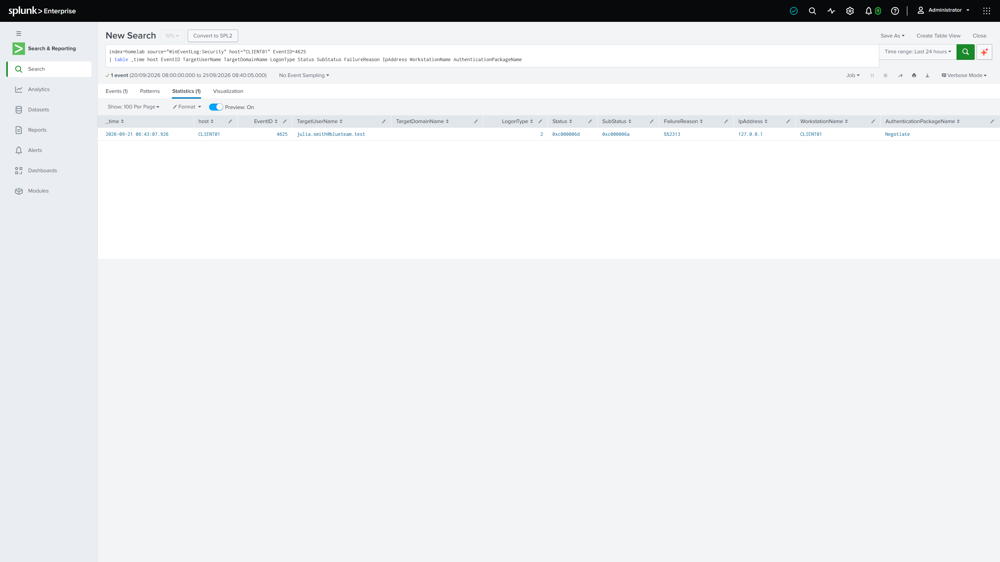

### Successful Logon

After identifying the failed authentication, the investigation pivoted on the target account, endpoint and timestamp to look for nearby successful and failed logon events.

A broad pivot can be performed with:
```spl
index=homelab source="WinEventLog:Security" host="CLIENT01" (EventID=4624 OR EventID=4625) TargetUserName="julia.smith*"
| table _time EventID TargetUserName TargetDomainName LogonType Status SubStatus IpAddress WorkstationName
| sort by _time
```
The initial pivot does not restrict `LogonType`, because the type of the subsequent successful logon should first be discovered from the evidence rather than assumed.

The relevant successful event was then isolated with:
```spl
index=homelab source="WinEventLog:Security" host="CLIENT01" EventID=4624 LogonType=11
| table _time host EventID TargetUserName TargetDomainName LogonType IpAddress WorkstationName
```
The search returned one relevant Event ID `4624` at `06:43:14 UTC`, seven seconds after the failed attempt.

The event contained:

* `TargetUserName=julia.smith`
* `TargetDomainName=BLUETEAM`
* `LogonType=11`
* `IpAddress=127.0.0.1`
* `WorkstationName=CLIENT01`

Logon Type `11`, or `CachedInteractive`, means that the user logged on using domain credentials previously cached on the endpoint. The domain controller was not contacted to verify the credentials during this authentication.

The failed and successful events having different Logon Types is not contradictory. The failed event records an attempted interactive logon, while the successful event records that the domain credentials were subsequently validated using the locally cached credential information.

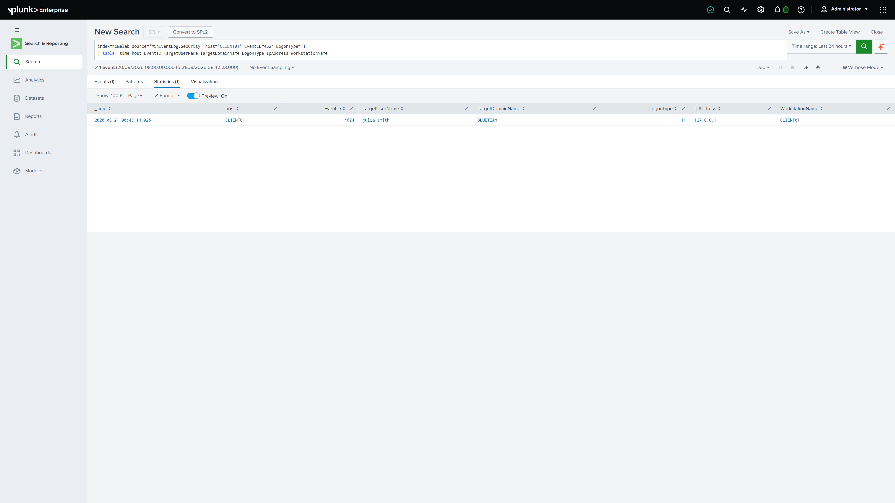

## Correlation and Assessment

The evidence establishes the following sequence:

1. At `06:43:07 UTC`, `CLIENT01` recorded a failed interactive logon against `julia.smith@blueteam.test`.
2. The failure was caused by an incorrect password.
3. The request originated locally from `127.0.0.1`.
4. At `06:43:14 UTC`, the same endpoint recorded a successful cached interactive logon for `julia.smith`.
5. The interval between the failed and successful events was approximately seven seconds.
6. No repeated sequence of failed attempts or remote source address was identified within the reviewed time window.

The short interval, local origin, same target account and absence of repeated failures are consistent with a benign password-entry error followed by a successful retry.

However, the logs cannot prove who physically entered the password. The evidence supports a benign explanation, but it does not establish the user's physical identity or intent with absolute certainty.

This activity should therefore be described as **benign authentication activity**, rather than a false positive. No security alert incorrectly classified the event; the events were examined to establish a normal authentication baseline.

## What Do We Learn From This?

This test produced one relevant Event ID `4625` followed by one relevant Event ID `4624`. This should not be interpreted as meaning that every human logon always produces exactly one Windows event.

Windows can generate multiple authentication events for interactive sessions, network access, services, workstation unlocks, cached credentials and other background activity. An analyst must use fields such as `TargetUserName`, `host`, `LogonType`, `IpAddress` and `_time` to distinguish the relevant user activity from unrelated authentication noise.

Similarly, multiple Event ID `4625` records do not automatically prove a brute-force attack. Repeated failures can also result from an expired password, stored credentials, a misconfigured service, a scheduled task or ordinary user error.

## When Does User Error Become a Possible Brute-Force Attack?

There is no universal numerical threshold at which failed logons automatically become a confirmed brute-force attack.

MITRE ATT&CK classifies brute-force activity under [T1110 — Brute Force](https://attack.mitre.org/techniques/T1110/), but it does not define a mandatory number of attempts or a universal time window.

A SIEM threshold determines when activity should be investigated; it does not determine the final verdict. The analyst must also consider:

* Number and frequency of failed attempts.
* Source address and source system.
* Target account and target endpoint.
* Logon Type.
* Whether one or multiple accounts were targeted.
* Whether a successful logon followed the failures.
* Account sensitivity and privileges.
* Normal authentication baseline.
* Account-lockout policy.
* Expected working hours and usual access locations, where this information is available.
* Subsequent activity performed after a successful logon.

Time, location, source address and Logon Type are contextual signals. They should not automatically be described as indicators of compromise unless they have been independently associated with malicious activity.

A possible password-guessing detection for this laboratory could identify five or more failed logons from the same source against the same account and endpoint within five minutes. A subsequent successful logon would increase the confidence and priority of the alert.

This would be a documented laboratory detection threshold, not an industry-wide definition of brute force. The threshold would need to be tuned in a production environment according to normal authentication activity and observed false positives.

Password spraying and distributed brute-force attacks would require separate detection logic because they may deliberately remain below a per-account or per-source threshold.

Detection engineering therefore requires continuing baseline analysis and rule tuning. The objective is to generate enough visibility for analysts to investigate suspicious patterns without treating every ordinary password error as an attack.

## External RDP Exposure and Benign Baseline

All activity described in this investigation was performed in an isolated, self-owned homelab for defensive security training.

Before simulating the brute-force activity, a benign RDP connection was established to understand how legitimate remote access appeared across the available data sources.

The simulated attacker system was `KALI01`, with IP address `192.168.52.10`. The target was `CLIENT01`, assigned to Julia Smith and using the internal IP address `192.168.51.20`.

RDP uses TCP port `3389` by default.

### RDP Configuration

RDP was enabled on `CLIENT01` using a local administrator account:
```text
Settings
→ System
→ Remote Desktop
→ Enable Remote Desktop
→ Confirm
```
Julia Smith was then authorised to access the endpoint remotely:
```text
Select users that can remotely access this PC
→ Add
→ BLUETEAM\julia.smith
```
### Initial Firewall Behaviour

The pfSense ATTACKER interface used the IP address `192.168.52.254`. Initially, there was no port-forward or matching firewall pass rule allowing RDP traffic from the attacker network to `CLIENT01`.

As a result, pfSense applied its implicit default-deny policy and blocked the connection before it reached the target endpoint.

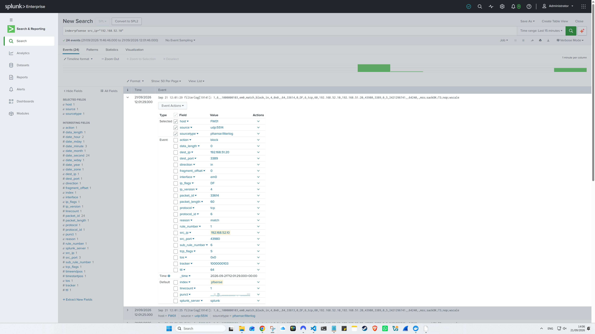

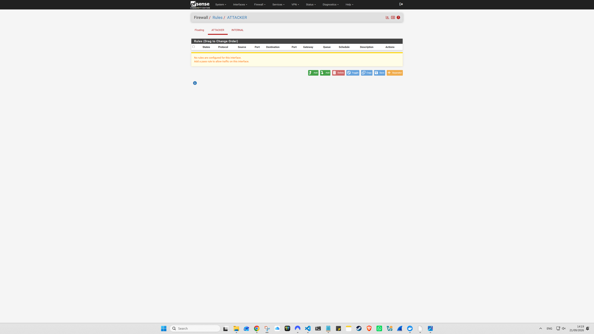

### Controlled RDP Exposure

To simulate an organisation exposing an internal RDP service to an untrusted network, an inbound NAT port-forward was created in pfSense with the following parameters:
```text
Ingress interface:       ATTACKER
Permitted source:        192.168.52.10
External destination:    192.168.52.254:3389
Redirect target:         192.168.51.20:3389
Protocol:                TCP
```
An associated firewall pass rule was also created. This rule allowed only `KALI01` to reach the forwarded RDP service, while other unsolicited traffic remained blocked.

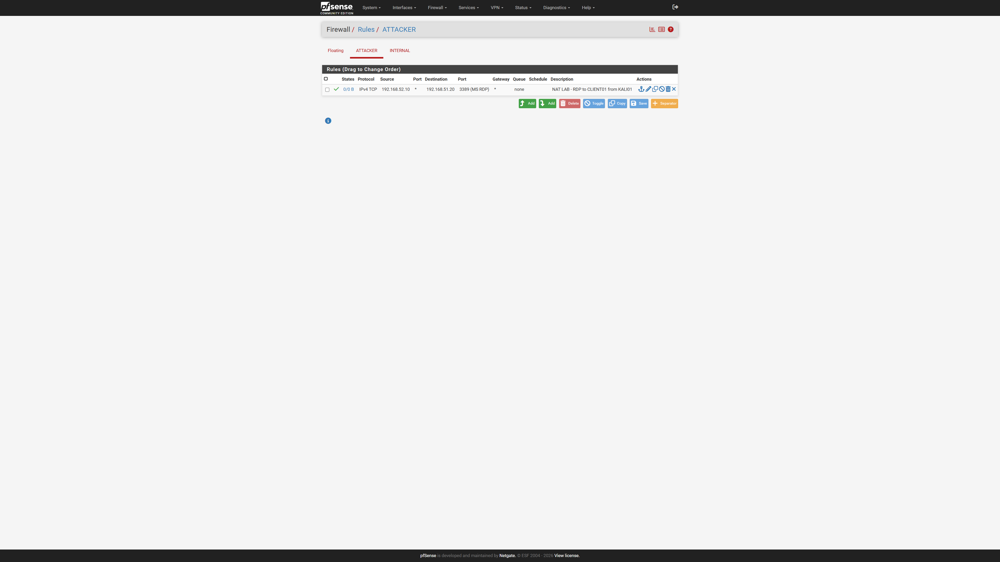

`CLIENT01` was configured to use the pfSense internal interface, `192.168.51.254`, as its default gateway. This provided a valid return route from `CLIENT01` to the attacker network.

The exposure was validated with a targeted Nmap scan:
```bash
sudo nmap -Pn -p 3389 --reason 192.168.52.254
```
The scan returned TCP port `3389` as open and identified the service as `ms-wbt-server`.

A second scan examined the 20 most common TCP ports:
```bash
sudo nmap -Pn -sS --top-ports 20 --max-retries 1 192.168.52.254
```
TCP port `3389` was open, while the remaining ports included in the top-20 scan remained filtered. This confirmed that the rule exposed the intended RDP service without broadly permitting other inbound services.

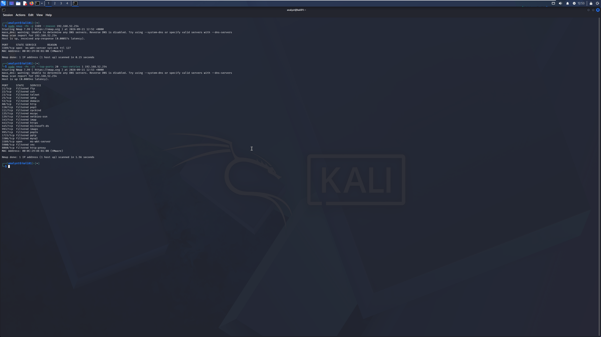

### Benign RDP Connection

Before generating failed authentication attempts, a legitimate RDP connection was established to create a baseline.

The connection was initiated from `KALI01` to the ATTACKER address of pfSense:
```bash
xfreerdp /v:192.168.52.254:3389 /d:BLUETEAM /u:julia.smith /cert:ignore
```
The password was entered interactively and was not included in the command. The `/cert:ignore` option was used because the isolated laboratory relied on the default self-signed RDP certificate.

The connection succeeded and opened an interactive session on `CLIENT01` as `BLUETEAM\julia.smith`.

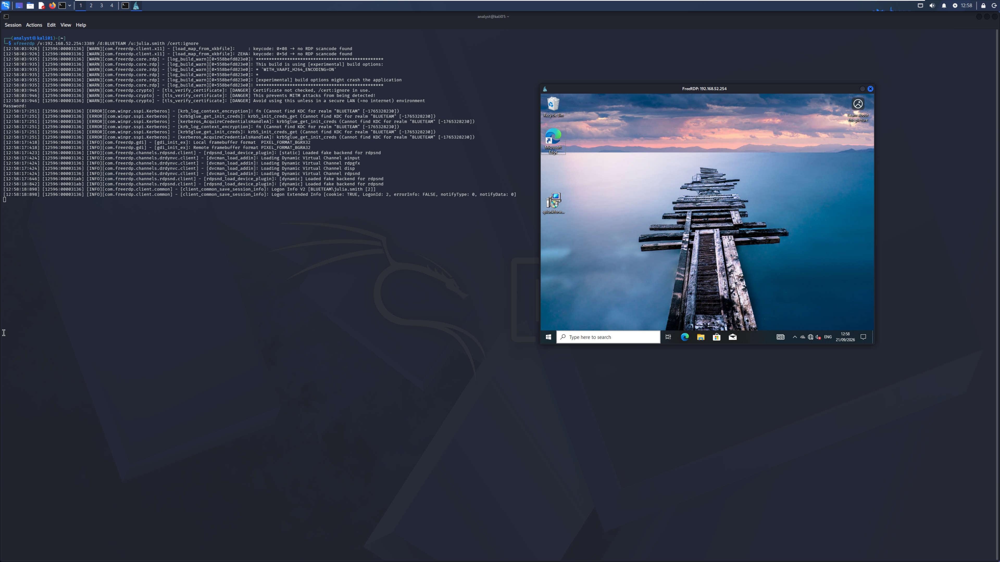

### Firewall Evidence

The corresponding pfSense traffic was identified in Splunk with:
```spl
index=pfsense sourcetype="pfsense:filterlog" src_ip="192.168.52.10" dest_port=3389 earliest=-5m
| table _time action interface direction src_ip src_port dest_ip dest_port
| sort - _time
```
The event contained:
```text
action=pass
interface=em0
direction=in
src_ip=192.168.52.10
dest_ip=192.168.51.20
dest_port=3389
```
This confirms that pfSense permitted the inbound TCP/3389 traffic from `KALI01` and forwarded it to `CLIENT01` according to the port-forward and associated firewall rule.

It does not, by itself, prove that the RDP authentication succeeded because pfSense records the network connection but has no visibility into the Windows username or authentication result.

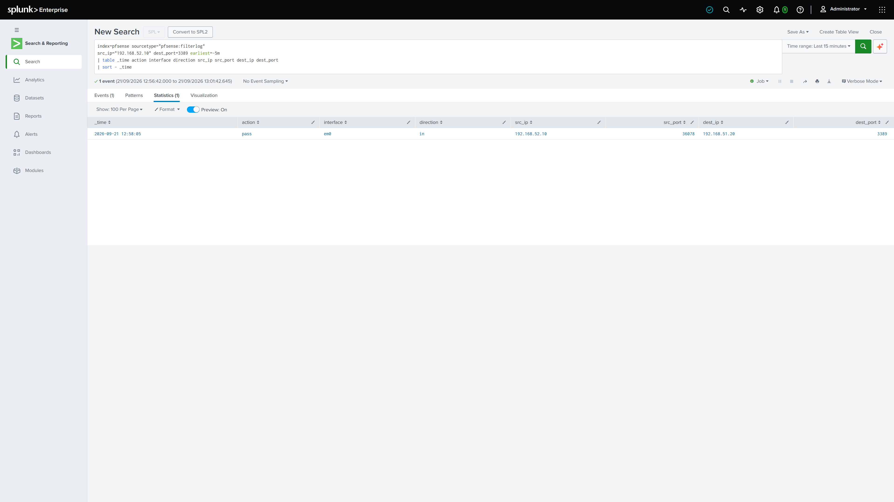

### Windows Authentication Evidence

Successful authentication was verified independently using the Windows Security logs collected from `CLIENT01`:
```spl
index=homelab source="WinEventLog:Security" host="CLIENT01" EventID=4624 LogonType=10
| table _time EventID TargetUserName TargetDomainName LogonType IpAddress WorkstationName
| sort - _time
```
The search returned one relevant Event ID `4624` containing:
```text
TargetUserName=julia.smith
TargetDomainName=BLUETEAM
LogonType=10
IpAddress=192.168.52.10
WorkstationName=CLIENT01
```
Logon Type `10`, also known as `RemoteInteractive`, represents an interactive remote logon through Remote Desktop or Terminal Services.

This event confirms that the RDP authentication succeeded for Julia Smith's domain account and originated from `KALI01`.

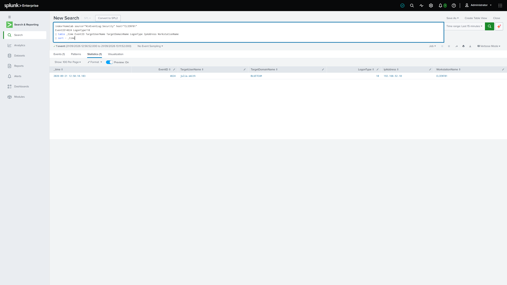

This legitimate connection establishes the expected baseline across three separate evidence sources:

* Nmap confirmed that TCP port `3389` was reachable.
* pfSense confirmed that the network traffic was permitted and forwarded.
* Windows Security Event ID `4624`, with Logon Type `10`, confirmed that the remote authentication succeeded.

The next phase compares this legitimate baseline with repeated failed RDP authentication attempts followed by a successful login.

## Simulated RDP Password Attack

All activity in this section was performed within the isolated homelab environment.

### Scenario Assumption

The simulated attacker had previously identified Julia Smith through OSINT and inferred the account `julia.smith@blueteam.test` from the organisation's username convention. The attacker therefore knew the username but not the password.

The domain initially had no account-lockout threshold configured, allowing an unlimited number of failed authentication attempts. Microsoft recommends a threshold of [10 invalid sign-in attempts](https://learn.microsoft.com/en-us/previous-versions/windows/it-pro/windows-10/security/threat-protection/security-policy-settings/account-lockout-threshold) as a starting point, although the final value should reflect each organisation's security and operational requirements.

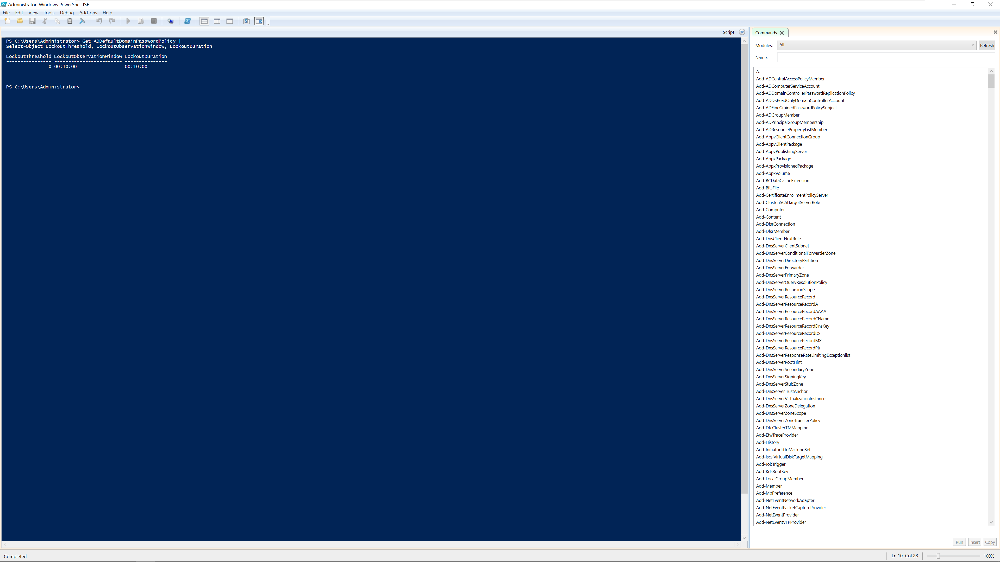

### Password-Guessing Simulation

KALI01 used [Hydra](https://www.kali.org/tools/hydra/) with the `rockyou.txt` password list against the RDP service exposed through pfSense:
```bash
hydra -l julia.smith@blueteam.test -P /usr/share/wordlists/rockyou_utf8.txt -t 1 -V rdp://192.168.52.254:3389
```
The `-t 1` option restricts Hydra to one parallel task, preventing the RDP service and Hydra's experimental RDP module from being overwhelmed by concurrent connections. The `-V` option displays each credential attempt.

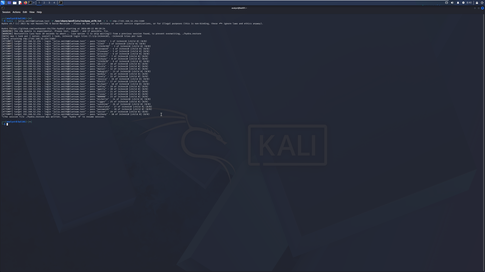

The resulting failed authentications were identified in Splunk with:
```spl
index=homelab source="WinEventLog:Security" host="CLIENT01" EventID=4625 IpAddress="192.168.52.10" earliest=-5m
| stats count earliest(_time) AS first_seen latest(_time) AS last_seen by TargetUserName Status SubStatus
| convert ctime(first_seen) ctime(last_seen)
| sort by first_seen
```
Windows recorded 29 failed authentications in approximately 56 seconds, all targeting `julia.smith@blueteam.test` from `192.168.52.10`. The combination of volume, frequency and repeated failures against one account is strongly consistent with automated password guessing.

This activity maps to [MITRE ATT&CK T1110.001 — Password Guessing](https://attack.mitre.org/techniques/T1110/001/).


### Account-Lockout Control

To limit repeated authentication attempts, an account-lockout policy was configured in `DC01` through:
```text
Server Manager
→ Tools
→ Group Policy Management
→ Forest: blueteam.test
→ Domains
→ blueteam.test
→ Default Domain Policy
→ Edit
→ Computer Configuration
→ Policies
→ Windows Settings
→ Security Settings
→ Account Policies
→ Account Lockout Policy
```
The policy was configured with:
```text
Account lockout threshold:             10 invalid logon attempts
Account lockout duration:              10 minutes
Reset account lockout counter after:   10 minutes
```
When the threshold was defined, Group Policy automatically populated the two dependent settings with ten-minute values.

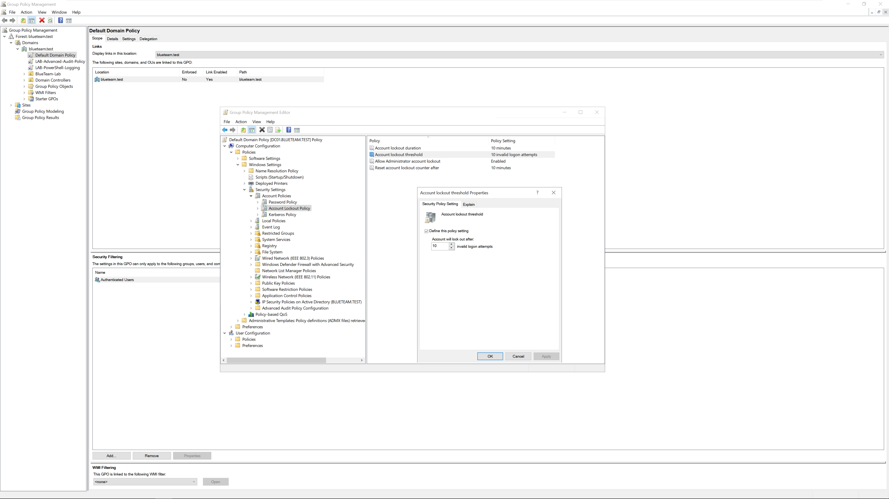

The same Hydra command was then executed again. Windows recorded ten failed authentications. Hydra initiated an eleventh attempt using the password `nicole`, but repeatedly retried the connection before stopping because of connection errors.

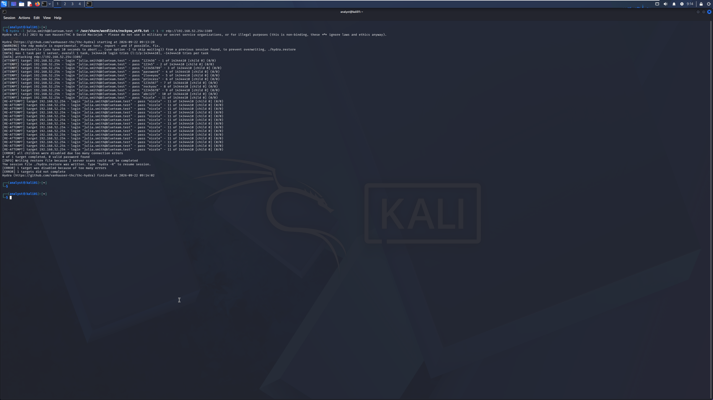

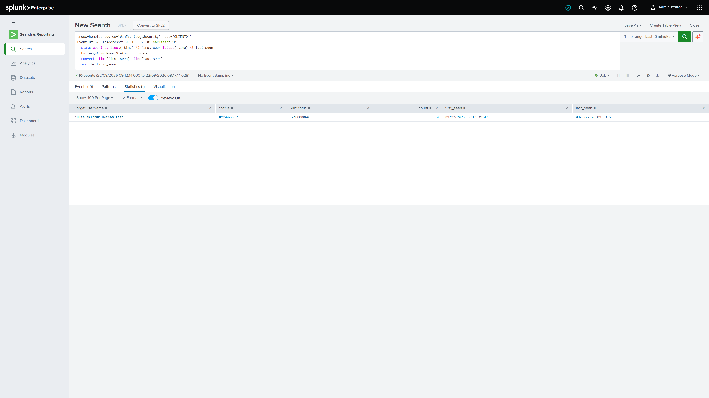

Hydra's displayed attempts and Windows audit events do not necessarily have a one-to-one relationship. During the first test, the final attempt was interrupted with `Ctrl+C`; during the second, the eleventh attempt did not complete after the account-lockout control took effect. The investigation therefore reports the number of failed authentications recorded by Windows rather than assuming that every client-side attempt generated an audit event.

The account lockout was confirmed independently on `DC01` using Windows Security Event ID `4740`. Because several lockout tests had been performed during the laboratory exercise, the search was restricted to the time window of the test documented above:
```spl
index=homelab source="WinEventLog:Security" host="DC01" EventID=4740 TargetUserName="julia.smith" earliest="09/22/2026:09:13:30" latest="09/22/2026:09:14:10"
| table _time host EventID TargetUserName SubjectUserName
| sort 0 _time
```
The search returned one Event ID `4740` at `09:13:57 UTC`, confirming that Active Directory locked the `julia.smith` account when the configured threshold was reached. The additional `4740` events found outside this time window were generated by later repetitions of the laboratory test and were not part of this specific execution.

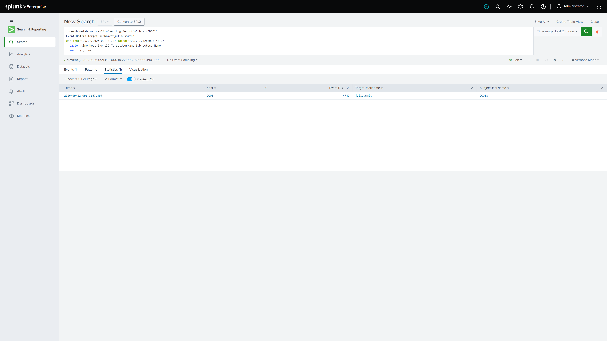

After validating the account-lockout control, the laboratory was returned to an intentionally vulnerable state so that the credential-compromise scenario could be completed. The lockout threshold was temporarily restored to `0`, and the account was allowed to unlock before the next test. This rollback was performed only within the isolated homelab and does not represent a recommended production configuration.

## Credential Compromise and Post-Authentication Activity

To simulate a successful dictionary attack, a custom wordlist named `possible_passwords.txt` was created. It contained ten incorrect passwords followed by the correct password:
```text
123456
12345
123456789
password
iloveyou
princess
1234567
rockyou
12345678
abc123
Finance2026!
```
Hydra was then executed against the exposed RDP service:
```bash
hydra -l julia.smith@blueteam.test -P possible_passwords.txt -t 1 -V rdp://192.168.52.254:3389
```
Hydra successfully identified a valid username and password combination.

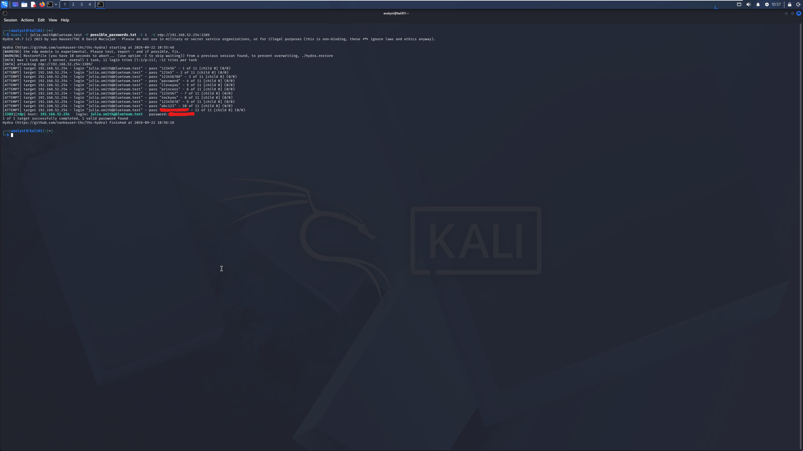

The corresponding Windows authentication activity was reviewed in Splunk:
```spl
index=homelab source="WinEventLog:Security" host="CLIENT01" (EventID=4624 OR EventID=4625) IpAddress="192.168.52.10" earliest=-15m
| eval Outcome=case(EventID=4625, "Failed", EventID=4624, "Successful")
| table _time EventID Outcome TargetUserName TargetDomainName LogonType IpAddress Status SubStatus
| sort 0 _time
```
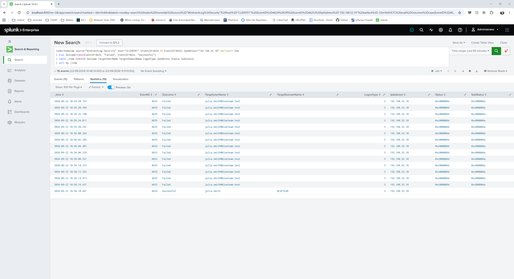

Splunk recorded fourteen failed authentication events followed by one successful event, although Hydra displayed ten incorrect password candidates before finding the valid password. Client-side password candidates and server-side authentication events do not necessarily have a strict one-to-one relationship because RDP authentication can involve additional exchanges or retries. As no packet capture or Hydra debug trace was collected during this test, the exact cause of the four additional Event ID `4625` records could not be conclusively determined.

The investigation therefore relies on the observable security pattern—a concentrated burst of Event ID `4625` events followed by Event ID `4624`—rather than assuming that the number of SIEM events must exactly match the number of candidates displayed by the client-side tool.

The successful event at this stage confirmed that the credentials were valid. An interactive RDP session was then established using FreeRDP:
```bash
xfreerdp /v:192.168.52.254:3389 /d:BLUETEAM /u:julia.smith /cert:ignore
```
After connecting to `CLIENT01`, PowerShell was opened and the following command was executed:
```powershell
whoami
```
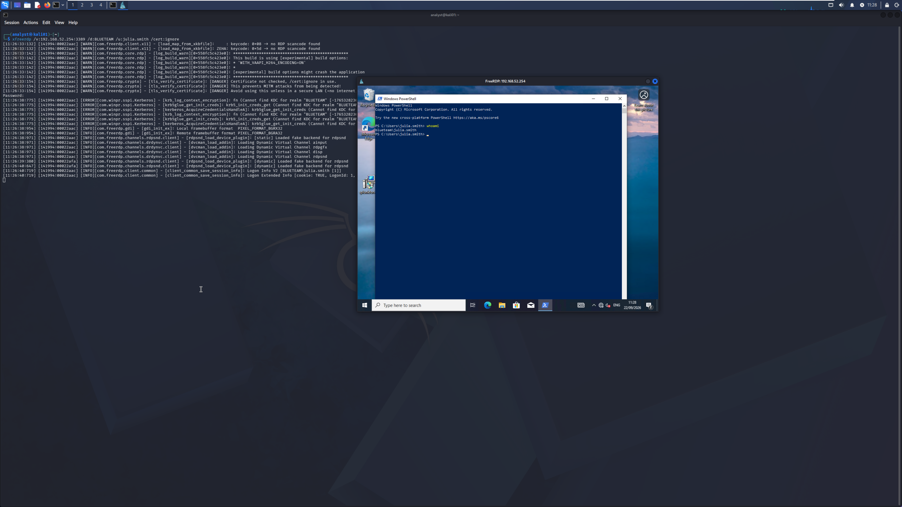

The command returned:
```text
blueteam\julia.smith
```
This activity represents account discovery and maps to [MITRE ATT&CK T1033 — System Owner/User Discovery](https://attack.mitre.org/techniques/T1033/).

### Confirming the Interactive RDP Session

The successful logons originating from the attacker network were reviewed using Windows Security Event ID `4624`:
```spl
index=homelab source="WinEventLog:Security" host="CLIENT01" EventID=4624 IpAddress="192.168.52.10"
| table _time TargetUserName TargetLogonId LogonType IpAddress
| sort by _time
```


The search returned both network and remote-interactive authentication activity:

* `LogonType=3` represents a network authentication operation associated with the RDP/NLA process.
* `LogonType=10` represents a `RemoteInteractive` logon and confirms that an interactive RDP session was established.

The key event occurred at `11:26:39`, when `julia.smith` logged on to `CLIENT01` with `LogonType=10` from `192.168.52.10`.

### Investigating Activity After the Logon

After identifying the successful RDP logon time, Sysmon Event ID `1` was used to examine processes created by the compromised account from that point onwards:
```spl
index=homelab source="WinEventLog:Microsoft-Windows-Sysmon/Operational" host="CLIENT01" EventCode=1 User="*julia.smith*" earliest="09/22/2026:11:26:39"
| table _time User Image ParentImage ParentCommandLine CommandLine
| sort 0 _time
```
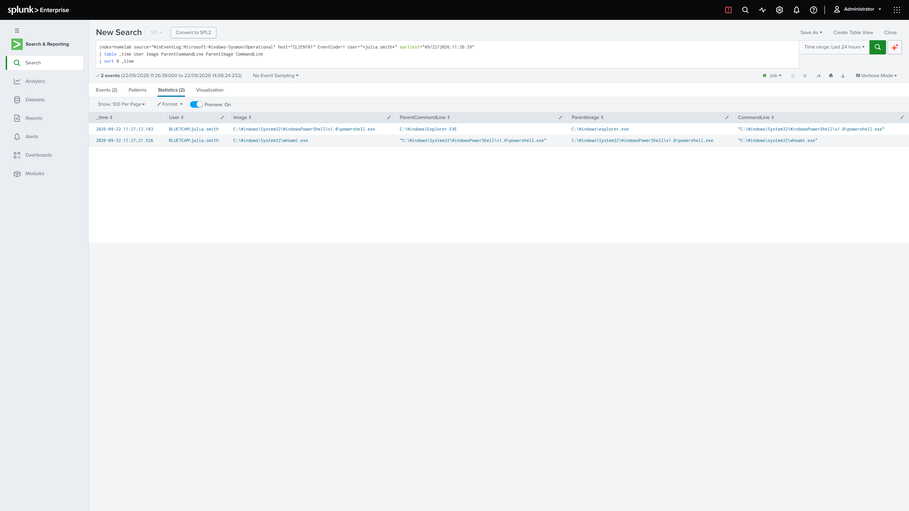

The results revealed the following process chain:

1. At `11:27:12`, `powershell.exe` was launched by `explorer.exe`.
2. At `11:27:21`, `whoami.exe` was launched as a child process of `powershell.exe`.

The matching host, username and narrow time interval following the successful `LogonType=10` event strongly indicate that these processes were executed during the newly established RDP session.

This evidence confirms the complete sequence:

* Multiple failed authentication attempts originated from `192.168.52.10`.
* The credentials for `BLUETEAM\julia.smith` were successfully identified.
* An interactive RDP session was established on `CLIENT01`.
* PowerShell was launched within that session.
* `whoami.exe` was executed to identify the compromised user context.
