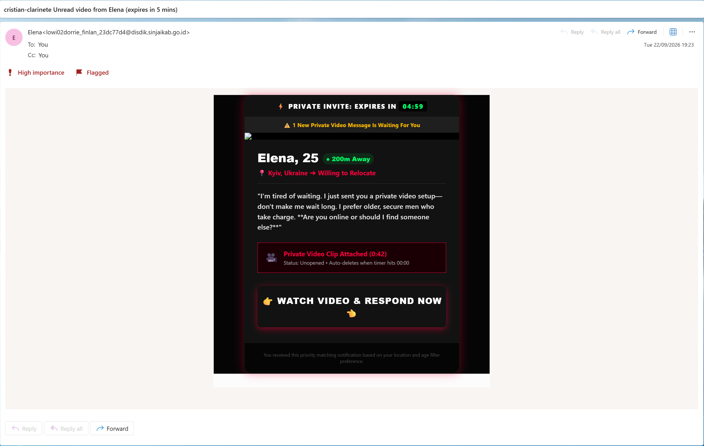
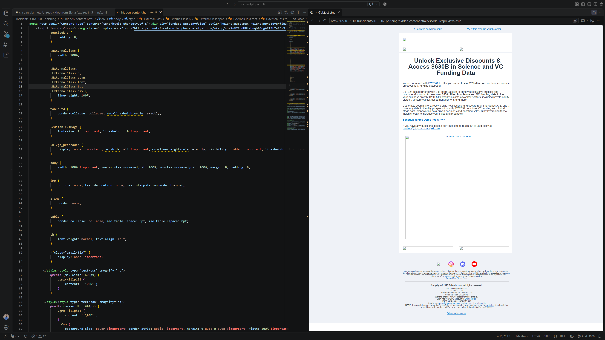
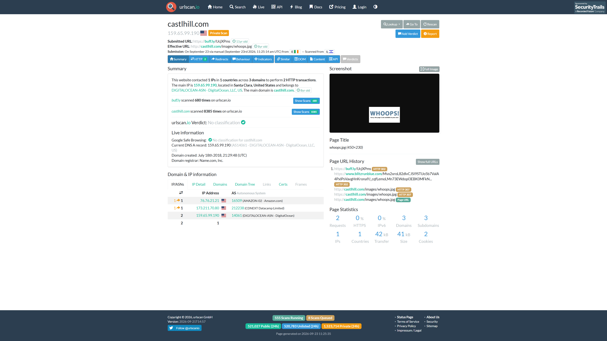
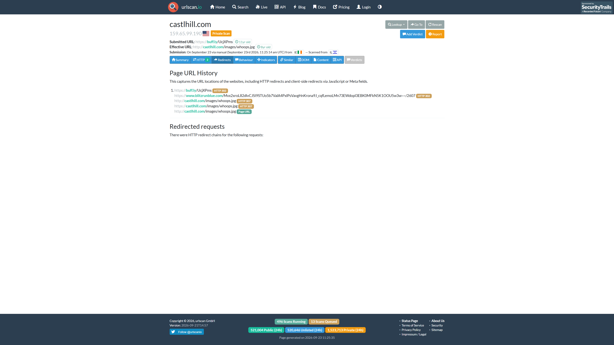
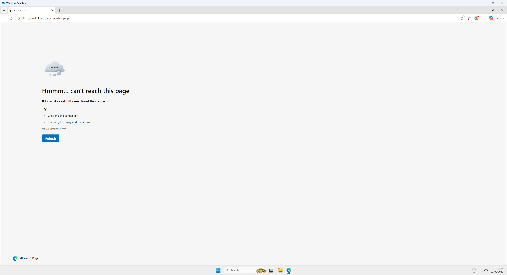

# INC-002 — Phishing Email Investigation and Redirect Analysis

## Contents

- [Case Overview](#case-overview)
- [Executive Summary](#executive-summary)
- [Methodology](#methodology)
- [Initial Email Triage](#initial-email-triage)
- [Header and Routing Analysis](#header-and-routing-analysis)
- [Email Authentication](#email-authentication)
- [Content and Social Engineering](#content-and-social-engineering)
- [URL and Attachment Analysis](#url-and-attachment-analysis)
- [Timeline](#timeline)
- [Scope, Entities and Indicators](#scope-entities-and-indicators)
- [Verdict and Severity](#verdict-and-severity)
- [MITRE ATT&CK Mapping](#mitre-attck-mapping)
- [Response and Escalation](#response-and-escalation)
- [Detection Opportunities](#detection-opportunities)
- [Lessons Learned](#lessons-learned)

## Case Overview

| Field | Value |
| --- | --- |
| Case ID | `INC-002` |
| Status | Closed |
| Incident category | Phishing / Social Engineering |
| Analysis date | 23 September 2026 |
| Platform | Microsoft 365 / Outlook / Hotmail |
| Evidence source | Real unsolicited `.eml` |
| Analysis tools | Outlook, raw HTML/header review, PhishTool, DomainTools, VS Code Live Preview, urlscan.io, Windows Sandbox |
| Original user interaction | Email opened; phishing CTA not clicked during normal use |
| Verdict | Phishing |
| Lab severity | Low |
| Confirmed impact | No compromise observed |
| Disposition | Closed at Tier 1; no escalation required based on observed user interaction and available evidence |

## Executive Summary

A real unsolicited email was received claiming that a private video from **“Elena”** would expire within five minutes. The message used a personalised subject, adult-themed social engineering, strong time pressure, a fake auto-delete narrative and a prominent call-to-action designed to induce an immediate click.

Header analysis showed that the message travelled through Microsoft 365 infrastructure. The final recipient-side authentication results were **SPF SoftFail, DKIM Pass and DMARC Fail**, while an earlier ARC authentication set preserved an upstream state in which SPF, DKIM and DMARC had passed. Microsoft assigned the message **SCL 5** and delivered it to Junk.

The visible email was considerably simpler than its raw HTML. Source analysis identified **100 URL occurrences** and a large amount of unrelated, hidden newsletter/template content. A coherent BioPharmCatalyst / `Scientist.com` newsletter was embedded inside a visually collapsed HTML container, consistent with content stuffing, HTML padding or template reuse.

The primary **call-to-action (CTA)** used the shortened URL `hxxps://buff[.]ly/UcjXPms`. urlscan.io showed a redirect through `www[.]blitzrunblue[.]com` before reaching `castlhill[.]com/images/whoops.jpg`, which served a **“WHOOPS! Sorry, this page is no longer available”** resource during automated analysis. A later analyst-controlled request from Windows Sandbox returned `ERR_CONNECTION_CLOSED`.

The message is therefore classified as **phishing**. The original recipient did not click the CTA during normal use, and no credential-harvesting page, malware payload, attachment or successful compromise was observed. The original post-click objective could not be recovered because the active campaign destination was no longer available.

## Methodology

The investigation used two primary methodological references:

1. **[NIST SP 800-61 Rev. 3 — Incident Response Recommendations and Considerations for Cybersecurity Risk Management: A CSF 2.0 Community Profile](https://csrc.nist.gov/pubs/sp/800/61/r3/final)** for the high-level incident-response framework.
2. **[Microsoft — Phishing investigation playbook](https://learn.microsoft.com/en-us/security/operations/incident-response-playbook-phishing)** for the technical phishing-investigation workflow.

MITRE ATT&CK is used only as a taxonomy for mapping behaviour observed during the investigation, not as an additional investigation methodology.

## Initial Email Triage

| Field | Observed value |
| --- | --- |
| From | `lowi02dorrie_finlan_23dc77d4@disdik.sinjaikab.go.id` |
| To | `cristian-clarinete@hotmail.com` |
| Subject | `cristian-clarinete Unread video from Elena (expires in 5 mins)` |
| Date | `Tue, 22 Sep 2026 17:23:44 +0000` |
| Message-ID | `<TYZPR03MB697997080A4F60A218EA59D0FB832@TYZPR03MB6979.apcprd03.prod.outlook.com>` |
| Reply-To | Not present |
| Return-Path | `lowi02dorrie_finlan_23dc77d4@disdik.sinjaikab.go.id` |
| Content-Type | `text/html; charset=UTF-8` |
| User interaction | Opened: Yes; CTA clicked during normal use: No |

The phishing link was later followed intentionally by the analyst inside controlled analysis environments. That activity is separate from the original recipient interaction.



## Header and Routing Analysis

The `Received` chain was read from the oldest entry upward to reconstruct how the message moved through Microsoft infrastructure.

| Time (UTC) | Routing event |
| --- | --- |
| 17:23:49 | The message was submitted and processed inside the sender-side Microsoft 365 environment through `TYZPR03MB6979.apcprd03.prod.outlook.com`. |
| 17:23:49 | The message was relayed from `TYZPR03MB6979.apcprd03.prod.outlook.com` to another Microsoft 365 internal server. |
| 17:23:52 | The message exited through `SEYPR02CU001.outbound.protection.outlook.com` using `40.107.44.29`. |
| 17:23:52–17:23:53 | The message entered Microsoft recipient-side mail protection through `BN2PEPF0000A7FE.mail.protection.outlook.com`. |
| 17:23:53 | The message traversed additional Microsoft internal routing infrastructure. |
| 17:23:53–17:23:55 | The message reached Microsoft European Exchange infrastructure and was delivered to the recipient mailbox. |

Relevant routing observations:

- **Sender-facing IP:** `40.107.44.29`
- **Header hostname:** `SEYPR02CU001.outbound.protection.outlook.com`
- **Reverse DNS / PTR:** `mail-koreacentralazon11013029.outbound.protection.outlook.com`
- **IP ownership:** Microsoft Corporation / AS8075
- **WHOIS/PTR reference:** https://whois.domaintools.com/40.107.44.29

The PTR contains `koreacentral`, and the IP was geolocated to Microsoft infrastructure associated with South Korea. This describes the infrastructure used to transport the message; it does **not** identify the attacker's physical location.

### Routing Assessment

The routing is consistent with a message transported through Microsoft 365 / Exchange Online infrastructure.

That observation establishes the mail infrastructure used to send the message. It does **not** establish that the sender account, the message content or the activity performed through the account was legitimate.

## Email Authentication

The final recipient-side `Authentication-Results` contained:

| Control | Result | Relevant value |
| --- | --- | --- |
| SPF | **SoftFail** | `smtp.mailfrom=disdik.sinjaikab.go.id`, sender IP `40.107.44.29` |
| DKIM | **Pass** | `header.d=disdiksinjaikab.onmicrosoft.com` |
| DMARC | **Fail** | `header.from=disdik.sinjaikab.go.id`, `action=quarantine` |
| Composite Authentication | **Pass** | `compauth=pass reason=130` |
| SCL | **5** | Message delivered to Junk |

### What SPF, DKIM and DMARC Actually Tell Us

**Sender Policy Framework (SPF)** checks whether the sending IP is authorised to send mail for the SMTP envelope sender / `MAIL FROM` domain. It does not prove that the person using the mailbox is trustworthy or that the message content is benign.

**DomainKeys Identified Mail (DKIM)** verifies a cryptographic signature and confirms that the signed portions of the message were not modified after signing. A valid DKIM signature does not prove that the sender's intention is legitimate.

**Domain-based Message Authentication, Reporting and Conformance (DMARC)** evaluates SPF and/or DKIM together with domain alignment against the visible `From` domain. It is an anti-spoofing and authentication control, not a general fraud-detection guarantee.

### Authenticated Received Chain (ARC) and Composite Authentication (CompAuth)

[Authenticated Received Chain (ARC)](https://learn.microsoft.com/en-us/defender-office-365/email-authentication-arc-configure) allows trusted mail intermediaries to preserve authentication results from an earlier stage of message delivery. This is useful when forwarding or other routing changes could otherwise cause a later SPF, DKIM or DMARC check to fail.

Microsoft also records a **Composite Authentication (CompAuth)** result, which combines multiple authentication and anti-spoofing signals into a final authentication decision.

In this message, the ARC chain passed validation.

An earlier ARC authentication set preserved an upstream state in which:

- SPF passed.
- DKIM passed.
- DMARC passed.

The final recipient-side authentication results were still used as the primary assessment for this investigation.

The final header also contained:

```text
compauth=pass reason=130
```

Microsoft documents [`reason=130`](https://learn.microsoft.com/en-us/defender-office-365/email-authentication-arc-configure) as an **ARC override**, meaning composite authentication passed because a trusted ARC sealer preserved an earlier valid authentication result.

The important analytical point is that ARC / CompAuth can preserve or restore authentication trust without certifying that the **message content itself is safe**. Microsoft also notes that a trusted ARC result does not bypass content-based spam filtering.

### Authentication Is Not Legitimacy

This incident provides a practical example of why successful email authentication must not be treated as a final legitimacy verdict.

A malicious sender can use a correctly configured domain, a legitimate cloud-mail tenant or a compromised legitimate account. In those situations, SPF, DKIM and DMARC may all pass while the message is still fraudulent.

In this case, the earlier ARC authentication state preserved SPF, DKIM and DMARC as passing, while the message content itself remained strongly consistent with phishing.

### Microsoft Spam Disposition

**Spam Confidence Level (SCL)** is a value stamped by Microsoft spam filtering to describe how spam-like a message was considered during processing.

The message contained:

```text
X-MS-Exchange-Organization-SCL: 5
```

Microsoft documents an [`SCL of 5`](https://learn.microsoft.com/en-us/defender-office-365/anti-spam-spam-confidence-level-scl-about) as a value generally associated with a message being considered bad / treated as spam. In Microsoft 365 cloud environments, however, SCL does not by itself determine the final spam verdict or delivery action; message categorisation and other filtering signals are also used.

The observed delivery result was **Junk**.

## Content and Social Engineering

The message used several social-engineering techniques at the same time.

| Element | Observation |
| --- | --- |
| Claimed identity | “Elena”, presented as a 25-year-old woman from Kyiv, Ukraine |
| Lure | Adult-themed / sexual private-video content |
| Urgency | Subject claims the video expires in five minutes; body displays `PRIVATE INVITE: EXPIRES IN 04:59` |
| Personalisation | Subject begins with `cristian-clarinete`, taken from the recipient address |
| CTA | `WATCH VIDEO & RESPOND NOW` |
| Emotional pressure | Language designed to provoke immediate, impulsive interaction |
| Misleading attachment claim | The email claims a `Private Video Clip` is attached, but no attachment exists |

The message presents the sender as “Elena”, while the actual `From` address is:

```text
lowi02dorrie_finlan_23dc77d4@disdik.sinjaikab.go.id
```

The sender address has no apparent contextual relationship to the claimed identity or the private-video/dating theme.

This mismatch is suspicious in context, but the absence of the name “Elena” in the address would not by itself prove phishing.

## URL and Attachment Analysis

### Complete URL Extraction

The raw `.eml` contained:

- **100 URL occurrences**
- **29 HTTP**
- **71 HTTPS**
- **87 unique URLs**
- **10 unique domains**

All URL occurrences were extracted **before** classification. This avoids prematurely dismissing references that appear to be HTML namespaces, fonts, tracking links, rendering resources or legitimate infrastructure.

<details>
<summary><strong>Full defanged URL inventory — 100 occurrences (29 HTTP / 71 HTTPS)</strong></summary>

All URL occurrences are preserved below exactly at the occurrence level, including duplicates.
They are defanged to prevent accidental navigation.

```text
HTTP — 29 occurrences

1. hxxp://r[.]notification[.]biopharmcatalyst[.]com/mk/cl/f/sh/7nVU1aA2nfsTSzF50tlaorLNTMB40yT/mP1yH953OqAB

2. hxxp://r[.]notification[.]biopharmcatalyst[.]com/mk/mr/sh/7nVTPdZCTJDXPIOlxg3FXGdDeiV75pF/QlgfLlw45yCs

3. hxxp://r[.]notification[.]biopharmcatalyst[.]com/mk/cl/f/sh/7nVU1aA2nfuMSVkNzT02rDfBdifqkuz/vGilg-O4zK1O

4. hxxp://r[.]notification[.]biopharmcatalyst[.]com/mk/cl/f/sh/7nVU1aA2nfwFS2Fgy2EUtZyzo5AdUrV/cLytEF0kIoNS

5. hxxp://r[.]notification[.]biopharmcatalyst[.]com/mk/cl/f/sh/7nVU1aA2nfy8RYkzwbSwvwInyRfQEo1/rd9zVwqCYAW9

6. hxxp://r[.]notification[.]biopharmcatalyst[.]com/mk/cl/f/sh/7nVU1aA2ng01R5GIvAhOyIcc8oACykX/nv14E4P3Rc_D

7. hxxp://r[.]notification[.]biopharmcatalyst[.]com/mk/cl/f/sh/7nVU1aA2ng1uQblbtjvr0ewQJAezih3/dvxBeAOdMBGb

8. hxxp://r[.]notification[.]biopharmcatalyst[.]com/mk/cl/f/sh/7nVU1aA2ng3nQ8GusJAJ31GETX9mSdZ/GnL0iE7mmmmg

9. hxxp://r[.]notification[.]biopharmcatalyst[.]com/mk/cl/f/sh/7nVU1aA2ng5gPemDqsOl5Na2dteZCa5/b8Owii5jZP48

10. hxxp://r[.]notification[.]biopharmcatalyst[.]com/mk/cl/f/sh/7nVU1aA2ng7ZPBHWpRdD7jtqoG9LwWb/HO-Q4bzhI2fR

11. hxxp://r[.]notification[.]biopharmcatalyst[.]com/mk/cl/f/sh/7nVU1aA2ng9SOhmpo0rfA6Deyce8gT7/bchHwEEN7zGI

12. hxxp://r[.]notification[.]biopharmcatalyst[.]com/mk/cl/f/sh/WCPzyXJTZ6vLwtrvUV2TOOsYVuFcipNt/UjZ3Q35dDgva

13. hxxp://r[.]notification[.]biopharmcatalyst[.]com/mk/cl/f/sh/WCPzyXJTZ7390w5BqaW9A92Leh8jyX01/KEMVwYkywPn7

14. hxxp://r[.]notification[.]biopharmcatalyst[.]com/mk/cl/f/sh/WCPzyXJTZ7Aw4yISCfzovtC8nU1rEEc9/Pa67pPLTeHGp

15. hxxp://r[.]notification[.]biopharmcatalyst[.]com/mk/cl/f/sh/WCPzyXJTZ7Ij90ViYlTUhdLvwGuyTwEH/1Y2pHy0dBVsa

16. hxxp://r[.]notification[.]biopharmcatalyst[.]com/mk/cl/f/sh/WCPzyXJTZ7QWD2iyuqxATNVj53o5jdqP/FQ3UmvXEwC-G

17. hxxp://r[.]notification[.]biopharmcatalyst[.]com/mk/cl/f/sh/WCPzyXJTZ7YJH4wFGwQqF7fWDqhCzLSX/YXpfutK6bCHS

18. hxxp://r[.]notification[.]biopharmcatalyst[.]com/mk/cl/f/sh/WCPzyXJTZ7g6L79Vd1uW0rpJMdaKF34f/SSuHP24ynZkt

19. hxxp://r[.]notification[.]biopharmcatalyst[.]com/mk/cl/f/sh/WCPzyXJTZ7ntP9Mlz7OBmbz6VQTRUkgn/3-oz0P4li5hc

20. hxxp://r[.]notification[.]biopharmcatalyst[.]com/mk/cl/f/sh/WCPzyXJTZ7vgTBa2LCrrYM8teDMYkSIv/LR0S3LJGVZmM

21. hxxp://r[.]notification[.]biopharmcatalyst[.]com/mk/up/sh/7nVTPdhloEl2COnEDxJ5HgIGaSJOsIH/qCTFLwsv1yuX

22. hxxp://r[.]notification[.]biopharmcatalyst[.]com/mk/un/sh/7nVTPdbLJ2bPbZUt1kMhyN2yt9SBXRV/g0EG9qSti3mH

23. hxxp://r[.]notification[.]biopharmcatalyst[.]com/mk/cl/f/sh/WCPzyXJTZ83TXDnIhILXK6Ign0Fg09v3/A2N7ISM9eg9m

24. hxxp://r[.]notification[.]biopharmcatalyst[.]com/mk/mr/sh/7nVTPdZCTJDXPIOlxg3FXGdDeiV75pF/QlgfLlw45yCs

25. hxxp://www[.]w3[.]org/TR/html4/loose.dtd

26. hxxp://www[.]w3[.]org/1999/xhtml

27. hxxp://fonts[.]googleapis[.]com/css?family=Roboto+Slab

28. hxxp://www[.]w3[.]org/TR/xhtml1/DTD/xhtml1-transitional.dtd

29. hxxp://www[.]w3[.]org/1999/xhtml


HTTPS — 71 occurrences

1. hxxps://z2[.]dlanaykk[.]co[.]uk/lists/gdkinsdb87aac/unsubscribe/pmpl21f5swzp/t7e6xfl4bxj?source=email-client-unsubscribe-button

2. hxxps://z2[.]dlanaykk[.]co[.]uk/campaigns/t7e6xfl4bxj/report-abuse/gdkinsdb87aac/pmpl21f5swzp

3. hxxps://z2[.]dlanaykk[.]co[.]uk/lists/block-address

4. hxxps://r[.]notification[.]biopharmcatalyst[.]com/mk/op/sh/7nVTPddU8lzHnqb05ogAPTSk7aPFz3l/LyHSzdfTS-DL

5. hxxps://r[.]notification[.]biopharmcatalyst[.]com/mk/op/sh/7nVTPddU8lzHnqb05ogAPTSk7aPFz3l/LyHSzdfTS-DL

6. hxxps://fonts[.]googleapis[.]com/css2?family=IBM

7. hxxps://fonts[.]googleapis[.]com/css2?family=Arimo&family=Roboto

8. hxxps://img[.]notification[.]biopharmcatalyst[.]com/im/sh/lqZ-D-8IdZNG.png?u=1N39KVvVK8itaGr7odbrTKnBdbwt4n7PoY

9. hxxps://img[.]notification[.]biopharmcatalyst[.]com/im/sh/TjeS1SGoP05G.png?u=1N39KVvVK8itaGr7odbrTKnBdbwt4n7PoY

10. hxxps://img[.]notification[.]biopharmcatalyst[.]com/im/sh/s105XDS-9lyP.png?u=1N39KVvVK8itaGr7odbrTKnBdbwt4n7PoY

11. hxxps://img[.]notification[.]biopharmcatalyst[.]com/im/sh/96zxXOdf1lIq.jpg?u=1N39KVvVK8itaGr7odbrTKnBdbwt4n7PoY

12. hxxps://img[.]notification[.]biopharmcatalyst[.]com/im/sh/TjeS1SGoP05G.png?u=1N39KVvVK8itaGr7odbrTKnBdbwt4n7PoY

13. hxxps://img[.]notification[.]biopharmcatalyst[.]com/im/sh/s105XDS-9lyP.png?u=1N39KVvVK8itaGr7odbrTKnBdbwt4n7PoY

14. hxxps://img[.]notification[.]biopharmcatalyst[.]com/im/sh/n_AcMSkb_Drl.png?u=1N39KVvVK8itaGr7odbrTKnBdbwt4n7PoY

15. hxxps://img[.]notification[.]biopharmcatalyst[.]com/im/sh/Il3c2Xfy_7dO.png?u=2BpAyz2gMiWncm2gTYJnGDkrYOnUh75vgz

16. hxxps://img[.]notification[.]biopharmcatalyst[.]com/im/sh/3MZrn1ya56UV.png?u=2BpAyz2gMiWncnvg03clpSCtuibf3bsfdV

17. hxxps://img[.]notification[.]biopharmcatalyst[.]com/im/sh/fvOmLss3UqI-.png?u=2BpAyz2gMiWncpofWYvkOgewH2PpQ6fPa1

18. hxxps://fonts[.]googleapis[.]com/css?family=Open+Sans:400,600,700,800

19. hxxps://fonts[.]googleapis[.]com/css?family=Roboto

20. hxxps://fonts[.]googleapis[.]com/css?family=Roboto+Slab

21. hxxps://fonts[.]googleapis[.]com/css?family=Open+Sans:400,600,700

22. hxxps://fonts[.]googleapis[.]com/css?family=Didact+Gothic

23. hxxps://fonts[.]googleapis[.]com/css?family=Muli

24. hxxps://assets[.]takeaway[.]com/fonts/takeaway-sans/takeaway-sans-regular.eot

25. hxxps://assets[.]takeaway[.]com/fonts/takeaway-sans/takeaway-sans-regular.eot?#iefix

26. hxxps://assets[.]takeaway[.]com/fonts/takeaway-sans/takeaway-sans-regular.woff2

27. hxxps://assets[.]takeaway[.]com/fonts/takeaway-sans/takeaway-sans-regular.woff

28. hxxps://assets[.]takeaway[.]com/fonts/takeaway-sans/takeaway-sans-regular.ttf

29. hxxps://assets[.]takeaway[.]com/fonts/takeaway-sans/takeaway-sans-bold.eot

30. hxxps://assets[.]takeaway[.]com/fonts/takeaway-sans/takeaway-sans-bold.eot?#iefix

31. hxxps://assets[.]takeaway[.]com/fonts/takeaway-sans/takeaway-sans-bold.woff2

32. hxxps://assets[.]takeaway[.]com/fonts/takeaway-sans/takeaway-sans-bold.woff

33. hxxps://assets[.]takeaway[.]com/fonts/takeaway-sans/takeaway-sans-bold.ttf

34. hxxps://assets[.]takeaway[.]com/fonts/takeaway-sans/takeaway-sans-campaign.eot

35. hxxps://assets[.]takeaway[.]com/fonts/takeaway-sans/takeaway-sans-campaign.eot?#iefix

36. hxxps://assets[.]takeaway[.]com/fonts/takeaway-sans/takeaway-sans-campaign.woff2

37. hxxps://assets[.]takeaway[.]com/fonts/takeaway-sans/takeaway-sans-campaign.woff

38. hxxps://assets[.]takeaway[.]com/fonts/takeaway-sans/takeaway-sans-campaign.ttf

39. hxxps://assets[.]takeaway[.]com/fonts/opensans/open-sans-v13-latin-regular.eot

40. hxxps://assets[.]takeaway[.]com/fonts/opensans/open-sans-v13-latin-regular.eot?#iefix

41. hxxps://assets[.]takeaway[.]com/fonts/opensans/open-sans-v13-latin-regular.woff2

42. hxxps://assets[.]takeaway[.]com/fonts/opensans/open-sans-v13-latin-regular.woff

43. hxxps://assets[.]takeaway[.]com/fonts/opensans/open-sans-v13-latin-regular.ttf

44. hxxps://assets[.]takeaway[.]com/fonts/opensans/open-sans-v13-latin-600.eot

45. hxxps://assets[.]takeaway[.]com/fonts/opensans/open-sans-v13-latin-600.eot?#iefix

46. hxxps://assets[.]takeaway[.]com/fonts/opensans/open-sans-v13-latin-600.woff2

47. hxxps://assets[.]takeaway[.]com/fonts/opensans/open-sans-v13-latin-600.woff

48. hxxps://assets[.]takeaway[.]com/fonts/opensans/open-sans-v13-latin-600.ttf

49. hxxps://assets[.]takeaway[.]com/fonts/opensans/open-sans-v13-latin-700.eot

50. hxxps://assets[.]takeaway[.]com/fonts/opensans/open-sans-v13-latin-700.eot?#iefix

51. hxxps://assets[.]takeaway[.]com/fonts/opensans/open-sans-v13-latin-700.woff2

52. hxxps://assets[.]takeaway[.]com/fonts/opensans/open-sans-v13-latin-700.woff

53. hxxps://assets[.]takeaway[.]com/fonts/opensans/open-sans-v13-latin-700.ttf

54. hxxps://www[.]thuisbezorgd[.]nl/assets/images/favicon.ico

55. hxxps://res[.]cloudinary[.]com/jet-dam-crm/raw/upload/Email/SFMC%20Template%20Images/fonts/JETSans-Regular.woff

56. hxxps://res[.]cloudinary[.]com/jet-dam-crm/raw/upload/Email/SFMC%20Template%20Images/fonts/JETSans-Regular.woff

57. hxxps://res[.]cloudinary[.]com/jet-dam-crm/raw/upload/Email/SFMC%20Template%20Images/fonts/JETSans-Bold.woff

58. hxxps://res[.]cloudinary[.]com/jet-dam-crm/raw/upload/Email/SFMC%20Template%20Images/fonts/JETSans-Bold.woff

59. hxxps://res[.]cloudinary[.]com/jet-dam-crm/raw/upload/Email/SFMC%20Template%20Images/fonts/JETSans-ExtraBold.woff

60. hxxps://res[.]cloudinary[.]com/jet-dam-crm/raw/upload/Email/SFMC%20Template%20Images/fonts/JETSans-ExtraBold.woff

61. hxxps://res[.]cloudinary[.]com/jet-dam-crm/raw/upload/Email/SFMC%20Template%20Images/fonts/JETSans-Black.woff

62. hxxps://res[.]cloudinary[.]com/jet-dam-crm/raw/upload/Email/SFMC%20Template%20Images/fonts/JETSans-Black.woff

63. hxxps://res[.]cloudinary[.]com/jet-dam-crm/raw/upload/Email/SFMC%20Template%20Images/fonts/JETSans-BlackItalic.woff

64. hxxps://res[.]cloudinary[.]com/jet-dam-crm/raw/upload/Email/SFMC%20Template%20Images/fonts/JETSans-BlackItalic.woff

65. hxxps://res[.]cloudinary[.]com/jet-dam-crm/raw/upload/Email/SFMC%20Template%20Images/fonts/JETSans-ExtraBlack.woff

66. hxxps://res[.]cloudinary[.]com/jet-dam-crm/raw/upload/Email/SFMC%20Template%20Images/fonts/JETSans-ExtraBlack.woff

67. hxxps://res[.]cloudinary[.]com/jet-dam-crm/raw/upload/Email/SFMC%20Template%20Images/fonts/JETSans-ExtraBlackItalic.woff

68. hxxps://res[.]cloudinary[.]com/jet-dam-crm/raw/upload/Email/SFMC%20Template%20Images/fonts/JETSans-ExtraBlackItalic.woff

69. hxxps://buff[.]ly/UcjXPms

70. hxxps://via[.]placeholder[.]com/500x450/121212/FFFFFF?text=⚠️+UNLOCK+PRIVATE+PHOTOS+%26+VIDEO

71. hxxps://buff[.]ly/UcjXPms
```

</details>

### URL Classification

| Observed role in this email | Domain | Occurrences | Unique URLs |
| --- | --- | ---: | ---: |
| Campaign / list-management infrastructure | `z2.dlanaykk.co.uk` | 3 | 3 |
| BioPharmCatalyst tracking / clickable links | `r.notification.biopharmcatalyst.com` | 26 | 24 |
| BioPharmCatalyst image resources | `img.notification.biopharmcatalyst.com` | 10 | 8 |
| External font/style resources | `fonts.googleapis.com` | 9 | 9 |
| HTML/DTD namespace references | `www.w3.org` | 4 | 3 |
| External font resources | `assets.takeaway.com` | 30 | 30 |
| External/favicon resource | `www.thuisbezorgd.nl` | 1 | 1 |
| External font/template resources | `res.cloudinary.com` | 14 | 7 |
| Elena lure destination / shortened CTA | `buff[.]ly` | 2 | 1 |
| Elena lure image resource | `via.placeholder.com` | 1 | 1 |

Grouped:

- Campaign / list-management: **3 occurrences / 3 unique URLs**
- Unrelated BioPharmCatalyst content: **36 occurrences / 32 unique URLs**
- HTML / rendering / template resources: **58 occurrences / 50 unique URLs**
- Elena lure: **3 occurrences / 2 unique URLs**

The role assigned to a URL describes how it appeared in this email. It does **not** mean that an apparently legitimate-looking resource should be discarded without review.

### Hidden HTML and Content Stuffing

The Outlook rendering shown to the recipient was relatively simple. Raw-source analysis showed that the message contained a much larger amount of unrelated HTML.

A coherent BioPharmCatalyst / `Scientist.com` newsletter was wrapped inside a visually collapsed container using styling equivalent to:

```html
style="height:2px;max-height:2px;overflow-y:hidden;color:#ffe"
```

The block contained corporate marketing text, images, clickable links, tracking resources, social links, Terms of Use, Privacy Policy, unsubscribe options, a physical mailing address and professional newsletter styling.

For analysis, the hidden block was copied into a separate working HTML file and the outer style was changed to:

```html
style="height:auto;max-height:none;overflow:visible;color:#000"
```

This allowed the otherwise-hidden content to be rendered in VS Code Live Preview.



**Evidence:** the message contains a coherent, unrelated newsletter/template hidden from the normal recipient view.

**Analyst assessment:** this is consistent with **content stuffing / HTML padding** or large-scale template reuse intended to dilute or complicate automated content analysis.

**Limitation:** the sender's exact intention cannot be proven from the `.eml` alone. The evidence does not establish that BioPharmCatalyst itself is malicious, nor does it establish that the message displays different lures depending on operating system or device.

### Visible CTA vs Actual Destination

The primary visible CTA was:

```text
WATCH VIDEO & RESPOND NOW
```

The actual `href`, shown here defanged to prevent accidental navigation, was:

```text
hxxps://buff[.]ly/UcjXPms
```

The same shortened URL was also used around the lure's remote hero image.

### Redirect Analysis

The shortened URL was analysed using urlscan.io.



The observed chain was:

```text
1. hxxps://buff[.]ly/UcjXPms
   HTTP 302

2. hxxps://www[.]blitzrunblue[.]com/Mvx2xroL82dlvCJSI9STUo5b7ValA4PxlPsVavgHnKrona9J_cqfLemoLMn73EWdopl3EBK0MFkN5K1OOU5w3w~~/2607
   HTTP 302

3. hxxp://castlhill[.]com/images/whoops.jpg
   Additional HTTP 307 redirects were observed between HTTP/HTTPS variants before the final Page URL was recorded.
```



At the time of analysis, the final observed resource displayed:

```text
WHOOPS!
Sorry, this page is no longer available
```

This is the destination observed on **23 September 2026**. It does not prove that the same content was served when the phishing campaign was originally active.

Relevant redirect-path infrastructure observed by urlscan:

| Observable | Role |
| --- | --- |
| `buff[.]ly` | URL shortener / primary CTA |
| `www[.]blitzrunblue[.]com` | Intermediate redirect |
| `castlhill[.]com/images/whoops.jpg` | Final observed fallback/dead-end resource |
| `76.76.21.21` | IP observed during redirect analysis |
| `173.211.70.80` | IP observed during redirect analysis |
| `159.65.99.190` | Final/main host observed; DigitalOcean |

### Historical Redirect Context

A historical urlscan search was performed for the terminal path. The search syntax below is intentionally shown in its functional form because it is a urlscan search expression rather than a navigable URL:

```text
filename:"castlhill[.]com/images/whoops.jpg"
```

returned thousands of results in which the same terminal path appeared at the end of many different redirect chains.

The observed chains included unrelated shorteners, tracking domains, cloud storage and other redirectors.

**Evidence:** the same terminal resource has appeared behind many different redirect chains.

**Analyst assessment:** `castlhill[.]com/images/whoops.jpg` is consistent with a shared fallback/dead-end endpoint used by redirect infrastructure.

**Limitation:** this does not prove that all historical scans belong to the same phishing campaign, infrastructure owner or threat actor.

The exact server-side logic that decides whether a visitor receives the fallback cannot be observed from the available evidence. Possible conditions could include campaign expiry, geolocation, browser/User-Agent characteristics, automated-analysis detection, consumed links or other backend filtering. Those possibilities remain hypotheses rather than findings.

### Analyst-Controlled Live Validation

The final observed destination was later tested manually from an isolated **Windows Sandbox** environment to observe live victim-side behaviour without using the analyst's normal host environment.

The direct request returned:

```text
ERR_CONNECTION_CLOSED
castlhill.com closed the connection
```



This differed from the earlier urlscan result, which successfully retrieved the `WHOOPS!` resource.

The inconsistent behaviour is observable; the reason for the inconsistency is not. Possible explanations include changing server state, filtering, temporary availability issues or other backend logic.

### Attachment Analysis

No attachment was present.

This is significant because the message explicitly claimed:

```text
Private Video Clip Attached (0:42)
```

The claimed attachment was therefore part of the social-engineering lure rather than a real MIME attachment.

**Attachment hashes:** Not applicable.

urlscan generated hashes for captured responses/resources, but those hashes were not treated as campaign IOCs because the associated objects were not individually attributed during this investigation.

## Timeline

| Time / Date | Event | Evidence source | Investigative significance |
| --- | --- | --- | --- |
| 22 Sep 2026 17:23:44 UTC | Message date recorded | `.eml` header | Establishes message timestamp |
| 22 Sep 2026 17:23:49 UTC | Message submitted inside Microsoft 365 | `Received` headers | Earliest observed sender-side Exchange activity |
| 22 Sep 2026 17:23:52 UTC | Message exits Microsoft outbound protection using `40.107.44.29` | `Received` headers | Establishes sender-facing delivery infrastructure |
| 22 Sep 2026 17:23:52–17:23:53 UTC | Message enters recipient-side Microsoft protection | `Received` / authentication headers | Final recipient-side authentication is evaluated |
| 22 Sep 2026 17:23:53–17:23:55 UTC | Message traverses Exchange infrastructure and reaches recipient mailbox | `Received` headers | Delivery completed |
| 22 Sep 2026 | Recipient opens email but does not click CTA during normal use | User-reported interaction | No original post-click exposure identified |
| 23 Sep 2026 | Raw HTML and full URL inventory analysed | `.eml`, HTML source, PhishTool, VS Code | Hidden content and 100 URL occurrences identified |
| 23 Sep 2026 | CTA analysed with urlscan.io | urlscan.io | Redirect chain and fallback destination identified |
| 23 Sep 2026 | Final observed destination tested from Windows Sandbox | Windows Sandbox | Live request returned `ERR_CONNECTION_CLOSED` |

## Scope, Entities and Indicators

### Confirmed Scope

This investigation used a real email received in a personal mailbox rather than a corporate Microsoft 365 tenant.

Confirmed scope:

- One known recipient.
- Email opened.
- No CTA click during normal use.
- No attachment opened because no attachment existed.
- No credential entry observed.
- No malware download or execution observed.
- No endpoint compromise observed.

Organisation-wide recipient search, Defender click telemetry, Exchange Message Trace, endpoint EDR and identity sign-in telemetry were not available for this personal-mailbox investigation.

### Relevant Indicators and Observables

Not every observed artifact should be treated as an IOC or globally blocked.

| Observable | Role | Defensive treatment |
| --- | --- | --- |
| `lowi02dorrie_finlan_23dc77d4@disdik.sinjaikab.go.id` | Sender / Return-Path | Campaign-relevant sender; hunt/block exact sender as appropriate |
| `disdik.sinjaikab.go.id` | Sender domain | Investigate scope before considering domain-wide blocking |
| `40.107.44.29` | Microsoft 365 outbound infrastructure | Context only; **do not globally block** |
| `hxxps://buff[.]ly/UcjXPms` | Primary phishing CTA | High-value campaign-specific URL; block exact URL where supported |
| `www[.]blitzrunblue[.]com` | Intermediate redirect infrastructure | Hunt and validate; block path/domain according to organisational use |
| `castlhill[.]com/images/whoops.jpg` | Final observed fallback/dead-end | Hunt as suspicious terminal infrastructure |
| `76.76.21.21` | Redirect-path IP | Context / enrichment |
| `173.211.70.80` | Redirect-path IP | Context / enrichment |
| `159.65.99.190` | Final observed host IP | Context / enrichment; DigitalOcean-hosted |

The investigation does **not** support globally blocking `biopharmcatalyst.com`, Microsoft infrastructure or all of `buff[.]ly` based solely on this message.

## Verdict and Severity

### Verdict

**Phishing**

The verdict is supported by the message itself, independent of whether the original post-click landing page can still be recovered.

Evidence includes:

- False/private-video lure.
- Strong urgency and countdown language.
- Fake auto-delete narrative.
- Misleading claim that a private video attachment exists.
- Recipient personalisation.
- Prominent click-oriented CTA.
- URL shortening that obscures the destination.
- Sender/content inconsistency.
- Extensive unrelated hidden HTML/template content.
- Layered redirect infrastructure.

### Current URL Behaviour

Observed during analysis:

- urlscan terminated at `castlhill[.]com/images/whoops.jpg`.
- The resource behaved as a fallback/dead-end during automated analysis.
- A later Windows Sandbox request returned `ERR_CONNECTION_CLOSED`.

**Cause:** Undetermined.

The investigation does not claim that the fallback was caused by campaign expiry, geofencing, sandbox detection, User-Agent filtering or any other specific backend rule.

### Impact

**No compromise observed.**

The original recipient opened the email but did not click the CTA during normal use. No credential submission, malicious file execution, attachment execution or other compromise was identified.

### Severity

**Low — lab assessment**

The message was confirmed as phishing, but no original user click or successful compromise was observed. The unknown historical post-click objective prevents stronger conclusions about what the campaign may have delivered when active.

## MITRE ATT&CK Mapping

| Technique | Status | Rationale |
| --- | --- | --- |
| [T1566 — Phishing](https://attack.mitre.org/techniques/T1566/) | **Mapped** | The message uses electronically delivered social engineering to induce the recipient to interact with a suspicious link. |
| [T1204.001 — User Execution: Malicious Link](https://attack.mitre.org/techniques/T1204/001/) | **Reviewed, not mapped** | A click was requested, but no malicious code/payload execution was observed and the original post-click objective could not be recovered. |
| [T1497 — Virtualization/Sandbox Evasion](https://attack.mitre.org/techniques/T1497/) | **Reviewed, not mapped** | Fallback/inconsistent behaviour was observed, but no explicit VM/sandbox detection logic was identified. |

No phishing sub-technique is assigned because the available evidence does not establish that the recipient was individually targeted rather than automatically personalised as part of a broader campaign.

## Response and Escalation

### Actions Performed During Analysis

- Preserved and reviewed the original `.eml`.
- Reconstructed the `Received` chain.
- Analysed SPF, DKIM, DMARC, ARC, composite authentication and SCL.
- Extracted all URL occurrences before classification.
- Rendered the hidden HTML in a controlled preview for comparison with the recipient view.
- Analysed the CTA using urlscan.io.
- Reviewed historical redirect behaviour.
- Validated the live final destination from Windows Sandbox.

### Recommended Production Response

For the recipient:

- Do not click the CTA.
- Do not reply.
- Report the message as phishing/spam.
- Delete or quarantine the email.

For the organisation:

- **Block the exact sender address** `lowi02dorrie_finlan_23dc77d4@disdik.sinjaikab.go.id`. This address was observed sending the confirmed phishing message. The block should apply to the exact address rather than automatically extending to the entire `disdik.sinjaikab.go.id` domain.
- Remove/purge the specific message if found in other mailboxes.
- Hunt for the exact `Message-ID`.
- Hunt for the sender and distinctive subject phrase.
- Block the exact defanged CTA URL `hxxps://buff[.]ly/UcjXPms` where supported.
- Hunt for the campaign-specific `www[.]blitzrunblue[.]com` path.
- Review `castlhill[.]com/images/whoops.jpg` as suspicious fallback infrastructure.
- Avoid blocking shared Microsoft infrastructure or entire legitimate services solely because they appear in this chain.

### Escalation Decision

**No Tier 2 escalation required for the observed recipient interaction.**

No normal-use CTA click, credential submission, malware execution or compromise was observed.

In a production environment, escalation would be appropriate if evidence showed that a recipient:

- clicked the CTA;
- entered credentials;
- downloaded or executed a file;
- reached a malicious landing page;
- generated suspicious endpoint/network activity after interaction.

## Detection Opportunities

This case highlights several opportunities for phishing detection and hunting.

### 1. Authentication Must Be Contextualised

SPF, DKIM and DMARC results should be correlated with:

- sender/display identity;
- message content;
- URL behaviour;
- spam scoring;
- domain alignment;
- social-engineering characteristics.

A successful authentication result should never be used as a standalone legitimacy verdict.

### 2. Hidden-HTML / Content-Stuffing Detection

Potential detection features include:

- large hidden containers;
- unusually small `height` / `max-height` values around large HTML blocks;
- `overflow:hidden` surrounding substantial unrelated content;
- unrelated newsletters/templates embedded next to a visible lure;
- unusually large numbers of external domains or tracking URLs.

These characteristics can also occur in legitimate marketing email, so they should be correlated with other suspicious signals rather than used as a standalone rule.

### 3. Social-Engineering Pattern Detection

Higher-confidence combinations include:

- personalised recipient identifier;
- adult-themed lure;
- strong time pressure;
- countdown language;
- auto-delete claims;
- prominent CTA;
- shortened destination URL.

### 4. URL and Redirect Hunting

Useful search pivots include:

```text
Message-ID:
<TYZPR03MB697997080A4F60A218EA59D0FB832@TYZPR03MB6979.apcprd03.prod.outlook.com>

Sender:
lowi02dorrie_finlan_23dc77d4@disdik.sinjaikab.go.id

Subject phrase:
Unread video from Elena

Exact CTA:
hxxps://buff[.]ly/UcjXPms

Intermediate domain:
www[.]blitzrunblue[.]com

Observed fallback:
castlhill[.]com/images/whoops.jpg
```

### 5. Production Correlation

Where available, correlate:

```text
email receipt
→ user click
→ outbound network connection
→ browser/download activity
→ credential submission or process execution
→ follow-on endpoint / identity activity
```

## Lessons Learned

### Authentication Does Not Equal Trust

SPF, DKIM and DMARC answer specific authentication and alignment questions. They do not determine whether the sender's intent is legitimate.

This case included an earlier ARC state in which all three controls passed, yet the message content was still clearly fraudulent.

### The Rendered Email Is Only Part of the Evidence

The Outlook view showed a relatively simple phishing lure. The raw HTML exposed a much larger structure containing hidden newsletter content, tracking infrastructure, template resources and unrelated domains.

Raw-source review materially changed the investigation.

### Extract First, Classify Second

The `.eml` contained 100 URL occurrences. Extracting everything before prioritisation prevented apparently routine HTML, font or tracking references from being discarded prematurely.

### A Dead-End Does Not Reveal the Original Objective

The current redirect chain ends at a fallback/dead-end resource, but this does not establish what the campaign delivered while active.

No credential-harvesting page or malware payload was observed, but neither can be historically ruled out from the current evidence.

### Shared Infrastructure Is Not Automatically Malicious

Microsoft 365 infrastructure, URL shorteners and legitimate-looking newsletter resources appeared in the message. Blocking everything in the chain would create unnecessary collateral impact.

The defensive decision must distinguish **campaign-specific indicators** from **shared infrastructure**.

### Tier 1 Requires a Stop Condition

The investigation could continue indefinitely into historical redirects, passive DNS, certificates, registrar history, infrastructure clustering and possible actor attribution.

For Tier 1, the case has sufficient evidence to:

- classify the message;
- identify actionable indicators;
- determine known user interaction;
- assess observed impact;
- recommend containment;
- document limitations;
- define escalation conditions.

Further infrastructure clustering and attribution would move into threat-intelligence / threat-research work rather than normal Tier 1 triage.

