# INC-003 — Suspicious PowerShell and Scheduled Task Persistence

## Contents

- [Case Overview](#case-overview)
- [Executive Summary](#executive-summary)
- [Methodology](#methodology)
- [Initial Discovery](#initial-discovery)
- [Service Registry Permissions Reconnaissance](#service-registry-permissions-reconnaissance)
- [Encoded PowerShell Execution](#encoded-powershell-execution)
- [Scheduled Task Persistence](#scheduled-task-persistence)
- [Timeline](#timeline)
- [Scope, Entities and Indicators](#scope-entities-and-indicators)
- [Verdict and Severity](#verdict-and-severity)
- [MITRE ATT&CK Mapping](#mitre-attck-mapping)
- [Response and Escalation](#response-and-escalation)
- [Detection Opportunities](#detection-opportunities)
- [Lessons Learned](#lessons-learned)

## Case Overview

| Field | Value |
| --- | --- |
| Case ID | `INC-003` |
| Status | Closed |
| Incident category | Suspicious PowerShell / Persistence |
| Analysis date | 28 September 2026 |
| Environment | `blueteam.test` homelab |
| Affected endpoint | `CLIENT02` |
| Affected user | `BLUETEAM\sam.potter` |
| User role | IT Support |
| User privilege level | Standard domain user / Medium integrity |
| Primary platform | Windows 10 |
| SIEM | Splunk Enterprise |
| Endpoint telemetry | Sysmon, PowerShell Operational logging |
| Adversary-emulation framework | Atomic Red Team |
| Verdict | True positive — controlled malicious-behaviour simulation |
| Lab severity | Medium |
| Confirmed impact | User-context command execution and scheduled-task persistence |
| Privilege escalation | Not achieved |
| External network activity | Not observed |
| Disposition | Closed after validation and cleanup; equivalent production activity would require escalation |

## Executive Summary

A controlled post-compromise scenario was generated on `CLIENT02` under the standard domain account `BLUETEAM\sam.potter`. The activity was designed to reproduce a realistic sequence of post-exploitation behaviour while avoiding artificial administrator access or deliberately introducing a privilege-escalation vulnerability.

The activity began with manual discovery to identify the current user, host, group memberships, token privileges, network configuration, domain controller and Domain Admin membership. The first Atomic Red Team test then enumerated service Registry permissions using `Get-Acl` in an attempt to identify a possible service Registry permissions weakness. No writable service Registry key was identified for the standard-user context and privilege escalation was not achieved.

The second test executed an obfuscated PowerShell command through `powershell.exe -e <Base64>`. Sysmon recorded the encoded command line, while PowerShell Script Block Logging exposed both the obfuscated expression and the resulting `Write-Host 'Hello, from PowerShell!'` command. Decoding the Base64 value with CyberChef confirmed the exact PowerShell content.

The third test created persistence using a Windows scheduled task. The test stored the Base64 value `cGluZyAxMjcuMC4wLjE=` under `HKCU\SOFTWARE\ATOMIC-T1053.005` and created the task `ATOMIC-T1053.005`. The task launched `cmd.exe`, which started PowerShell, read the Registry value, decoded it and executed `ping 127.0.0.1`. The task was manually triggered to validate execution and was subsequently removed using the Atomic Red Team cleanup routine.

Splunk telemetry was sufficient to reconstruct the complete activity chain from discovery and PowerShell execution through scheduled-task creation, execution and cleanup. No privilege escalation, credential theft, lateral movement, external command-and-control traffic or additional endpoint compromise was observed.

## Methodology

This investigation was performed entirely inside a controlled, self-owned homelab.

The endpoint activity was generated with manual Windows commands and three Atomic Red Team tests:

1. [T1574.011 Atomic Test #1 — Service Registry Permissions Weakness](https://www.atomicredteam.io/docs/atomics/T1574.011#atomic-test-1-service-registry-permissions-weakness)
2. [T1059.001 Atomic Test #17 — PowerShell Command Execution](https://www.atomicredteam.io/docs/atomics/T1059.001#atomic-test-17-powershell-command-execution)
3. [T1053.005 Atomic Test #7 — Scheduled Task Executing Base64 Encoded Commands From Registry](https://www.atomicredteam.io/docs/atomics/T1053.005#atomic-test-7-scheduled-task-executing-base64-encoded-commands-from-registry)

The investigation was then performed from the defender side using Splunk rather than treating the known Atomic test names as the initial detection condition.

The main data sources were:

| Log source | Event ID | Purpose |
| --- | --- | --- |
| Sysmon Operational | `1` | Process creation, parent/child relationships and command lines |
| Sysmon Operational | `12`, `13`, `14` | Registry object creation, modification and deletion |
| PowerShell Operational | `4104` | PowerShell Script Block Logging |
| Windows Security | `4698`, `4699`, `4702` | Scheduled-task auditing when available |

The official generation window began at:

```text
28 September 2026 08:24:23 UTC
```

Activity generated before this point was treated as laboratory preparation and excluded from the incident narrative.

## Initial Discovery

The scenario assumes that an attacker already obtained command execution as the standard domain user `BLUETEAM\sam.potter` on `CLIENT02`. The initial access mechanism itself is outside the scope of this incident.

The following commands were executed manually:

```powershell
whoami
hostname
whoami /groups
whoami /priv
ipconfig /all
nltest /dsgetdc:blueteam.test
net group "Domain Admins" /domain
```

Each command answered a different post-compromise discovery question.

| Command | Information obtained | ATT&CK relevance |
| --- | --- | --- |
| `whoami` | Identified the current security context as `blueteam\sam.potter` | [T1033 — System Owner/User Discovery](https://attack.mitre.org/techniques/T1033/) |
| `hostname` | Identified the compromised endpoint as `CLIENT02` | [T1082 — System Information Discovery](https://attack.mitre.org/techniques/T1082/) |
| `whoami /groups` | Displayed the security groups present in the current access token, including `BLUETEAM\GG-IT-Support` | [T1069 — Permission Groups Discovery](https://attack.mitre.org/techniques/T1069/) |
| `whoami /priv` | Displayed the privileges available in the current token and helped establish that the session was not running with high-value administrative privileges | Supports privilege-context assessment |
| `ipconfig /all` | Revealed local addressing, DNS configuration and domain-related network information | [T1016 — System Network Configuration Discovery](https://attack.mitre.org/techniques/T1016/) |
| `nltest /dsgetdc:blueteam.test` | Located the domain controller for `blueteam.test` | [T1018 — Remote System Discovery](https://attack.mitre.org/techniques/T1018/) |
| `net group "Domain Admins" /domain` | Enumerated the members of the Domain Admins group | [T1069.002 — Permission Groups Discovery: Domain Groups](https://attack.mitre.org/techniques/T1069/002/) |

The discovery established several important facts:

- The compromised account was `BLUETEAM\sam.potter`.
- The compromised host was `CLIENT02`.
- The account belonged to the lab's IT Support group.
- The token did not expose privileges such as `SeDebugPrivilege` or `SeImpersonatePrivilege`.
- `CLIENT02` used `192.168.51.30/24`.
- The domain controller was `DC01.blueteam.test` at `192.168.51.10`.
- The `Domain Admins` group contained only the built-in `Administrator` account.

The `net group "Domain Admins" /domain` output was short because the lab intentionally contains only one Domain Admin. The command still executed successfully and returned valid domain information.

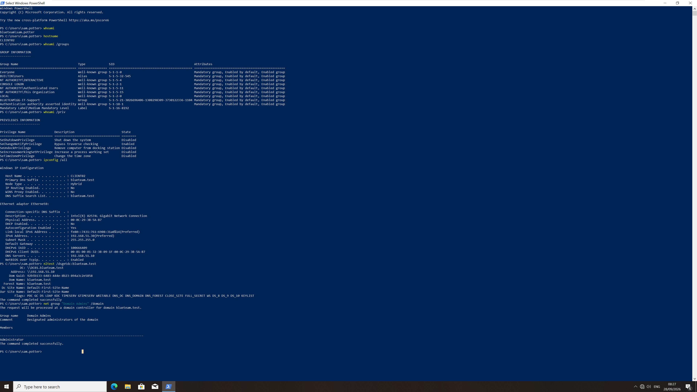

## Service Registry Permissions Reconnaissance

The first Atomic Red Team test evaluated behaviour associated with:

[T1574.011 — Hijack Execution Flow: Services Registry Permissions Weakness](https://attack.mitre.org/techniques/T1574/011/)

The test was executed as the standard user:

```powershell
Invoke-AtomicTest T1574.011 -TestNumbers 1
```

The test enumerated Access Control Lists under:

```text
HKLM\SYSTEM\CurrentControlSet\Services\*
```

using:

```powershell
get-acl REGISTRY::HKLM\SYSTEM\CurrentControlSet\Services\* | FL
```

The purpose of this enumeration is to identify service Registry keys whose permissions could allow a low-privileged user to modify service configuration.

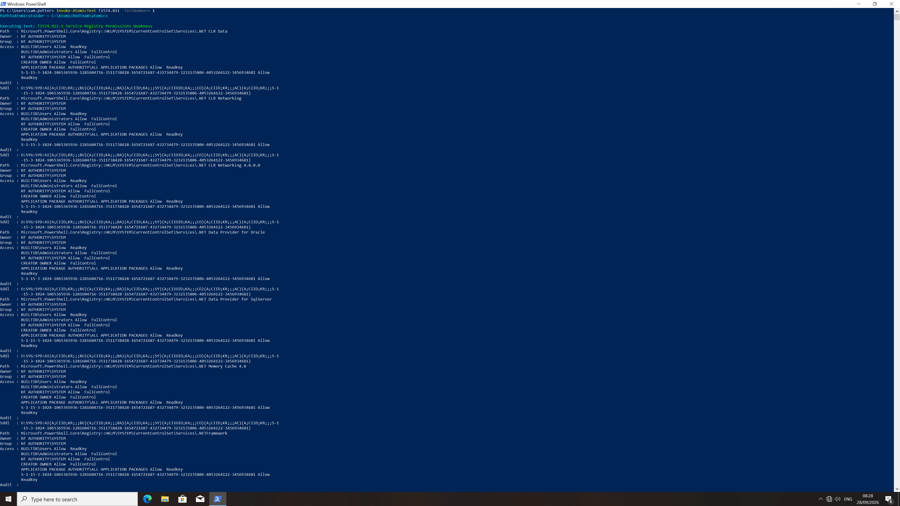

The Atomic test also attempted to inspect a single service using the input value `weak_service_name`. Because no custom service name was supplied, Atomic used its default value:

```text
weakservicename
```

The resulting path did not exist and PowerShell returned a `Get-Acl` path-not-found error.

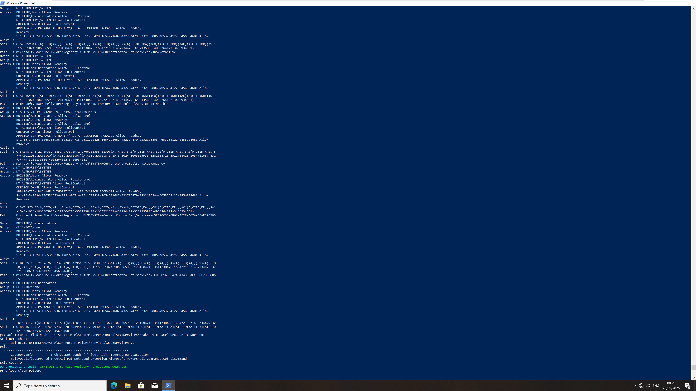

This error does not mean that the enumeration failed. The first command successfully enumerated the service Registry ACLs; the second command simply attempted to inspect a placeholder service name that did not exist.

An additional effective-write check was performed as `BLUETEAM\sam.potter`. No service Registry key could be opened with write access from the current standard-user context.

**Outcome:** no exploitable service Registry permissions weakness was identified and privilege escalation was not achieved.

### Sysmon Process Evidence

Once the suspicious PowerShell activity had been scoped to `CLIENT02`, Sysmon Event ID `1` was used to confirm the exact process and command line:

```spl
index=* host=CLIENT02 sourcetype="XmlWinEventLog:Microsoft-Windows-Sysmon/Operational" EventCode=1 Image="*\\powershell.exe" CommandLine="*get-acl*" CommandLine="*CurrentControlSet*Services*"
| table _time User ParentImage ParentCommandLine CommandLine IntegrityLevel ProcessId ParentProcessId
| sort by _time
```

The search returned one relevant process at `08:28:13.023 UTC`.

Important fields included:

```text
User:             BLUETEAM\sam.potter
Image:            powershell.exe
IntegrityLevel:   Medium
ProcessId:        1412
ParentProcessId:  1516
```

The command line contained both service Registry `Get-Acl` operations, including the attempted lookup of `weakservicename`.

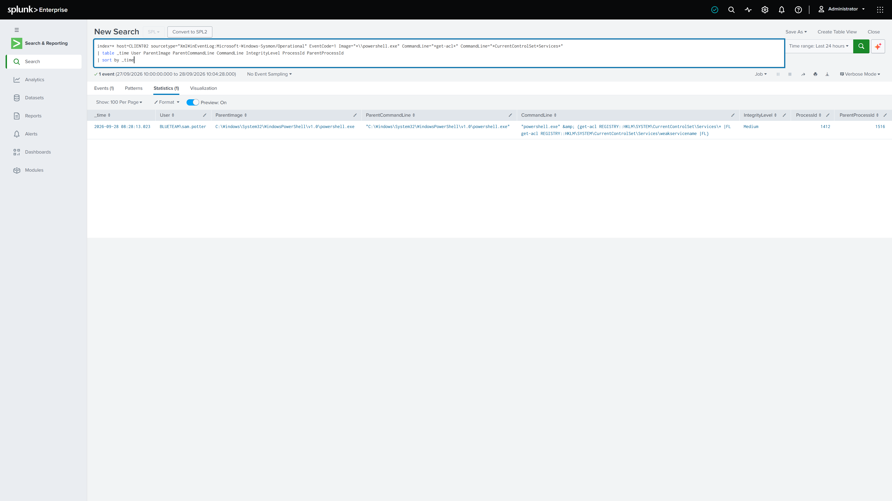

### PowerShell Script Block Evidence

A one-minute PowerShell Script Block Logging search initially returned approximately 80 events:

```spl
index=* host=CLIENT02 sourcetype="XmlWinEventLog:Microsoft-Windows-PowerShell/Operational" EventCode=4104 earliest="09/28/2026:08:28:00" latest="09/28/2026:08:29:00"
| table _time ScriptBlockText
| sort by _time
```

This illustrates why a narrow time window alone is not always enough to isolate one action. PowerShell generates additional framework and session activity around the command of interest.

The results were therefore narrowed using strings already visible in the suspicious process command line:

```spl
index=* host=CLIENT02 sourcetype="XmlWinEventLog:Microsoft-Windows-PowerShell/Operational" EventCode=4104 earliest="09/28/2026:08:28:00" latest="09/28/2026:08:29:00" ScriptBlockText="*get-acl*" ScriptBlockText="*CurrentControlSet*Services*"
| table _time ScriptBlockText
| sort by _time
```

Two relevant script blocks remained:

```powershell
& {get-acl REGISTRY::HKLM\SYSTEM\CurrentControlSet\Services\* |FL
get-acl REGISTRY::HKLM\SYSTEM\CurrentControlSet\Services\weakservicename |FL}
```

and:

```powershell
{get-acl REGISTRY::HKLM\SYSTEM\CurrentControlSet\Services\* |FL
get-acl REGISTRY::HKLM\SYSTEM\CurrentControlSet\Services\weakservicename |FL}
```

The empty `Path` field in these events is expected because the commands were executed interactively rather than from a PowerShell script file.

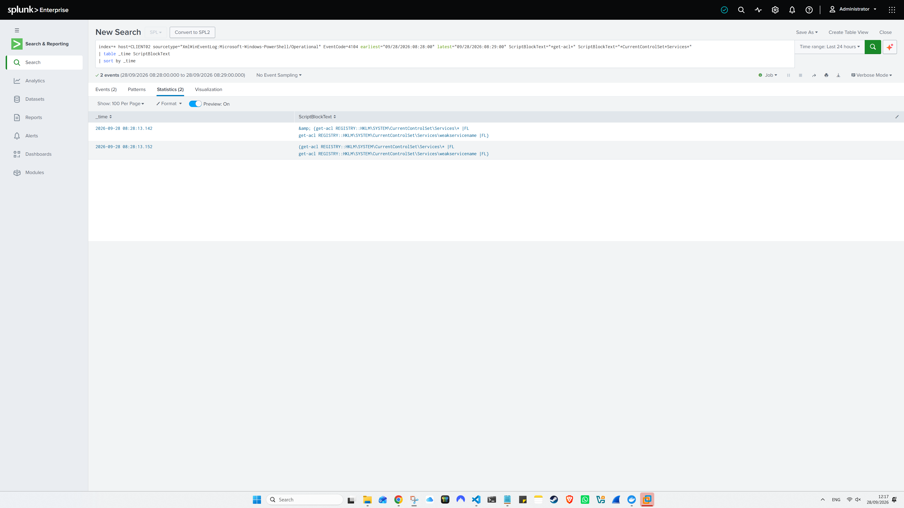

## Encoded PowerShell Execution

The second Atomic Red Team test simulated suspicious PowerShell execution:

[T1059.001 — Command and Scripting Interpreter: PowerShell](https://attack.mitre.org/techniques/T1059/001/)

The test was executed with:

```powershell
Invoke-AtomicTest T1059.001 -TestNumbers 17
```

Atomic launched PowerShell with the `-e` / `EncodedCommand` parameter and supplied a Base64-encoded command.

The command executed successfully and produced:

```text
Hello, from PowerShell!
```

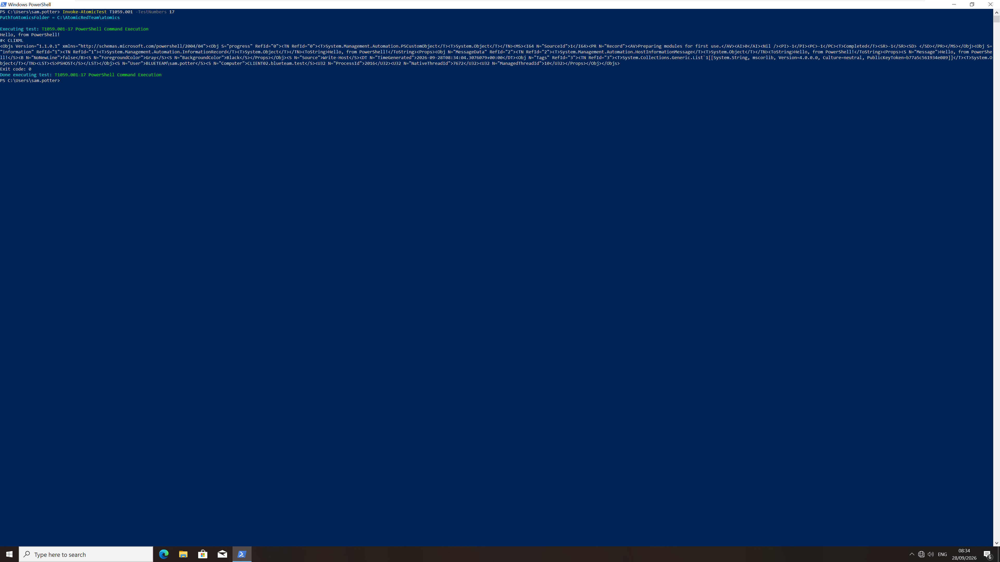

### Sysmon Process Evidence

A defender can hunt for encoded PowerShell without knowing the Atomic test name by looking for PowerShell process creation containing the encoded-command switch:

```spl
index=* host=CLIENT02 sourcetype="XmlWinEventLog:Microsoft-Windows-Sysmon/Operational" EventCode=1 Image="*\\powershell.exe" CommandLine="* -e *"
| table _time User ParentImage ParentCommandLine Image CommandLine IntegrityLevel ProcessId ParentProcessId
| sort by _time
```

The search returned one relevant event at `08:34:04.168 UTC`.

The process was executed as:

```text
User:             BLUETEAM\sam.potter
ParentImage:      C:\Windows\System32\cmd.exe
Image:            C:\Windows\System32\WindowsPowerShell\v1.0\powershell.exe
IntegrityLevel:   Medium
ProcessId:        2016
ParentProcessId:  2636
```

The command line contained:

```text
powershell.exe -e JgAgACgAZwBjAG0AIAAoACcAaQBlAHsAMAB9ACcAIAAtAGYAIAAnAHgAJwApACkAIAAoACIAVwByACIAKwAiAGkAdAAiACsAIgBlAC0ASAAiACsAIgBvAHMAdAAgACcASAAiACsAIgBlAGwAIgArACIAbABvACwAIABmAHIAIgArACIAbwBtACAAUAAiACsAIgBvAHcAIgArACIAZQByAFMAIgArACIAaAAiACsAIgBlAGwAbAAhACcAIgApAA==
```

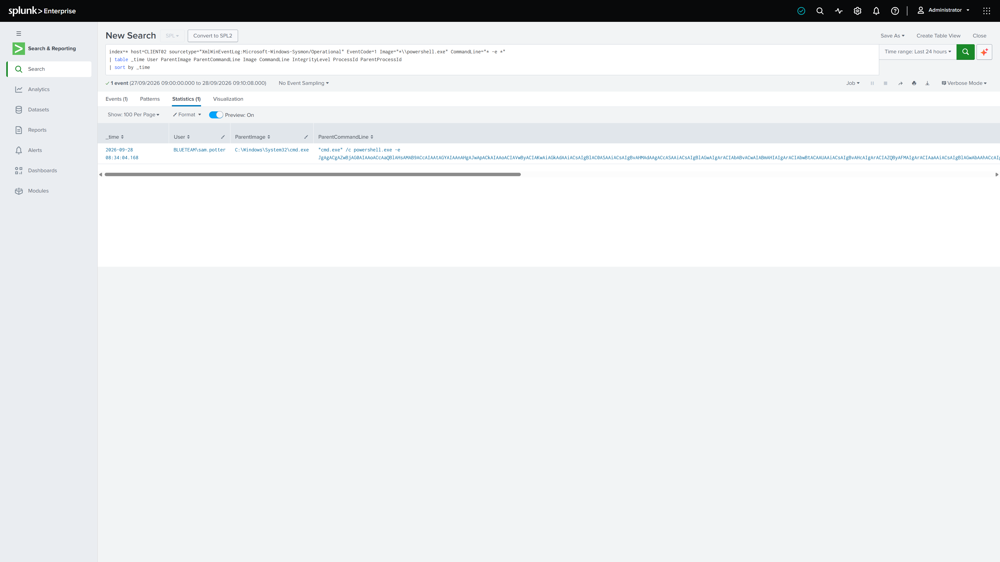

### Decoding the Command

The Base64 value was copied into CyberChef.

The recipe used:

```text
From Base64
Decode text → UTF-16LE (1200)
```

PowerShell's `-EncodedCommand` parameter expects text encoded as UTF-16LE before Base64 encoding, which explains why a plain Base64 decode initially produced text containing null-byte style spacing.

The decoded command was:

```powershell
& (gcm ('ie{0}' -f 'x')) ("Wr"+"it"+"e-H"+"ost 'H"+"el"+"lo, fr"+"om P"+"ow"+"erS"+"h"+"ell!'")
```

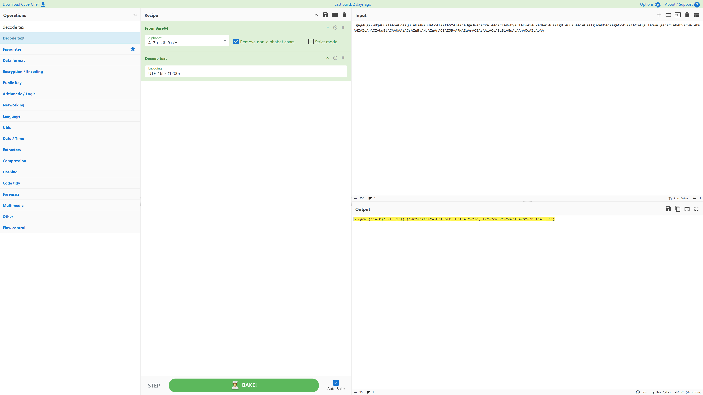

The command is intentionally obfuscated:

- `gcm` is the PowerShell alias for `Get-Command`.
- `'ie{0}' -f 'x'` produces `iex`.
- `iex` resolves to `Invoke-Expression`.
- String concatenation reconstructs `Write-Host 'Hello, from PowerShell!'`.

Functionally, the command becomes equivalent to:

```powershell
Invoke-Expression "Write-Host 'Hello, from PowerShell!'"
```

The behaviour therefore maps not only to PowerShell execution but also to [T1027.010 — Obfuscated Files or Information: Command Obfuscation](https://attack.mitre.org/techniques/T1027/010/).

### PowerShell Script Block Evidence

PowerShell Script Block Logging was then used to inspect what the PowerShell engine actually processed:

```spl
index=* host=CLIENT02 sourcetype="XmlWinEventLog:Microsoft-Windows-PowerShell/Operational" EventCode=4104 earliest="09/28/2026:08:34:00" latest="09/28/2026:08:35:00" (ScriptBlockText="*gcm ('ie{0}'*" OR ScriptBlockText="*Hello, from PowerShell!*")
| table _time ScriptBlockText
| sort by _time
```

Two events were returned:

```text
08:34:04.272
& (gcm ('ie{0}' -f 'x')) ("Wr"+"it"+"e-H"+"ost 'H"+"el"+"lo, fr"+"om P"+"ow"+"erS"+"h"+"ell!'")

08:34:04.314
Write-Host 'Hello, from PowerShell!'
```

This is an important visibility difference.

Sysmon showed the encoded process command line, while Event ID `4104` exposed the PowerShell content after the engine processed it.

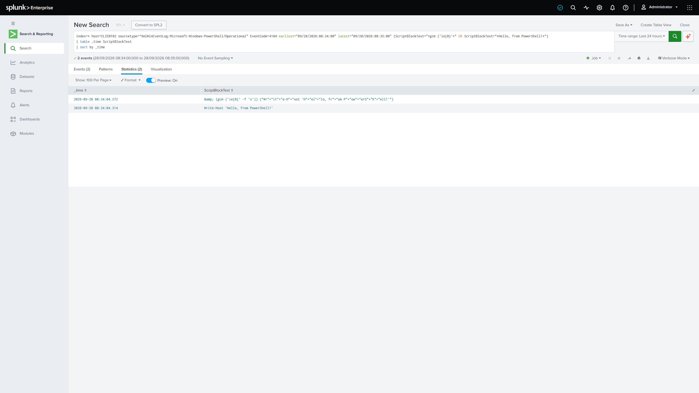

## Scheduled Task Persistence

The third Atomic Red Team test simulated persistence using:

[T1053.005 — Scheduled Task/Job: Scheduled Task](https://attack.mitre.org/techniques/T1053/005/)

The test was executed with:

```powershell
Invoke-AtomicTest T1053.005 -TestNumbers 7
```

The Atomic test performed two important actions:

1. Stored an encoded command in the current user's Registry hive.
2. Created a Windows scheduled task that read, decoded and executed that Registry value.

The scheduled task was created successfully.

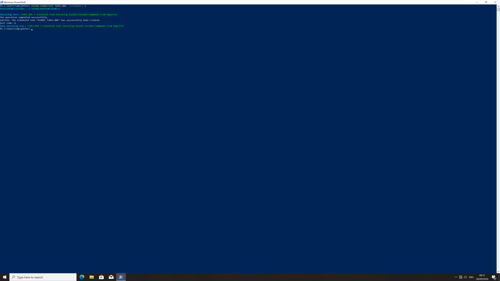

### Persistence Configuration

The Registry value and task configuration were inspected from the endpoint:

```powershell
Get-ItemProperty 'HKCU:\SOFTWARE\ATOMIC-T1053.005'

schtasks /Query /TN "ATOMIC-T1053.005" /V /FO LIST
```

The Registry contained:

```text
test : cGluZyAxMjcuMC4wLjE=
```

This Base64 string decodes to:

```text
ping 127.0.0.1
```

The scheduled task configuration showed:

```text
TaskName:       \ATOMIC-T1053.005
Status:         Ready
Run As User:    sam.potter
Schedule Type:  Daily
Start Time:     07:45:00
```

The configured action launched:

```text
cmd /c start /min "" powershell.exe -Command IEX(
    [System.Text.Encoding]::ASCII.GetString(
        [System.Convert]::FromBase64String(
            (Get-ItemProperty -Path HKCU:\SOFTWARE\ATOMIC-T1053.005).test
        )
    )
)
```

This mechanism combines several behaviours:

```text
Scheduled Task
→ cmd.exe
→ powershell.exe
→ read encoded Registry value
→ Base64 decode
→ IEX
→ ping 127.0.0.1
```

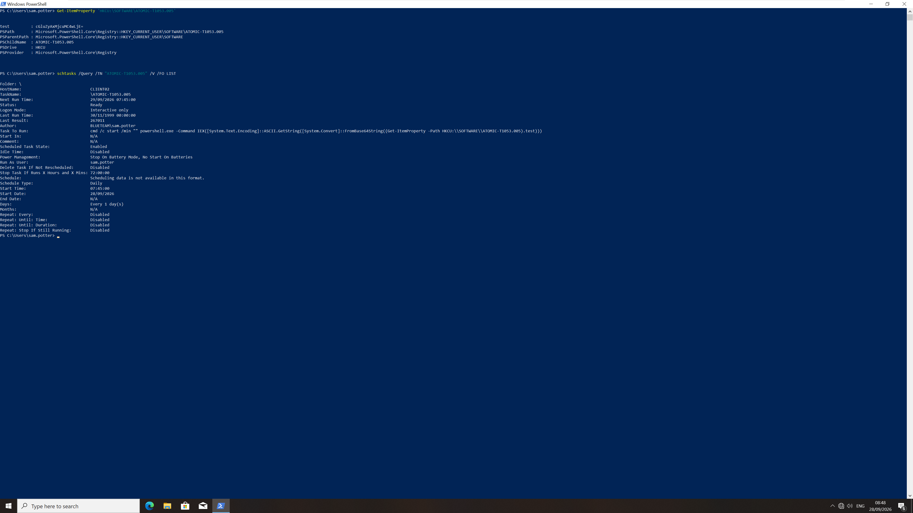

### Manual Execution Validation

The task was manually triggered to confirm that the persistence mechanism worked:

```powershell
schtasks /Run /TN "ATOMIC-T1053.005"

Start-Sleep -Seconds 5

schtasks /Query /TN "ATOMIC-T1053.005" /V /FO LIST
```

The task reported a successful execution:

```text
Last Run Time:  28/09/2026 08:49:12
Last Result:    0
```

The manual `/Run` operation was part of laboratory validation. In a real intrusion, a scheduled task may instead execute automatically according to its configured trigger.

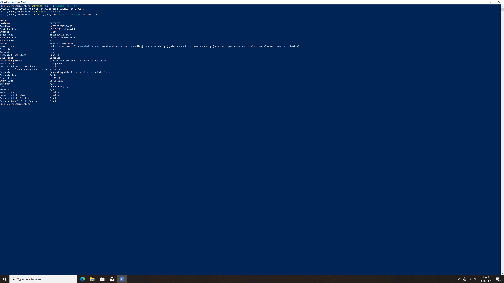

### Defender Investigation — Discovering Scheduled-Task Activity

The defender-side investigation did not begin by searching for the literal Atomic task name.

A broad Sysmon search was first used to identify scheduled-task utility execution:

```spl
index=* host=CLIENT02 sourcetype="XmlWinEventLog:Microsoft-Windows-Sysmon/Operational" EventCode=1 Image="*\\schtasks.exe"
| table _time User ParentImage CommandLine IntegrityLevel ProcessId ParentProcessId
| sort by _time
```

Six events were returned.

The first relevant event at `08:37:26.884 UTC` contained:

```text
schtasks.exe /Create /F /TN "ATOMIC-T1053.005" ...
```

This event naturally revealed the task name and the suspicious task action, which launched PowerShell and decoded data from the Registry.

The remaining `schtasks.exe` events showed later task queries, the manual `/Run`, cleanup deletion and the final validation query.

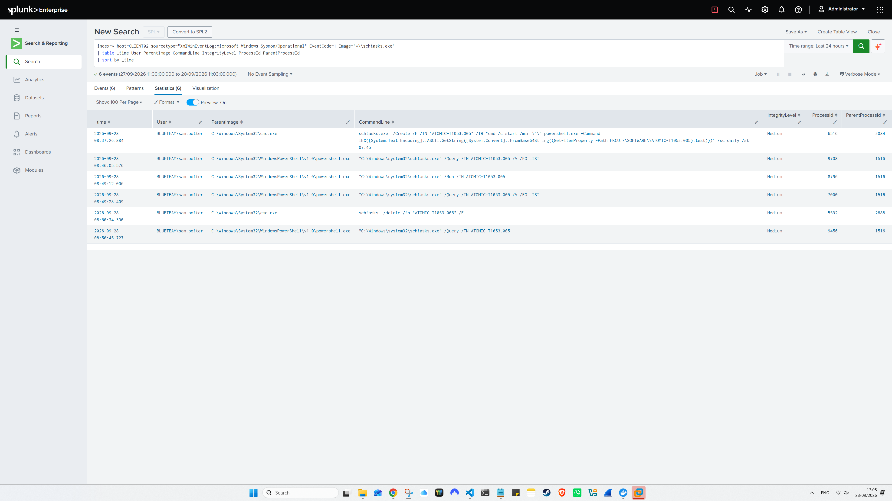

### Pivoting on the Discovered Task Name

After discovering the task name from the broad search, it became a valid investigation pivot.

The following query searched all Sysmon process-creation events whose command line referenced that task:

```spl
index=* host=CLIENT02 sourcetype="XmlWinEventLog:Microsoft-Windows-Sysmon/Operational" EventCode=1 CommandLine="*ATOMIC-T1053.005*"
| table _time User ParentImage Image CommandLine IntegrityLevel ProcessId ParentProcessId
| sort by _time
```

The search returned 12 events and reconstructed the complete laboratory lifecycle.

| Time | Process / action | Interpretation |
| --- | --- | --- |
| `08:37:26.833` | `cmd.exe /c reg add ... & schtasks.exe /Create ...` | Atomic launches the Registry write and task creation chain |
| `08:37:26.865` | `reg.exe add HKCU\SOFTWARE\ATOMIC-T1053.005 ...` | Encoded command stored in the current user's Registry |
| `08:37:26.884` | `schtasks.exe /Create ...` | Scheduled task created |
| `08:46:05.576` | `schtasks.exe /Query ...` | Analyst-side validation of the task configuration |
| `08:49:12.006` | `schtasks.exe /Run ...` | Manual laboratory execution of the task |
| `08:49:12.030` | `svchost.exe → cmd.exe` | Task Scheduler launches the configured command |
| `08:49:12.123` | `cmd.exe → powershell.exe` | PowerShell reads and decodes the Registry payload |
| `08:49:28.409` | `schtasks.exe /Query ...` | Analyst verifies the task result |
| `08:50:34.361` | `cmd.exe /c schtasks /delete ... & reg delete ...` | Atomic cleanup routine begins |
| `08:50:34.390` | `schtasks.exe /delete ...` | Scheduled task removed |
| `08:50:34.407` | `reg.exe delete ...` | Registry value removed |
| `08:50:45.727` | `schtasks.exe /Query ...` | Final analyst validation confirms the task no longer exists |

The distinction between simulated attacker activity and laboratory validation is important. The task creation and execution chain represent the malicious behaviour being investigated. The `/Query` commands and cleanup actions were performed by the analyst as part of controlled validation and restoration of the lab.

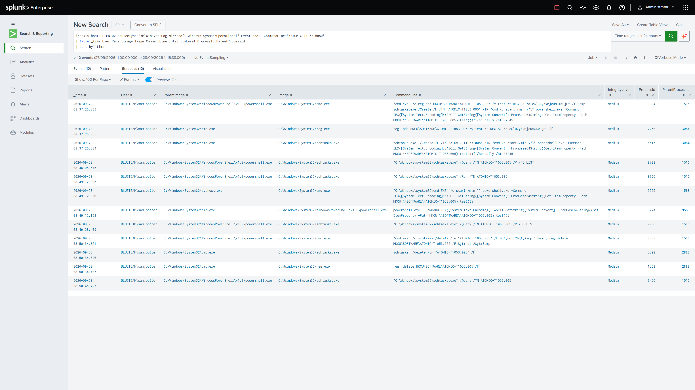

### PowerShell Execution Generated by the Task

The scheduled task launched PowerShell, so the investigation pivoted into PowerShell Script Block Logging around the execution time:

```spl
index=* host=CLIENT02 sourcetype="XmlWinEventLog:Microsoft-Windows-PowerShell/Operational" EventCode=4104 earliest="09/28/2026:08:49:00" latest="09/28/2026:08:50:00"
| table _time ScriptBlockText Path
| sort by _time
```

Eleven events were returned.

The relevant sequence was:

```text
08:49:12.000
schtasks /Run /TN "ATOMIC-T1053.005"

08:49:22.756
IEX([System.Text.Encoding]::ASCII.GetString([System.Convert]::FromBase64String((Get-ItemProperty -Path HKCU:\SOFTWARE\ATOMIC-T1053.005).test)))

08:49:22.866
ping 127.0.0.1

08:49:28.407
schtasks /Query /TN "ATOMIC-T1053.005" /V /FO LIST
```

Other events in the same minute, such as `prompt`, `$global:?`, `cls` and `Start-Sleep`, were ordinary PowerShell session activity surrounding the test.

The `Path` field was empty because these commands were executed interactively or dynamically rather than from a `.ps1` file.

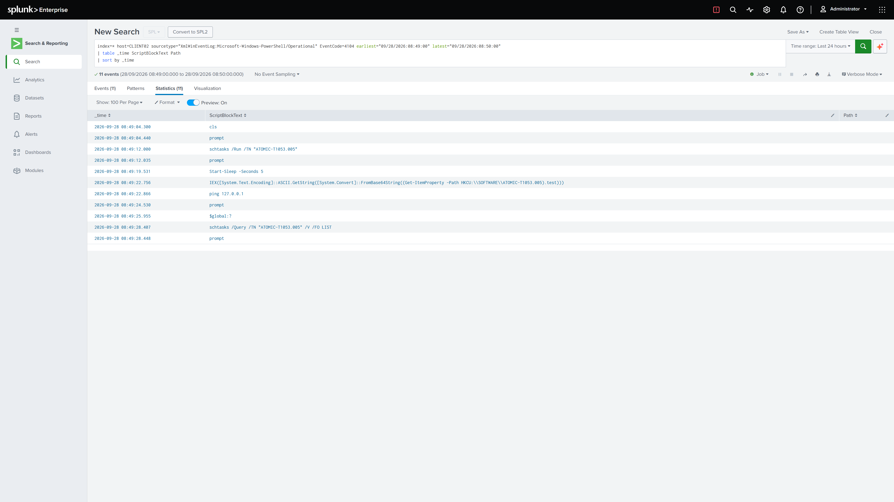

### Confirming the Final Child Process

The Script Block event showed that the decoded command was `ping 127.0.0.1`.

That observation provided a natural pivot into Sysmon process creation around the same timestamp:

```spl
index=* host=CLIENT02 sourcetype="XmlWinEventLog:Microsoft-Windows-Sysmon/Operational" EventCode=1 earliest="09/28/2026:08:49:20" latest="09/28/2026:08:49:30" Image="*\\PING.EXE"
| table _time User ParentImage ParentCommandLine Image CommandLine IntegrityLevel ProcessId ParentProcessId
| sort by _time
```

One event was returned at `08:49:22.872 UTC`:

```text
User:               BLUETEAM\sam.potter
ParentImage:        powershell.exe
Image:              C:\Windows\System32\PING.EXE
CommandLine:        "C:\Windows\system32\PING.EXE" 127.0.0.1
IntegrityLevel:     Medium
ProcessId:          6868
ParentProcessId:    5224
```

The parent PowerShell command line contained the same `FromBase64String(...Get-ItemProperty...)` expression previously observed.

This confirms the final execution chain:

```text
Task Scheduler
→ cmd.exe
→ powershell.exe
→ decode Registry value
→ PING.EXE 127.0.0.1
```

### Additional Telemetry Checks

Two additional searches produced no matching events:

```spl
index=* host=CLIENT02 sourcetype="XmlWinEventLog:Microsoft-Windows-Sysmon/Operational" EventCode=3 (ProcessId=2016 OR ProcessId=5224)
| table _time User Image ProcessId SourceIp SourcePort DestinationIp DestinationPort Protocol Initiated
| sort by _time
```

and:

```spl
index=* host=CLIENT02 sourcetype="WinEventLog:Security" (EventCode=4698 OR EventCode=4699 OR EventCode=4702) earliest="09/28/2026:08:37:00" latest="09/28/2026:08:51:00"
| table _time EventCode SubjectUserName TaskName TaskContent
| sort by _time
```

The absence of these events does not invalidate the activity because the execution was independently confirmed by Sysmon Event ID `1` and PowerShell Event ID `4104`.

Sysmon Registry telemetry was also reviewed with:

```spl
index=* host=CLIENT02 sourcetype="XmlWinEventLog:Microsoft-Windows-Sysmon/Operational" (EventCode=12 OR EventCode=13 OR EventCode=14) TargetObject="*ATOMIC-T1053.005*"
| table _time EventCode User Image EventType TargetObject Details ProcessId
| sort by _time
```

Four events were returned from the Task Scheduler service context:

- Three Event ID `13` `SetValue` operations during task creation.
- One Event ID `12` `DeleteKey` operation during cleanup.

These Registry events provide supplementary corroboration of the scheduled-task lifecycle, but the primary investigation evidence remains the clearer process and PowerShell execution chain above.

## Timeline

| Time (UTC) | Event | Evidence |
| --- | --- | --- |
| `08:24:23` | Official incident-generation window begins | Endpoint timestamp |
| `~08:24` | Manual host, user, privilege, network and domain discovery | PowerShell / command output |
| `08:28:13` | Service Registry permissions enumeration executed | Sysmon Event ID `1`, PowerShell Event ID `4104` |
| `08:34:04` | Encoded PowerShell process launched from `cmd.exe` | Sysmon Event ID `1` |
| `08:34:04` | Obfuscated command and resolved `Write-Host` content captured | PowerShell Event ID `4104` |
| `08:37:26` | Base64 command stored under `HKCU\SOFTWARE\ATOMIC-T1053.005` | Sysmon process telemetry |
| `08:37:26` | Scheduled task `ATOMIC-T1053.005` created | Sysmon process telemetry |
| `08:46:05` | Task configuration queried for analyst validation | Sysmon Event ID `1` |
| `08:49:12` | Scheduled task manually triggered | Sysmon Event ID `1` |
| `08:49:12` | Task Scheduler launches `cmd.exe`, followed by PowerShell | Sysmon Event ID `1` |
| `08:49:22` | PowerShell decodes the Registry value | PowerShell Event ID `4104` |
| `08:49:22` | Decoded command `ping 127.0.0.1` executes | PowerShell Event ID `4104`, Sysmon Event ID `1` |
| `08:50:34` | Atomic cleanup deletes the task and Registry value | Sysmon Event ID `1` |
| `08:50:45` | Final task query confirms removal | Endpoint / Sysmon evidence |

## Scope, Entities and Indicators

### Confirmed Scope

The confirmed scope is limited to:

```text
Endpoint:  CLIENT02
User:      BLUETEAM\sam.potter
Domain:    blueteam.test
Role:      IT Support
```

Observed activity:

- Host and user discovery.
- Group and privilege discovery.
- Network and domain-controller discovery.
- Domain Admin group enumeration.
- Service Registry permission reconnaissance.
- Encoded / obfuscated PowerShell execution.
- User-level Registry modification.
- Scheduled-task persistence.
- Dynamic Base64 decoding.
- Execution of `ping 127.0.0.1`.
- Controlled cleanup.

Not observed:

- Successful privilege escalation.
- Administrator or SYSTEM-level attacker execution.
- Credential dumping.
- Lateral movement.
- Additional compromised endpoints.
- External payload retrieval.
- Command-and-control traffic.
- Data collection or exfiltration.
- Destructive activity.

### Relevant Observables

| Observable | Role | Defensive treatment |
| --- | --- | --- |
| `powershell.exe -e <Base64>` | Encoded PowerShell execution | High-value behavioural hunting pattern when correlated with context |
| `HKCU\SOFTWARE\ATOMIC-T1053.005` | Lab Registry storage location | Lab-specific artifact; not a universal IOC |
| `ATOMIC-T1053.005` | Lab scheduled-task name | Lab-specific artifact; do not build a production rule around this literal string |
| `schtasks.exe /Create` | Scheduled-task creation | Behavioural detection candidate |
| `FromBase64String(...)` | Runtime decoding | Suspicious when combined with execution and persistence |
| `IEX(...)` | Dynamic PowerShell execution | High-value PowerShell hunting signal |
| `ping 127.0.0.1` | Benign test payload | Demonstrates execution only; not malicious by itself |

The `ATOMIC-*` names are artifacts of the adversary-emulation framework. They identify this laboratory execution but should not be treated as production threat indicators.

## Verdict and Severity

### Verdict

**True positive — controlled malicious-behaviour simulation**

The telemetry confirms that the suspicious actions actually occurred on `CLIENT02`.

The activity included:

- Post-compromise discovery.
- Service Registry permission reconnaissance.
- Obfuscated PowerShell execution.
- Registry modification.
- Scheduled-task persistence.
- Dynamic decoding and execution of a Registry-stored command.

The scenario therefore represents genuine malicious-style behaviour from a detection and investigation perspective, even though the payloads were intentionally benign and the activity was generated in a controlled laboratory.

### Privilege Escalation Assessment

**Not achieved.**

The T1574.011 test enumerated service Registry ACLs but did not identify a writable service Registry key for the current standard-user context.

The later execution also remained at:

```text
IntegrityLevel=Medium
User=BLUETEAM\sam.potter
```

No evidence showed a transition to an administrator, elevated token or SYSTEM attacker context.

### Impact

**Confirmed user-context execution and persistence.**

A scheduled task was created and successfully executed under `sam.potter`.

The decoded payload was intentionally benign:

```text
ping 127.0.0.1
```

No external target was contacted by that payload.

### Severity

**Medium — lab assessment**

The severity is based on confirmed command execution and persistence on a compromised endpoint.

The activity is not rated higher because:

- Privilege escalation was unsuccessful.
- The persistence remained in the compromised user's context.
- No external C2 activity was observed.
- No credential access or lateral movement was identified.
- No additional systems were affected.
- No destructive or exfiltration behaviour occurred.

In a production environment, the severity would need to be reassessed according to the actual payload, account sensitivity, host role, external communication, credential access and scope.

## MITRE ATT&CK Mapping

| Technique | Status | Rationale |
| --- | --- | --- |
| [T1033 — System Owner/User Discovery](https://attack.mitre.org/techniques/T1033/) | **Mapped** | `whoami` identified the current compromised user context. |
| [T1082 — System Information Discovery](https://attack.mitre.org/techniques/T1082/) | **Mapped** | `hostname` identified the compromised endpoint. |
| [T1069 — Permission Groups Discovery](https://attack.mitre.org/techniques/T1069/) | **Mapped** | `whoami /groups` exposed group membership associated with the current token. |
| [T1016 — System Network Configuration Discovery](https://attack.mitre.org/techniques/T1016/) | **Mapped** | `ipconfig /all` collected local network and DNS configuration. |
| [T1018 — Remote System Discovery](https://attack.mitre.org/techniques/T1018/) | **Mapped** | `nltest /dsgetdc:blueteam.test` identified the domain controller. |
| [T1069.002 — Permission Groups Discovery: Domain Groups](https://attack.mitre.org/techniques/T1069/002/) | **Mapped** | `net group "Domain Admins" /domain` enumerated Domain Admin membership. |
| [T1574.011 — Hijack Execution Flow: Services Registry Permissions Weakness](https://attack.mitre.org/techniques/T1574/011/) | **Attempted / reconnaissance only** | Service Registry ACLs were inspected, but no writable service key was found and the technique was not successfully exploited. |
| [T1059.001 — Command and Scripting Interpreter: PowerShell](https://attack.mitre.org/techniques/T1059/001/) | **Mapped** | PowerShell executed encoded and dynamically decoded commands. |
| [T1027.010 — Obfuscated Files or Information: Command Obfuscation](https://attack.mitre.org/techniques/T1027/010/) | **Mapped** | The encoded PowerShell used Base64, aliases, format substitution and string concatenation to obscure the final command. |
| [T1059.003 — Command and Scripting Interpreter: Windows Command Shell](https://attack.mitre.org/techniques/T1059/003/) | **Mapped** | `cmd.exe` was used to launch Registry modification, `schtasks.exe` and PowerShell. |
| [T1112 — Modify Registry](https://attack.mitre.org/techniques/T1112/) | **Mapped** | `reg.exe` created the `HKCU\SOFTWARE\ATOMIC-T1053.005` value used by the persistence mechanism. |
| [T1053.005 — Scheduled Task/Job: Scheduled Task](https://attack.mitre.org/techniques/T1053/005/) | **Mapped** | A Windows scheduled task was created and successfully executed under the compromised account. |
| [T1140 — Deobfuscate/Decode Files or Information](https://attack.mitre.org/techniques/T1140/) | **Mapped** | PowerShell used `FromBase64String` to decode the Registry-stored command before execution. |

No ATT&CK technique is assigned solely to `whoami /priv` in this report. The command was useful for establishing the privilege context of the compromised account, but a separate mapping would overstate what was demonstrated.

## Response and Escalation

### Actions Performed During the Lab

After validating the scheduled task, the Atomic cleanup routine was executed:

```powershell
Invoke-AtomicTest T1053.005 -TestNumbers 7 -Cleanup
```

Cleanup removed:

```text
Scheduled task:
ATOMIC-T1053.005

Registry key:
HKCU\SOFTWARE\ATOMIC-T1053.005
```

Removal was validated with:

```powershell
Test-Path 'HKCU:\SOFTWARE\ATOMIC-T1053.005'

schtasks /Query /TN "ATOMIC-T1053.005"
```

The Registry path returned:

```text
False
```

and Windows reported that the scheduled task could no longer be found.

### Recommended Production Response

Equivalent activity in a production environment should not be handled as a benign PowerShell anomaly.

Recommended actions would include:

- Isolate the affected endpoint if compromise is not already contained.
- Preserve relevant endpoint and SIEM telemetry before remediation.
- Identify the initial-access mechanism that gave the attacker execution as the user.
- Review the affected account for suspicious authentication activity.
- Reset or revoke credentials if account compromise is suspected or confirmed.
- Remove the malicious scheduled task only after evidence collection.
- Remove associated Registry artifacts only after evidence collection.
- Hunt for the same task action, Registry pattern, encoded PowerShell behaviour and related process chain across other endpoints.
- Review PowerShell, Sysmon, EDR, authentication and network telemetry for follow-on activity.
- Determine whether the same account authenticated to additional systems.
- Escalate immediately if privilege escalation, credential theft, lateral movement, C2 or additional persistence mechanisms are identified.

### Escalation Decision

**Production equivalent: escalate to Tier 2 / incident response.**

The evidence confirms both suspicious code execution and persistence. A Tier 1 analyst should not close equivalent production activity solely because the observed process runs at Medium integrity or because the final payload appears harmless.

The laboratory case was closed only because:

- the activity was deliberately generated;
- the full execution chain was known;
- the payload was benign;
- cleanup was controlled and validated;
- no broader compromise existed.

## Detection Opportunities

### 1. Encoded PowerShell

Monitor PowerShell process creation for encoded-command switches such as:

```text
-e
-enc
-EncodedCommand
```

The switch alone should not automatically generate a high-severity incident because administrators and legitimate software can use encoded PowerShell.

Confidence increases when encoded execution is combined with:

- unusual parent processes;
- Base64 content;
- `IEX` / `Invoke-Expression`;
- string concatenation;
- suspicious child processes;
- persistence activity;
- network connections;
- execution by an unexpected user.

### 2. PowerShell Script Block Logging

Event ID `4104` provided visibility that was not available from the encoded process command line.

Useful patterns include:

```text
IEX
Invoke-Expression
FromBase64String
Get-ItemProperty
gcm
string concatenation
```

The strongest detection logic should correlate several behaviours rather than alerting on one keyword in isolation.

### 3. Scheduled-Task Creation

A useful scheduled-task detection should focus on behaviour such as:

```text
schtasks.exe /Create
```

combined with suspicious task actions including:

```text
powershell.exe
cmd.exe
encoded content
IEX
Registry-based payload retrieval
unexpected user-writable paths
```

The literal task name `ATOMIC-T1053.005` must not be used as the production detection because it is specific to this test.

### 4. Registry Modification Followed by Execution

The persistence chain demonstrates a useful correlation pattern:

```text
Registry write
→ scheduled-task creation
→ task execution
→ PowerShell reads Registry value
→ Base64 decode
→ child-process execution
```

This is higher confidence than treating the Registry write or scheduled-task creation as isolated events.

### 5. Process-Tree Correlation

The scheduled-task execution produced a distinctive chain:

```text
svchost.exe
→ cmd.exe
→ powershell.exe
→ PING.EXE
```

The final child process will vary in real incidents, so detection should focus on suspicious relationships and command lines rather than `PING.EXE` itself.

### 6. Discovery Sequences

One discovery command is often legitimate.

A rapid sequence containing several of the following is more meaningful:

```text
whoami
hostname
whoami /groups
whoami /priv
ipconfig /all
nltest
net group ... /domain
```

Context remains essential because IT administrators and support staff may legitimately execute the same commands.

### 7. Data-Source Coverage

This investigation also demonstrated the importance of complementary telemetry.

Sysmon Event ID `1` provided:

- process creation;
- parent-child relationships;
- command lines;
- user;
- integrity level.

PowerShell Event ID `4104` provided:

- decoded / deobfuscated script content;
- dynamically executed PowerShell;
- the final `ping 127.0.0.1` command.

Neither source alone provided the complete picture as clearly as the two sources together.

## Lessons Learned

### Process Command Lines and Script Blocks Answer Different Questions

Sysmon showed that `powershell.exe` was launched with Base64 content.

PowerShell Script Block Logging showed what the PowerShell engine actually executed.

For encoded PowerShell investigations, both views are valuable.

### Failed Privilege Escalation Is Still Relevant Activity

The service Registry permissions test did not produce privilege escalation.

That does not make the activity irrelevant.

An adversary enumerating service permissions is still performing post-compromise reconnaissance, and the unsuccessful result helps define the incident scope.

### Persistence Can Exist Without Administrator Privileges

The scheduled task was created and executed under the standard user `sam.potter`.

Persistence therefore does not automatically imply SYSTEM or administrator access.

User-level persistence remains significant because it can re-establish execution whenever the required user context and trigger conditions are present.

### Follow the Evidence Before Using a Known Indicator

Searching immediately for:

```text
ATOMIC-T1053.005
```

would have found the activity, but it would not represent a realistic first investigative step.

The more defensible workflow was:

```text
identify schtasks.exe activity
→ observe /Create
→ discover the task name
→ pivot on that task name
→ reconstruct its lifecycle
```

Known strings become valid pivots only after the evidence exposes them.

### Cleanup Generates Telemetry Too

The 12-event scheduled-task lifecycle included both suspicious activity and laboratory actions.

The analyst-generated `/Query` operations and Atomic cleanup must not be misclassified as attacker actions simply because they contain the same task name.

Timeline reconstruction requires understanding who generated each event and why.

### Zero Results Are Findings, Not Proof of Absence

The searches for Sysmon Event ID `3` and Windows Security scheduled-task events returned no matches.

This means only that those searches produced no evidence in the available dataset.

It does not override the independent execution evidence captured by Sysmon Event ID `1` and PowerShell Event ID `4104`.

### Lab Indicators Are Not Production IOCs

Names such as:

```text
ATOMIC-T1053.005
HKCU\SOFTWARE\ATOMIC-T1053.005
```

are artifacts of Atomic Red Team.

The transferable defensive value of the investigation is the behaviour:

```text
discovery
→ reconnaissance
→ encoded PowerShell
→ Registry modification
→ scheduled-task persistence
→ runtime decoding
→ child-process execution
```

That behavioural chain is what should guide production hunting and detection engineering.
