# INC-004 — Suspicious Cross-Workstation Authentication in Microsoft Sentinel

## Contents
- [Case Overview](#case-overview)
- [Executive Summary](#executive-summary)
- [Methodology](#methodology)
- [Scenario and Data Sources](#scenario-and-data-sources)
- [Controlled Authentication Generation](#controlled-authentication-generation)
- [Sentinel Ingestion Pipeline](#sentinel-ingestion-pipeline)
- [Initial Sentinel Validation](#initial-sentinel-validation)
- [Detection Engineering](#detection-engineering)
- [Scheduled Analytics Rule and Case Generation](#scheduled-analytics-rule-and-case-generation)
- [Investigation and Scope](#investigation-and-scope)
- [Timeline](#timeline)
- [Verdict and Severity](#verdict-and-severity)
- [MITRE ATT&CK Mapping](#mitre-attck-mapping)
- [Response and Escalation](#response-and-escalation)
- [Detection Improvements](#detection-improvements)
- [Lessons Learned](#lessons-learned)
- [Case Closure](#case-closure)

## Case Overview

| Field | Value |
| --- | --- |
| Case ID | `INC-004` |
| Status | Closed |
| Incident category | Suspicious authentication / identity anomaly |
| Analysis date | 30 September 2026 |
| Environment | `blueteam.test` homelab |
| Account under investigation | `BLUETEAM\julia.smith` |
| Unexpected source | `CLIENT02` / `192.168.51.30` |
| Expected Julia source | `CLIENT01` / `192.168.51.20` |
| Target endpoint | `CLIENT01` |
| Domain controller | `DC01` |
| SIEM | Microsoft Sentinel |
| Custom table | `HomelabAuth_CL` |
| Analytics rule | `Suspicious Cross-Workstation Authentication` |
| Rule severity | Medium |
| MITRE ATT&CK | `T1078 — Valid Accounts`; `T1078.002 — Domain Accounts` |
| Confirmed activity | Five Kerberos pre-authentication failures followed by one successful Kerberos network logon from the unexpected source |
| Verdict | Benign Positive — controlled security test |
| Disposition | Closed after investigation |

## Executive Summary

A controlled authentication scenario was generated inside the `blueteam.test` homelab to build and validate an end-to-end Microsoft Sentinel workflow using lab-generated telemetry.

From `CLIENT02` (`192.168.51.30`), the credentials of `BLUETEAM\julia.smith` were used to authenticate to `CLIENT01`. Five intentionally incorrect passwords produced Windows Security Event ID `4771` on `DC01`, followed by one successful Event ID `4624` on `CLIENT01` using Kerberos and `LogonType=3`.

The VMs remained isolated from the Internet. Windows Security telemetry reached the Windows 11 host through the existing Splunk Universal Forwarder pipeline. The six scenario events were selected, normalised and sent from the host to Microsoft Sentinel through the Azure Monitor Logs Ingestion API and a Data Collection Rule.

A KQL rule detected the successful authentication because `julia.smith` authenticated from `192.168.51.30` instead of the lab baseline source `192.168.51.20`. The five preceding Kerberos failures were added as investigation context. The scheduled analytics rule generated one alert and automatically created **Case ID 4 — Suspicious Cross-Workstation Authentication**.

For investigation, 18 nearby successful human-authentication events were added as context: 12 for `sam.potter` from `192.168.51.30` and six for `julia.smith` from `192.168.51.20`. This short-window context was consistent with the configured lab baseline: `.30` was the expected source for Sam, while `.20` was the expected source for Julia.

No further Julia authentication from `192.168.51.30` was observed in the reviewed post-event window. The available authentication evidence did not establish an interactive session or post-authentication command execution. Because the detected behaviour was real but intentionally generated as authorised lab activity, the case was classified **Benign Positive** and closed.

## Methodology

The exercise separated activity generation, collection, normalisation, detection and investigation:

```text
Windows lab endpoints
        ↓
Windows Security telemetry
        ↓
Splunk Universal Forwarder
        ↓
Splunk Enterprise on Windows 11 host
        ↓
Incident-specific CSV export
        ↓
PowerShell normalisation
        ↓
Azure Monitor Logs Ingestion API
        ↓
Data Collection Rule
        ↓
HomelabAuth_CL
        ↓
Microsoft Sentinel KQL / analytics rule
        ↓
Alert
        ↓
Microsoft Defender Case
```

Splunk was used as the existing local collection and validation layer. Detection, alerting and case investigation for `INC-004` were performed in Microsoft Sentinel / Microsoft Defender.

The Windows VMs were not given Internet access. Only the Windows 11 host authenticated to Azure and submitted the selected telemetry.

## Scenario and Data Sources

The configured lab baseline was:

| Account | Expected workstation | Expected source IP |
| --- | --- | --- |
| `julia.smith` | `CLIENT01` | `192.168.51.20` |
| `sam.potter` | `CLIENT02` | `192.168.51.30` |

The anomaly was therefore not the address `192.168.51.30` itself. The suspicious condition was the use of Julia's domain credentials from the source assigned to `CLIENT02`.

`CLIENT02` is identified from the lab's static IP assignment `192.168.51.30`; the successful 4624 event did not provide a useful `WorkstationName` value.

The controlled authentication path was:

```text
CLIENT02 / 192.168.51.30
        │
        ├── five incorrect passwords as BLUETEAM\julia.smith
        │       ↓
        │     DC01
        │     Event ID 4771
        │
        └── correct password
                ↓
              CLIENT01
              Event ID 4624
              Logon Type 3
              Kerberos
```

This was a network authentication scenario, not an RDP scenario. `LogonType=3` confirms a network logon and does not by itself prove interactive desktop access.

The relevant data sources were:

| Source | Event / object | Purpose |
| --- | --- | --- |
| Windows Security on `DC01` | `4771` | Kerberos pre-authentication failures |
| Windows Security on `CLIENT01` | `4624` | Successful network authentication |
| Splunk Enterprise | `XmlWinEventLog:Security` | Local collection and event selection |
| Microsoft Sentinel | `HomelabAuth_CL` | Normalised authentication dataset |
| Sentinel Analytics | Scheduled query rule | Detection |
| Microsoft Defender Cases | Case ID `4` | Investigation and closure |

A narrow Windows firewall rule was required on `CLIENT01` because its active profile was `Public`. The rule allowed TCP/445 only from `192.168.51.30` for the controlled test.

## Controlled Authentication Generation

The official scenario window was:

```text
START: 2026-09-30T08:21:31.1538200Z
END:   2026-09-30T08:25:57.5180920Z
```

From `CLIENT02`, the following command was used:

```powershell
net use \\CLIENT01\IPC$ * /user:BLUETEAM\julia.smith
```

The password was entered interactively and was not included in the command line.

Five attempts used an intentionally incorrect password and returned Windows error `1326`. The sixth attempt used the correct password and completed successfully.

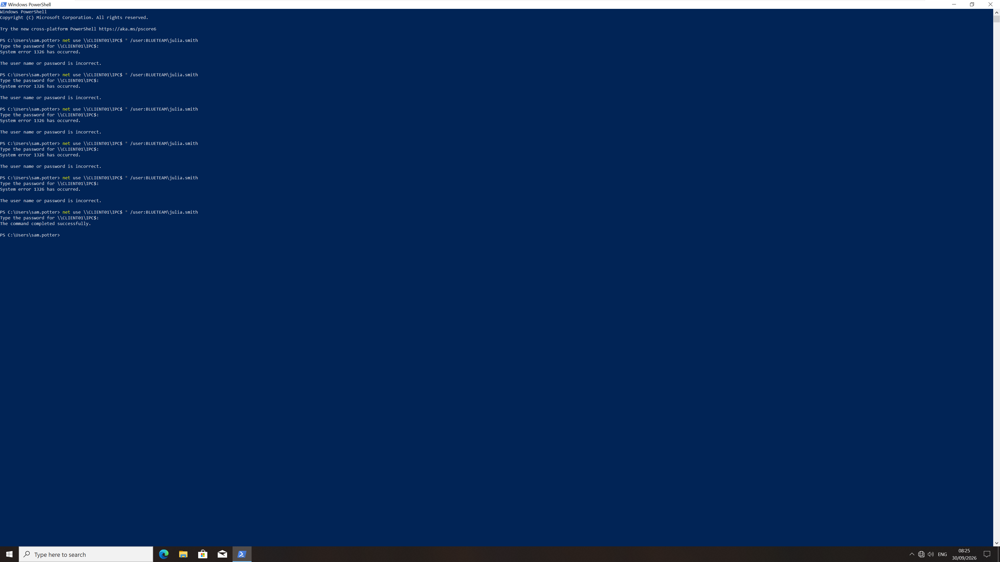

The five Kerberos failures were recorded on `DC01`:

| Time (UTC) | Event ID | Account | Client address | Client port | Status |
| --- | ---: | --- | --- | ---: | --- |
| `08:22:17.804` | `4771` | `julia.smith` | `::ffff:192.168.51.30` | `49760` | `0x18` |
| `08:22:49.715` | `4771` | `julia.smith` | `::ffff:192.168.51.30` | `49765` | `0x18` |
| `08:23:28.580` | `4771` | `julia.smith` | `::ffff:192.168.51.30` | `49770` | `0x18` |
| `08:24:01.540` | `4771` | `julia.smith` | `::ffff:192.168.51.30` | `49775` | `0x18` |
| `08:24:33.034` | `4771` | `julia.smith` | `::ffff:192.168.51.30` | `49781` | `0x18` |

The IPv4-mapped IPv6 value was normalised to `192.168.51.30` before Sentinel ingestion.

The successful authentication occurred at `08:25:29.006 UTC` on `CLIENT01`:

```text
EventID:                   4624
Account:                   julia.smith
AccountDomain:             BLUETEAM.TEST
SourceIpAddress:           192.168.51.30
SourcePort:                49784
LogonType:                 3
AuthenticationPackageName: Kerberos
EventRecordId:             51242
```

## Sentinel Ingestion Pipeline

A custom Log Analytics table named `HomelabAuth_CL` was used for the incident.

The principal fields were:

| Column | Type |
| --- | --- |
| `TimeGenerated` | `datetime` |
| `EventID` | `int` |
| `Computer` | `string` |
| `Account` | `string` |
| `AccountDomain` | `string` |
| `SourceIpAddress` | `string` |
| `SourcePort` | `int` |
| `WorkstationName` | `string` |
| `LogonType` | `int` |
| `Result` | `string` |
| `FailureReason` | `string` |
| `StatusCode` | `string` |
| `SubStatusCode` | `string` |
| `AuthenticationPackageName` | `string` |
| `LogonProcessName` | `string` |
| `EventRecordId` | `int` |

The Azure Monitor components were:

```text
Data Collection Endpoint: dce-soc-homelab-auth
Data Collection Rule:     dcr-soc-homelab-auth
Custom stream:            Custom-HomelabAuth_CL
Application registration: homelab-sentinel-ingest
```

The service principal was assigned the `Monitoring Metrics Publisher` role on the DCR. No client secret, bearer token, tenant identifier, subscription identifier or immutable DCR identifier is stored in the repository.

The six scenario records were transformed to the custom schema with PowerShell 7 and submitted as JSON through:

```text
{DCE}/dataCollectionRules/{DCR-immutable-id}/streams/Custom-HomelabAuth_CL?api-version=2023-01-01
```

The API request completed successfully and the records became queryable in Sentinel.

For investigation context, a broad 20-minute raw-log review returned 159 Event ID `4624` / `4771` records. Most belonged to `SYSTEM`, machine accounts or loopback/service activity. Eighteen nearby successful human-authentication records were selected as context and ingested through the same pipeline:

```text
sam.potter   / 192.168.51.30 → 12 successes
julia.smith  / 192.168.51.20 →  6 successes
```

The final incident-focused Sentinel dataset therefore contained 24 records: 18 contextual successes, five suspicious failures and one suspicious success.

## Initial Sentinel Validation

### Kerberos Pre-Authentication Failures

```kusto
HomelabAuth_CL
| where TimeGenerated between (
    datetime(2026-09-30T08:21:31Z) ..
    datetime(2026-09-30T08:25:57Z)
)
| where EventID == 4771
| where Account == "julia.smith"
| where SourceIpAddress == "192.168.51.30"
| project TimeGenerated, Computer, EventID, Account, SourceIpAddress,
          SourcePort, Result, FailureReason, StatusCode,
          AuthenticationPackageName, EventRecordId
| order by TimeGenerated asc
```

The query returned five failures.

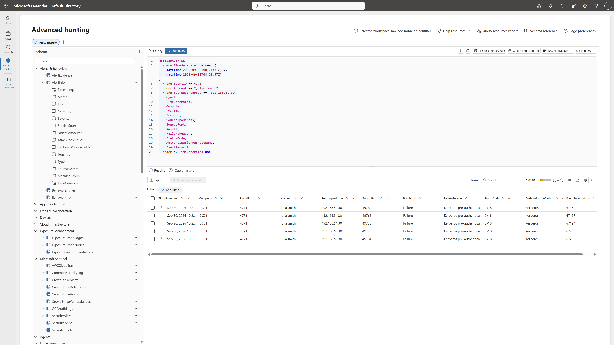

### Successful Network Logon

```kusto
HomelabAuth_CL
| where TimeGenerated between (
    datetime(2026-09-30T08:21:31Z) ..
    datetime(2026-09-30T08:25:57Z)
)
| where EventID == 4624
| where Account == "julia.smith"
| where SourceIpAddress == "192.168.51.30"
| where LogonType == 3
| project TimeGenerated, Computer, EventID, Account, AccountDomain,
          SourceIpAddress, SourcePort, LogonType, Result,
          AuthenticationPackageName, EventRecordId
```

The query returned the single successful event on `CLIENT01`.

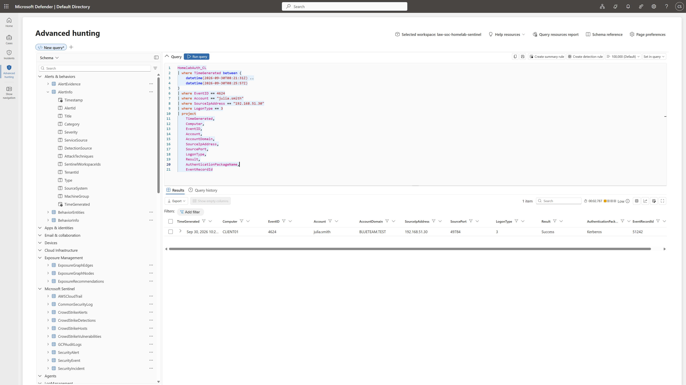

### Combined Timeline

```kusto
HomelabAuth_CL
| where TimeGenerated between (
    datetime(2026-09-30T08:21:31Z) ..
    datetime(2026-09-30T08:25:57Z)
)
| where Account == "julia.smith"
| where SourceIpAddress == "192.168.51.30"
| project TimeGenerated, Computer, EventID, Account, SourceIpAddress,
          SourcePort, LogonType, Result, AuthenticationPackageName, StatusCode
| order by TimeGenerated asc
```

The result showed five `4771` failures followed by one `4624` success.

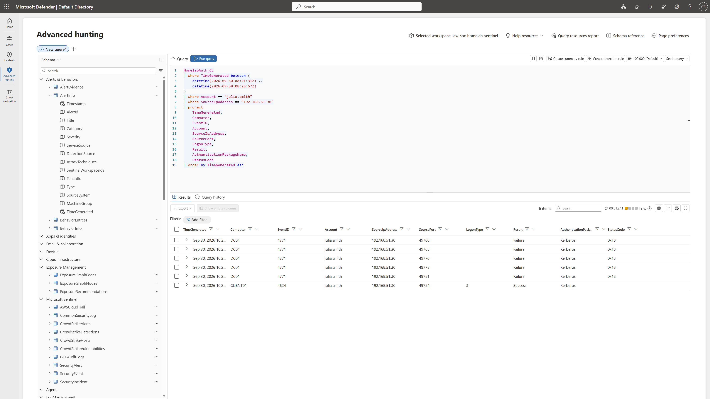

## Detection Engineering

`INC-001` already covers brute-force/password-guessing analysis. The detection for this case therefore focused on a different signal: **a successful domain authentication from a source not associated with the account in the lab baseline**.

```kusto
HomelabAuth_CL
| where EventID == 4624
| where Result == "Success"
| where LogonType == 3
| extend ExpectedSourceIp = case(
    Account == "julia.smith", "192.168.51.20",
    Account == "sam.potter",  "192.168.51.30",
    ""
)
| extend ExpectedWorkstation = case(
    Account == "julia.smith", "CLIENT01",
    Account == "sam.potter",  "CLIENT02",
    ""
)
| where isnotempty(ExpectedSourceIp)
| where SourceIpAddress != ExpectedSourceIp
| join kind=leftouter (
    HomelabAuth_CL
    | where EventID == 4771
    | where Result == "Failure"
    | summarize
        PriorFailures = count(),
        FirstFailure = min(TimeGenerated),
        LastFailure = max(TimeGenerated)
      by Account, SourceIpAddress
) on Account, SourceIpAddress
| project TimeGenerated, Account, AccountDomain, Computer,
          SourceIpAddress, ExpectedSourceIp, ExpectedWorkstation,
          LogonType, AuthenticationPackageName, PriorFailures,
          FirstFailure, LastFailure, EventRecordId
| order by TimeGenerated desc
```

The query returned one result: `julia.smith` successfully authenticated from `192.168.51.30`, while the configured Julia baseline expected `192.168.51.20`. Five matching Kerberos failures were attached as context.

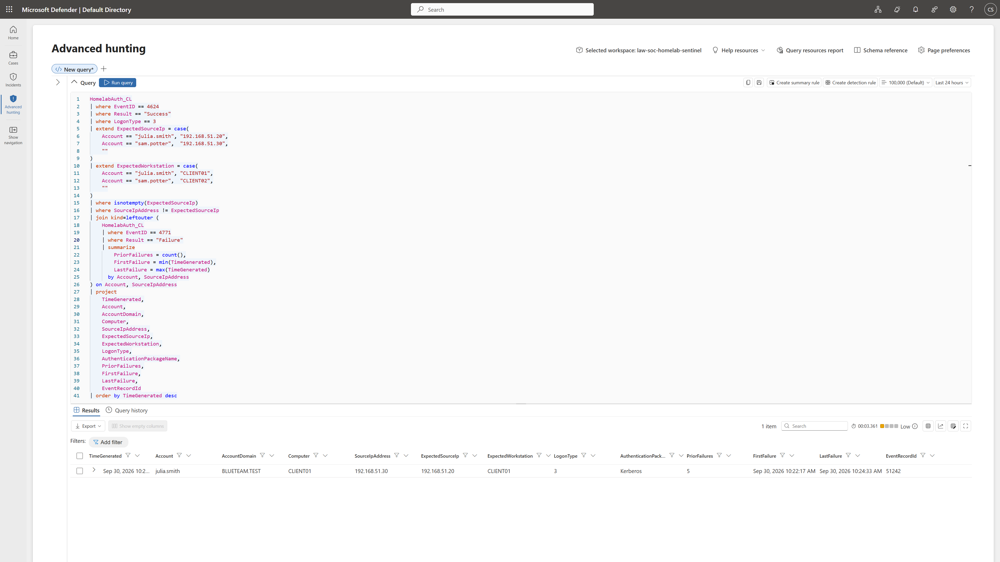

The hard-coded account/IP mapping is intentionally limited to this small homelab. It is not presented as a production-scale identity baseline.

## Scheduled Analytics Rule and Case Generation

The validated KQL became a scheduled rule named `Suspicious Cross-Workstation Authentication`.

| Setting | Value |
| --- | --- |
| Severity | Medium |
| MITRE ATT&CK | `T1078`; `T1078.002` |
| Run query every | 5 minutes |
| Lookup data from | Last 1 day |
| Threshold | More than `0` results |
| Event grouping | Single alert |
| Suppression | 24 hours after alert |
| Incident creation | Enabled |

The one-day lookback was temporary. It allowed the newly created rule to evaluate the already-ingested lab event without repeating the scenario. The 24-hour suppression prevented repeated alerts from the same historical event.

Entity mappings:

```text
Account.Name      → Account
Account.DnsDomain → AccountDomain
IP.Address        → SourceIpAddress
Host.HostName     → Computer
```

Custom details:

```text
ExpectedIP    → ExpectedSourceIp
ExpectedHost  → ExpectedWorkstation
PriorFailures → PriorFailures
FirstFailure  → FirstFailure
LastFailure   → LastFailure
AuthPackage   → AuthenticationPackageName
```

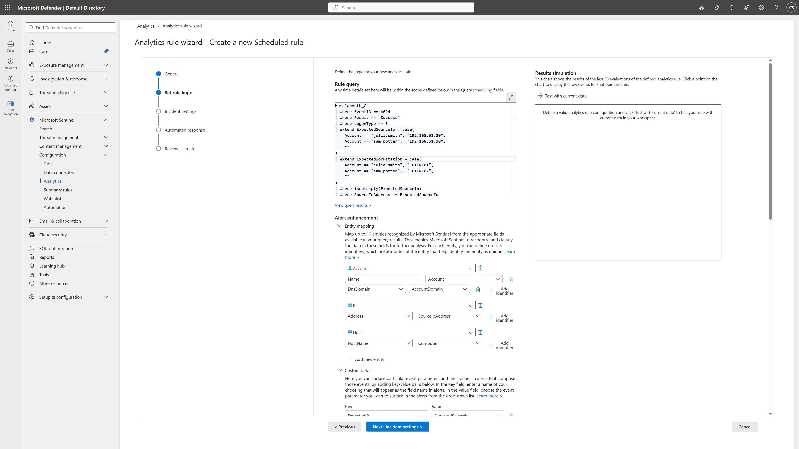

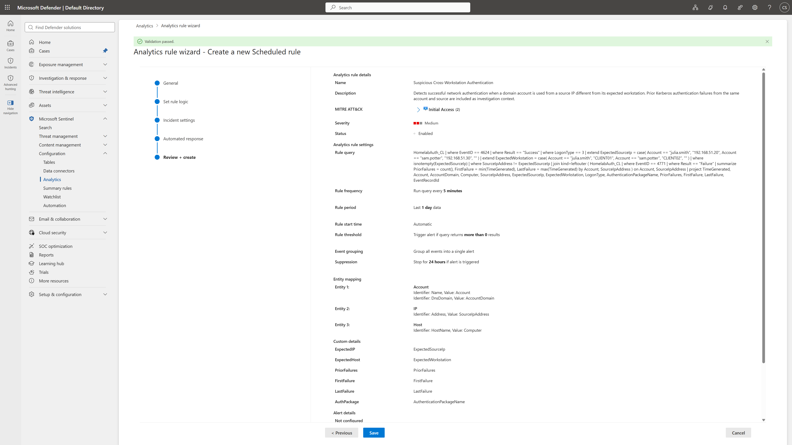

The rule generated one alert and automatically created:

```text
Case ID:   4
Name:      Suspicious Cross-Workstation Authentication
Status:    New
Severity:  Medium
```

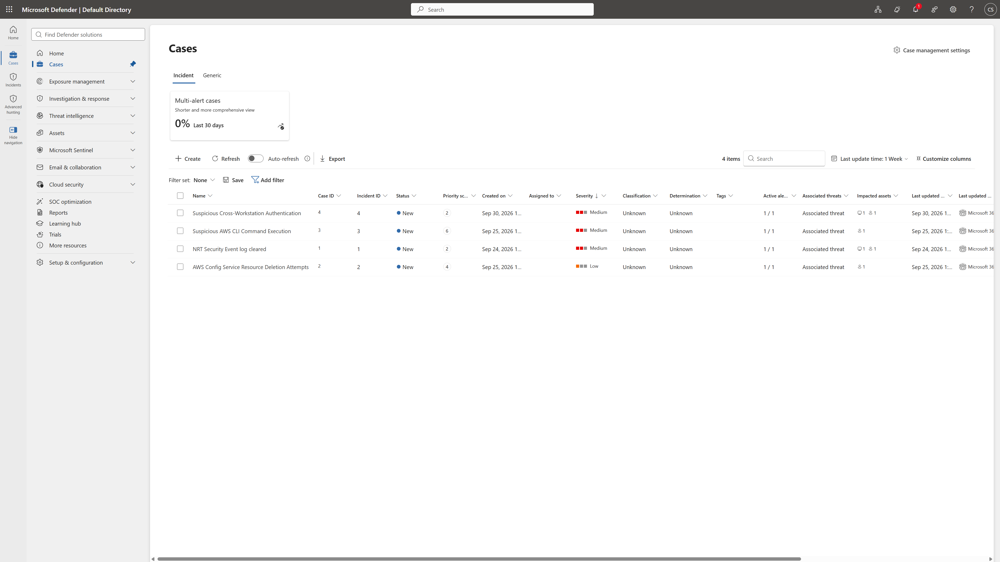

The case overview linked the source IP, target host and account:

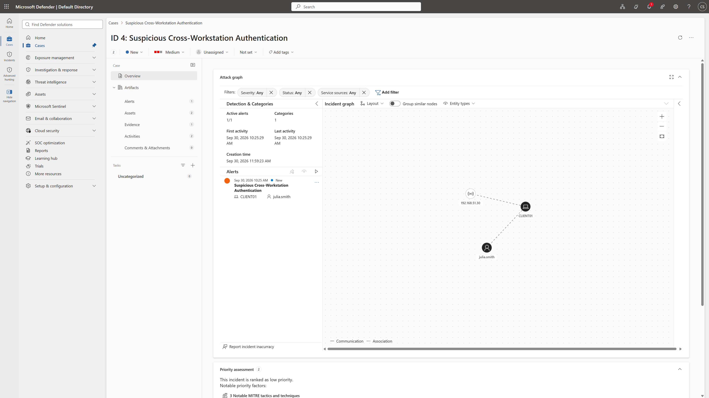

The alert exposed the observed source, expected source and five preceding failures:

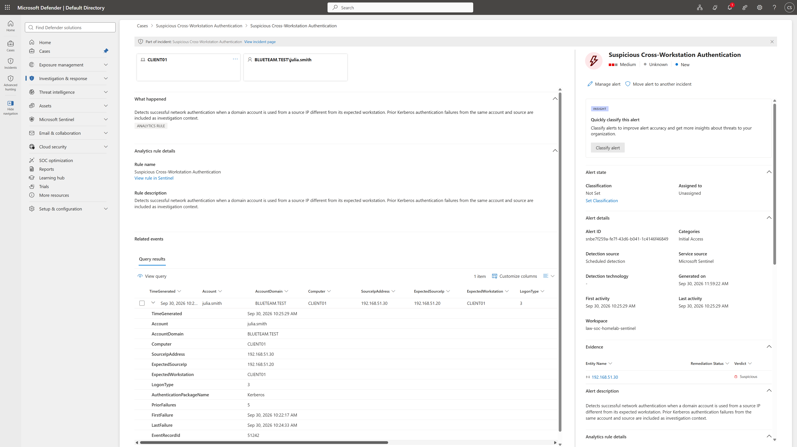

## Investigation and Scope

The alert already provided the initial hypothesis. Investigation therefore focused on validating the account/source relationship and checking the surrounding scope.

### Source-IP Pivot

```kusto
HomelabAuth_CL
| where TimeGenerated between (
    datetime(2026-09-30T08:15:00Z) ..
    datetime(2026-09-30T08:35:00Z)
)
| where SourceIpAddress == "192.168.51.30"
| summarize
    TotalEvents = count(),
    Failures = countif(Result == "Failure"),
    Successes = countif(Result == "Success"),
    FirstSeen = min(TimeGenerated),
    LastSeen = max(TimeGenerated)
  by Account, SourceIpAddress
| order by Account asc
```

The source produced 12 successful authentications for `sam.potter` and six Julia events consisting of five failures and one success. This was consistent with the lab mapping of `.30` to Sam/`CLIENT02`; the unexpected element was Julia's use of that source.

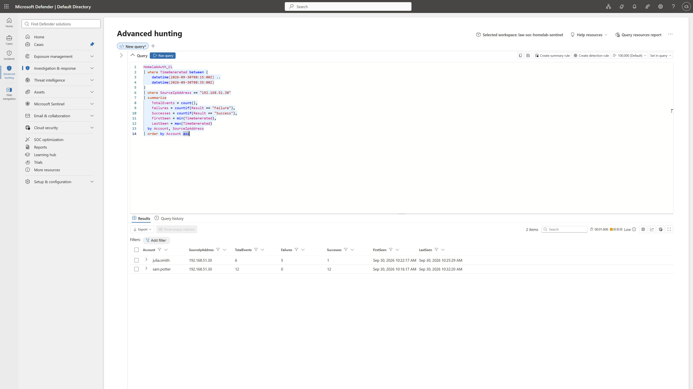

### Julia Source Pivot

```kusto
HomelabAuth_CL
| where TimeGenerated between (
    datetime(2026-09-30T08:15:00Z) ..
    datetime(2026-09-30T08:35:00Z)
)
| where Account == "julia.smith"
| summarize
    TotalEvents = count(),
    Failures = countif(Result == "Failure"),
    Successes = countif(Result == "Success"),
    FirstSeen = min(TimeGenerated),
    LastSeen = max(TimeGenerated)
  by SourceIpAddress
| order by SourceIpAddress asc
```

Julia had six successful events from the expected lab source `.20`, while `.30` produced five failures followed by one success.


### Account / Source / Host Scope

```kusto
HomelabAuth_CL
| where TimeGenerated between (
    datetime(2026-09-30T08:15:00Z) ..
    datetime(2026-09-30T08:35:00Z)
)
| summarize
    TotalEvents = count(),
    Failures = countif(Result == "Failure"),
    Successes = countif(Result == "Success"),
    FirstSeen = min(TimeGenerated),
    LastSeen = max(TimeGenerated)
  by Account, SourceIpAddress, Computer
| order by Account asc, SourceIpAddress asc, Computer asc
```

The five failures were recorded on `DC01`; the successful network logon was recorded on `CLIENT01`. This is consistent with the different roles of the domain controller and target endpoint in the authentication sequence.

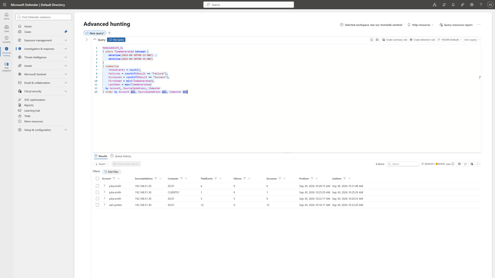

The broader raw `4624` / `4771` review used to build the context dataset showed no additional human account names in the reviewed 20-minute window beyond `sam.potter` and `julia.smith`.

### Post-Event Authentication

```kusto
HomelabAuth_CL
| where TimeGenerated > datetime(2026-09-30T08:25:29Z)
| where TimeGenerated <= datetime(2026-09-30T08:35:00Z)
| where Account == "julia.smith"
| summarize
    TotalPostEventAuth = count(),
    ExpectedSourceAuth = countif(SourceIpAddress == "192.168.51.20"),
    UnexpectedSourceAuth = countif(SourceIpAddress != "192.168.51.20"),
    ObservedSources = make_set(SourceIpAddress),
    ObservedHosts = make_set(Computer)
```

Three later Julia authentications were observed, all from `192.168.51.20`. No further Julia authentication from `.30` appeared in the reviewed window.

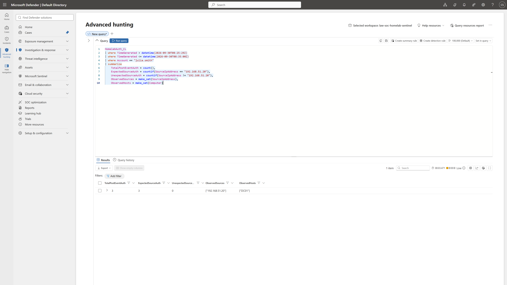

A supporting raw-log pivot identified the successful logon as `TargetLogonId=0x2899a8` and found Event IDs `4624` and `4627` associated with that logon. A check for Event IDs `5140` / `5145` in the immediate window returned no records.

The correct conclusion is limited: the available authentication telemetry confirms a network logon but does not establish an interactive session or subsequent command execution.

## Timeline

> Event timestamps below are UTC. The Microsoft Defender portal may display them in local time.

| Time | Event |
| --- | --- |
| `08:22:17` | First `4771` failure for `julia.smith` from `192.168.51.30` |
| `08:22:49` | Second `4771` failure |
| `08:23:28` | Third `4771` failure |
| `08:24:01` | Fourth `4771` failure |
| `08:24:33` | Fifth `4771` failure |
| `08:25:29` | Successful `4624` Kerberos network logon to `CLIENT01` from `192.168.51.30` |
| Later on 30 Sep | Scenario events ingested and detection query validated |
| Later on 30 Sep | Scheduled rule generated the alert and Defender Case ID `4` |
| Later on 30 Sep | Context events ingested and scope pivots completed |
| Later on 30 Sep | Case classified `Benign Positive` and closed |

## Verdict and Severity

### Verdict

**Benign Positive — controlled security test**

The rule detected behaviour that actually occurred: Julia's domain credentials were successfully used from a source that did not match the configured lab account/source mapping, after five failed Kerberos attempts.

It is not classified as a false positive because the detection condition was real. The activity was benign in operational context because it was intentionally generated and authorised in the homelab.

### Severity

**Medium — analytics-rule severity**

Medium was retained for the rule because the production equivalent would represent successful use of valid domain credentials from an unexpected source, with repeated authentication failures immediately beforehand.

The Defender case activity history separately recorded a priority-score change from `2` to `4`. No cause for that score change is inferred in this report.

## MITRE ATT&CK Mapping

| Technique | Status | Rationale |
| --- | --- | --- |
| [T1078 — Valid Accounts](https://attack.mitre.org/techniques/T1078/) | Mapped | Valid credentials were successfully used for network authentication. |
| [T1078.002 — Valid Accounts: Domain Accounts](https://attack.mitre.org/techniques/T1078/002/) | Mapped | The account was an Active Directory domain account. |

The five incorrect passwords are treated as detection context for this incident rather than mapped separately as a brute-force technique, which is already covered by `INC-001`.

## Response and Escalation

No containment was required after the activity was confirmed as the authorised lab test.

For an unexplained production equivalent, a Tier 1 analyst should validate the source-device/account relationship, review the same identity and source for additional authentication activity, and pivot to endpoint/network telemetry for post-authentication behaviour. Credential reset, endpoint isolation and Tier 2 / incident-response escalation would be appropriate if the activity could not be legitimately explained or if additional compromise indicators were found.

## Detection Improvements

Three improvements are directly supported by this exercise:

1. **Replace the hard-coded account/IP map.** A production rule should obtain expected user/device relationships from maintained inventory, a watchlist, CMDB, EDR or similar source.
2. **Time-bound the failure correlation.** The current join counts matching `4771` failures inside the analytics lookback; a production version should explicitly require failures to occur before the successful logon and within a defined interval.
3. **Correlate authentication with endpoint activity.** Authentication telemetry can establish that a network logon occurred, but higher-confidence investigation requires share access, process, EDR and network telemetry.

The one-day lookback and 24-hour suppression were also lab-specific settings used to trigger the rule against already-ingested data, not recommended production defaults.

## Lessons Learned

The main lessons from the case are:

- An IP address is contextual. `192.168.51.30` was expected for Sam but unexpected for Julia.
- Kerberos failures and the resulting successful network logon can be recorded on different systems; the analyst must correlate the domain controller and target endpoint.
- Event ID `4624` with `LogonType=3` proves a network logon, not interactive desktop control or command execution.
- A highly curated six-event dataset is enough to validate a detection but not enough to investigate context. Adding nearby baseline activity made the account/source pivots meaningful.

## Case Closure

Microsoft Defender Case ID `4` was closed as **Benign Positive** after the investigation.

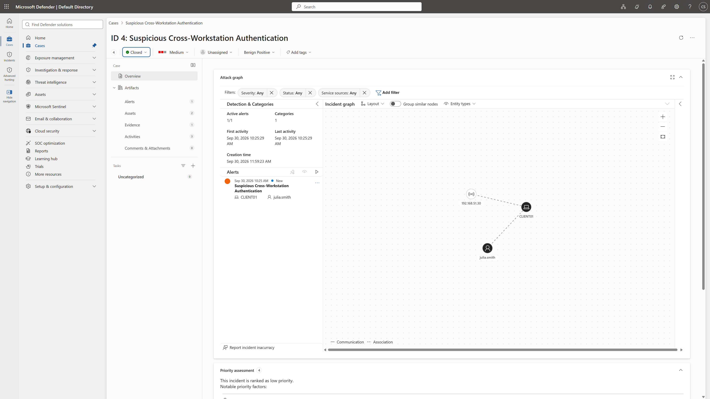

Final state:

```text
Case:           Suspicious Cross-Workstation Authentication
Status:         Closed
Classification: Benign Positive
Severity:       Medium
```

The production equivalent would remain open for escalation if the unexpected source could not be explained or if supporting telemetry showed additional compromise.
