# INC-005 — Domain Controller Compromise: C2, Persistence and Privileged Access


## Legal and Ethical Notice

> **Authorised-lab use only.** All activity documented in this incident was performed against systems that I own and control inside an isolated homelab for defensive-security training and portfolio development.
>
> Performing equivalent actions — including unauthorised access, command-and-control deployment, persistence, credential access, privileged-account manipulation or data exfiltration — against systems without the owner's explicit permission may be illegal and may violate organisational policy, contracts and applicable law.
>
> This report is intended to demonstrate defensive investigation, evidence correlation, incident triage and escalation. It is **not** intended as a guide for targeting third-party systems.


## Contents

- [Legal and Ethical Notice](#legal-and-ethical-notice)
- [Case Overview](#case-overview)
- [Executive Summary](#executive-summary)
- [Methodology](#methodology)
- [Scenario and Data Sources](#scenario-and-data-sources)
- [Controlled Attack Simulation](#controlled-attack-simulation)
- [Tier 1 Detection and Investigation](#tier-1-detection-and-investigation)
- [Timeline](#timeline)
- [Scope, Entities and Indicators](#scope-entities-and-indicators)
- [Verdict and Severity](#verdict-and-severity)
- [MITRE ATT&CK Mapping](#mitre-attck-mapping)
- [Response and Escalation](#response-and-escalation)
- [Detection Opportunities](#detection-opportunities)
- [Lessons Learned](#lessons-learned)

## Case Overview

| Field | Value |
| --- | --- |
| Case ID | `INC-005` |
| Status | Escalated |
| Incident category | Endpoint compromise / Command and Control |
| Analysis date | 7 October 2026 |
| Environment | `blueteam.test` homelab |
| Affected system | `DC01` |
| Asset role | Active Directory Domain Controller |
| Operating system | Windows Server 2019 |
| Compromised security context | `BLUETEAM\Administrator` |
| Malicious process | `C:\Windows\Temp\svchost.exe` |
| SIEM | Splunk Enterprise |
| Endpoint telemetry | Sysmon, Windows Security |
| Network telemetry | pfSense `filterlog` |
| Adversary-emulation framework | Havoc C2 / Demon |
| C2 destination | `192.168.52.10:8080` |
| Verdict | True Positive — confirmed compromise |
| Lab severity | Critical |
| Confirmed impact | C2 execution, Registry persistence, privileged backdoor account, SAM hive collection, controlled file exfiltration and system defacement |
| Disposition | Escalated to Tier 2 / CSIRT for containment, broader scoping, eradication and recovery |

## Executive Summary

A controlled endpoint-compromise scenario was generated against `DC01`, the Domain Controller for the `blueteam.test` homelab.

A **Havoc Demon C2 implant** was staged as `C:\Windows\Temp\svchost.exe` and executed under the `BLUETEAM\Administrator` account. The filename was intentionally chosen to resemble the legitimate Windows `svchost.exe` process while running from an abnormal location.

The sample was detected by Microsoft Defender as `Trojan:Win32/Wacatac.H!ml`, while multiple VirusTotal engines identified it using Havoc-related family labels.

### Malware Sample Identification

| Field | Value |
| --- | --- |
| File name | `svchost.exe` |
| Classification | Havoc Demon C2 implant / backdoor |
| SHA-256 | `c1896c4748e46991f7620fac4d891704b5c1c5e18e86f0b60c7cdaaa682dda36` |
| Microsoft Defender | `Trojan:Win32/Wacatac.H!ml` |
| VirusTotal detections | `30 / 71` at analysis time |
| VirusTotal popular threat label | `trojan.havokiz/marte` |
| Observed family labels | `havokiz`, `marte`, `havoc` |

The different antivirus labels are treated as vendor classifications rather than as a single canonical malware-family name. For this incident, the known ground truth is that the executable was generated and used as a **Havoc Demon C2 implant**.

The process established an HTTP C2 connection from `DC01` (`192.168.51.10`) to the attacker-controlled `KALI01` system (`192.168.52.10`) on TCP port `8080`.

After establishing remote control, the simulated attacker performed host, network, account and domain reconnaissance. Persistence was established by creating the Registry value:

```text
HKLM\SOFTWARE\Microsoft\Windows\CurrentVersion\Run\WindowsUpdateService
```

pointing to:

```text
C:\Windows\Temp\svchost.exe
```

The attacker then created the domain account `hacker` and added it to the `Domain Admins` group, establishing an additional privileged access mechanism independent of the original C2 process.

The controlled scenario continued with a copy of the Windows SAM hive to `C:\Windows\Temp\SAM_copy`. The copied hive and two synthetic test files, `passwords.txt` and `bank_accounts.txt`, were transferred through the established C2 session to the attacker system.

Finally, the attacker remotely uploaded and applied a custom desktop wallpaper, demonstrating continued remote control of the compromised server.

The Tier 1 investigation began independently from the defender side with a broad review of recent process-creation telemetry. Hunting for executables running from commonly abused temporary or user-writable locations identified `C:\Windows\Temp\svchost.exe`.

Subsequent pivots confirmed:

- execution from an abnormal path;
- execution as `BLUETEAM\Administrator` with High integrity;
- outbound communication to `192.168.52.10:8080`;
- Registry-based persistence;
- creation of the unauthorized domain account `hacker`;
- addition of that account to `Domain Admins`;
- matching permitted network traffic in pfSense.

The combination of active C2, persistence, privileged account creation and compromise of a Domain Controller was sufficient for a **Critical** Tier 1 verdict.

The case was therefore escalated to Tier 2 / CSIRT rather than continuing into full environment scoping, containment and eradication at Tier 1.

## Methodology

This investigation was performed entirely inside a controlled, self-owned homelab for defensive security training.

### Offensive-Tooling Disclosure

Havoc is shown in this report only where it provides necessary laboratory ground truth for the defensive investigation.

The screenshots and narrative intentionally omit parts of the operational setup required to reproduce the C2 environment. The exercise involved additional preparation beyond simply installing and launching the framework, but this portfolio does not provide a step-by-step walkthrough for payload generation, framework preparation, delivery, evasion or other operational details that are not necessary to understand the SOC investigation.

This is deliberate: the objective of `INC-005` is to demonstrate detection, evidence correlation, incident assessment and escalation rather than to provide a reproducible offensive-deployment guide.

The exercise intentionally separated two perspectives:

1. **Attack simulation evidence**, used to document exactly what activity was generated.
2. **Defender-side investigation**, performed from Splunk and network telemetry as a Tier 1 analyst would investigate an unexplained compromise.

> **Investigation principle:** the attack-side screenshots provide laboratory ground truth, but the Tier 1 investigation did not begin by searching for the known C2 address, attacker-created username or persistence value.

Instead, the defensive workflow began with recent process activity on `DC01`, identified suspicious execution from `C:\Windows\Temp`, and then used each discovered artifact as a pivot into additional telemetry.

The investigation followed this sequence:

```text
Initial triage
→ identify suspicious process
→ inspect process context
→ correlate network activity
→ identify persistence
→ identify account changes
→ confirm C2 from an independent network source
→ assess severity
→ escalate
```

### Initial-Access Limitation

The initial payload-delivery mechanism is intentionally outside the scope of this incident.

The Havoc executable was manually placed in:

```text
C:\Windows\Temp\svchost.exe
```

as a laboratory pre-condition before execution.

The incident therefore begins at **execution** and does not claim that Tier 1 detected or reconstructed how the executable originally arrived on `DC01`.

This also means that the absence of a Sysmon Event ID `11` showing creation of the file is not treated as evidence that the executable was never written to disk.

## Scenario and Data Sources

The relevant systems were:

| System | Role | IP address |
| --- | --- | --- |
| `DC01` | Windows Server 2019 / Active Directory Domain Controller | `192.168.51.10` |
| `CLIENT01` | Windows 10 workstation | `192.168.51.20` |
| `CLIENT02` | Windows 10 workstation | `192.168.51.30` |
| `KALI01` | Attacker / adversary-emulation system | `192.168.52.10` |
| `FW01` | pfSense firewall | `192.168.51.254` / `192.168.52.254` |

The INTERNAL and ATTACKER networks were separate laboratory segments routed through pfSense.

The Havoc HTTP listener was configured on the attacker system on TCP port `8080`.

A narrow pfSense rule permitted the controlled connection from:

```text
192.168.51.10
```

to:

```text
192.168.52.10:8080
```

and firewall logging was enabled so that endpoint network evidence could later be corroborated independently.

### Relevant Defender Data Sources

| Source | Event / data | Investigative purpose |
| --- | --- | --- |
| Sysmon Operational | Event ID `1` | Process creation, parent process, command line, user and integrity level |
| Sysmon Operational | Event ID `3` | Process-associated network connections |
| Sysmon Operational | Event ID `13` | Registry value modification |
| Windows Security | Event ID `4720` | Domain user account creation |
| Windows Security | Event ID `4728` | Member added to a security-enabled global group |
| pfSense | `filterlog` | Independent network-path confirmation |

## Controlled Attack Simulation

The following activity describes the controlled adversary simulation.

It establishes laboratory ground truth and is intentionally separated from the later Tier 1 investigation.

### Payload Staging

The Havoc Demon executable was staged manually on `DC01` as:

```text
C:\Windows\Temp\svchost.exe
```

The filename was selected to resemble the legitimate Windows `svchost.exe` process while executing from an abnormal location.

The legitimate Windows Service Host binary normally resides under the Windows system directories; the copy under `C:\Windows\Temp` was therefore intentionally suspicious.

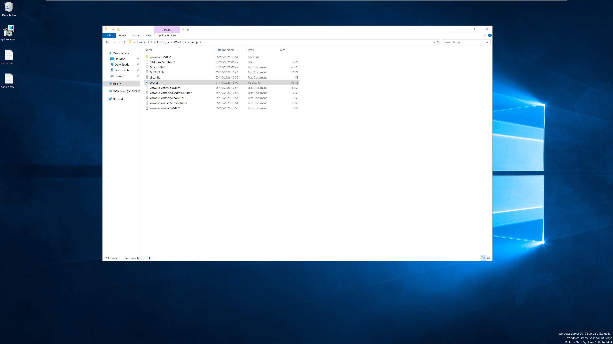

### C2 Listener

An HTTP listener was configured in Havoc on TCP port `8080`.

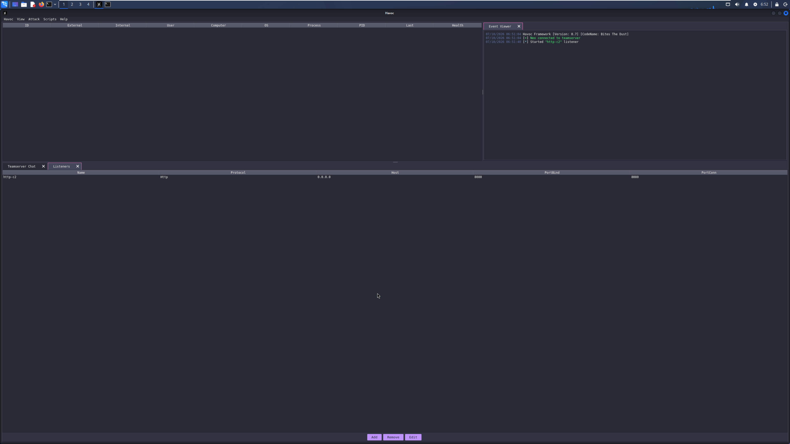

### C2 Session Established

The staged executable was manually executed on `DC01`.

Havoc received a Demon callback identifying:

```text
Computer: DC01
User:     Administrator
OS:       Windows Server 2019
Process:  svchost.exe
```

This established interactive C2 control of the Domain Controller.

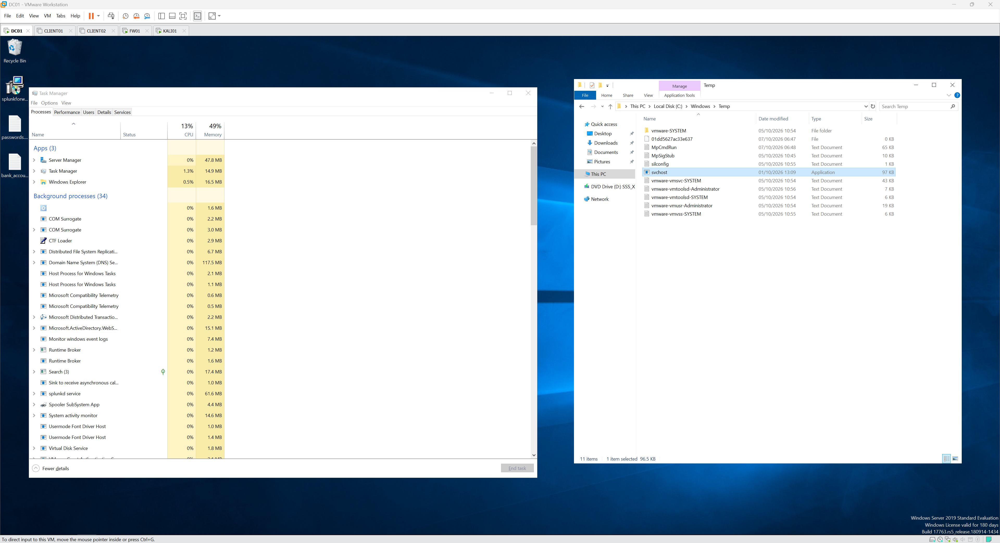

### Host and Network Discovery

The attacker used the established session to inspect the compromised context and network configuration.

The commands included:

```text
whoami
ipconfig
```

The results confirmed that the implant was operating on `DC01` as the Administrator account and that the compromised system used:

```text
192.168.51.10
```

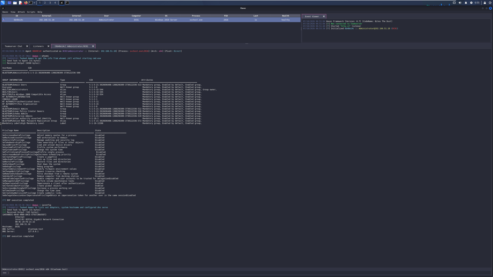

### Domain and Privileged-Group Discovery

Domain accounts were enumerated and the attacker queried the membership of:

```text
Domain Admins
```

At this point, the group contained the existing `Administrator` account and did not yet contain the later backdoor account.

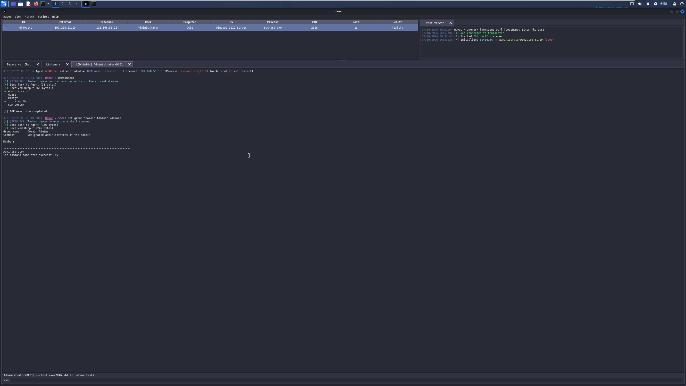

### Registry Persistence

Persistence was established by creating:

```text
HKLM\SOFTWARE\Microsoft\Windows\CurrentVersion\Run\WindowsUpdateService
```

with the value:

```text
C:\Windows\Temp\svchost.exe
```

The name `WindowsUpdateService` was deliberately chosen to resemble a legitimate Windows component.

The resulting configuration would cause the referenced executable to run at logon under the applicable user context.

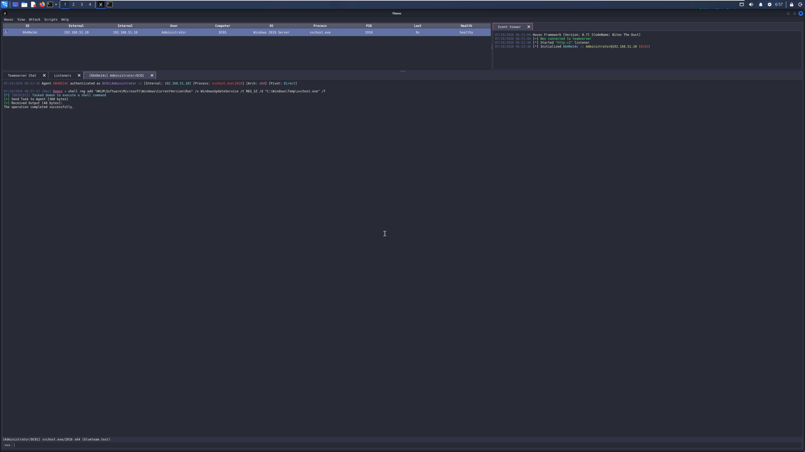

### Privileged Backdoor Account

A new domain account named:

```text
hacker
```

was created remotely.

The account was then added to:

```text
Domain Admins
```

This created an additional privileged access mechanism that could survive independently of the existing C2 process.

Because the original implant was already operating as `BLUETEAM\Administrator` with elevated privileges, this step is **not interpreted as evidence that the existing C2 session escalated from a low-privileged context**.

Instead, it represents creation and manipulation of an attacker-controlled domain identity for persistent privileged access.

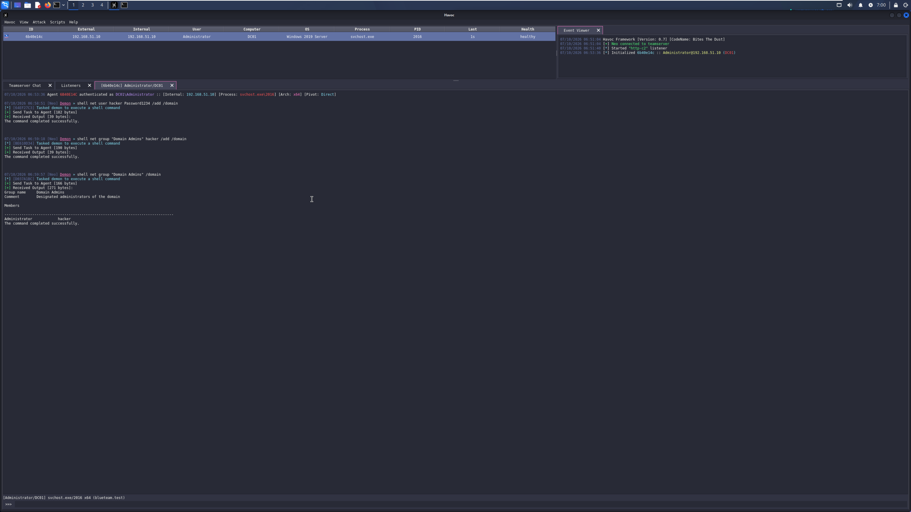

### SAM Hive Collection

The attacker used Havoc to copy:

```text
C:\Windows\System32\config\SAM
```

to:

```text
C:\Windows\Temp\SAM_copy
```

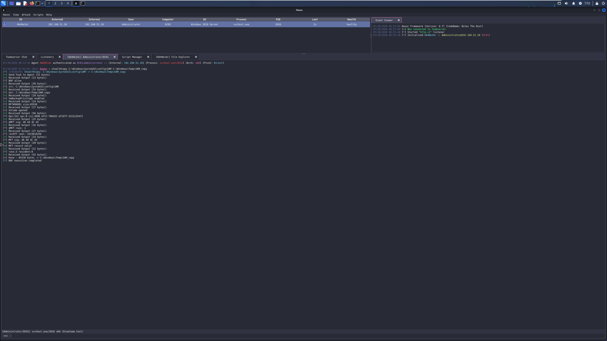

A second attack-side capture was retained immediately after the SAM-copy operation to preserve the completed state of the action before the exfiltration stage. It serves as supplementary ground-truth evidence for the credential-access portion of the scenario.


This represents credential-access behaviour because the SAM database contains local account credential material.

However, this investigation does **not** claim that password hashes were subsequently extracted, cracked or used.

It also does not claim that domain credential material was recovered from the Domain Controller. Active Directory domain credential data is not equivalent to the local SAM database and would require separate evidence.

### Potential Credential-Access Follow-On — Not Performed

Copying the SAM hive is only one stage of a possible credential-access workflow. Possession of the hive does not automatically provide plaintext credentials.

A realistic follow-on could include:

| Potential follow-on | MITRE ATT&CK | Relevance to this incident |
| --- | --- | --- |
| Extract usable password hashes from acquired credential material | [T1003.002 — OS Credential Dumping: Security Account Manager](https://attack.mitre.org/techniques/T1003/002/) | The SAM hive was copied, but no hash-extraction step was performed here |
| Attempt offline recovery of plaintext passwords from recovered hashes | [T1110.002 — Brute Force: Password Cracking](https://attack.mitre.org/techniques/T1110/002/) | Tools such as John the Ripper or Hashcat could be used after valid hash material had been obtained |
| Test a small set of candidate passwords across multiple accounts | [T1110.003 — Brute Force: Password Spraying](https://attack.mitre.org/techniques/T1110/003/) | This would be a separate online credential attack rather than a direct consequence of copying the SAM hive |
| Authenticate using credentials that were successfully recovered | [T1078 — Valid Accounts](https://attack.mitre.org/techniques/T1078/) | Relevant only if usable credentials were actually recovered and then used |

None of these follow-on actions were performed in `INC-005`. They are documented to show where the credential-access path could continue without presenting unperformed activity as evidence.

There is also an important Domain Controller distinction. The local SAM hive is **not** the Active Directory domain credential database. Domain credential material on a Domain Controller is associated with `NTDS.dit`, covered by [T1003.003 — OS Credential Dumping: NTDS](https://attack.mitre.org/techniques/T1003/003/). This incident intentionally did not collect or analyse `NTDS.dit`.

The scenario therefore stops at confirmed SAM-hive collection and transfer rather than extending into hash extraction, offline cracking, password spraying or subsequent use of recovered credentials.

### File Exfiltration

Three controlled files were transferred from the compromised system through the existing Havoc C2 session:

```text
passwords.txt
bank_accounts.txt
SAM_copy
```

The two text files contained synthetic laboratory data.

The attacker-side verification was performed directly from Kali after the Havoc download operation. The screenshot below deliberately shows both sides of the evidence at the same time:

- the Havoc File Explorer on the left shows the source files present on `DC01`;
- the Kali terminal on the right searches Havoc's loot directory and reads the recovered copies;
- the recovered text files appear in the loot directory as `passwords.txt.txt` and `bank_accounts.txt.txt`;
- `SAM_copy` produces binary Registry-hive content when read with `cat`, which is expected and demonstrates that a non-text hive file was retrieved rather than merely creating a filename locally.

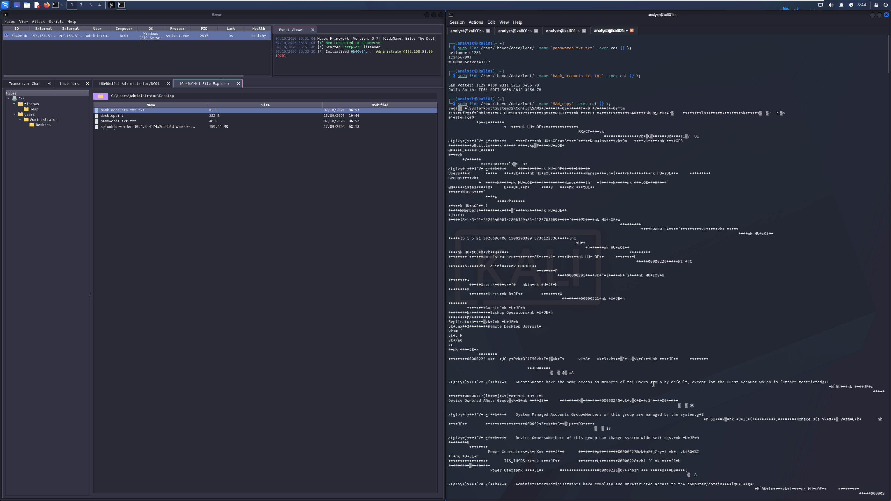

This is important evidence because it demonstrates more than file staging on the victim. The files were present in the attacker's Havoc loot directory after the transfer, confirming that the controlled exfiltration completed successfully.

The readable contents of the two synthetic text files also confirm that the retrieved copies contained the expected laboratory data. The binary output from `SAM_copy` is not interpreted as recovered credentials: it only confirms retrieval of the copied SAM hive. No password hashes were extracted, cracked or reused during this incident.

The later Tier 1 investigation did not attempt to reconstruct the contents of the file transfer from firewall telemetry alone. The pfSense evidence confirms the network path, but it does not expose the application-layer contents of the Havoc C2 session.

### Remote Wallpaper Modification

To demonstrate continued remote control, a custom image was uploaded from the attacker system to `DC01`.

The wallpaper was then changed remotely through the established Havoc session using a PowerShell command that invoked the Windows `SystemParametersInfo` API.

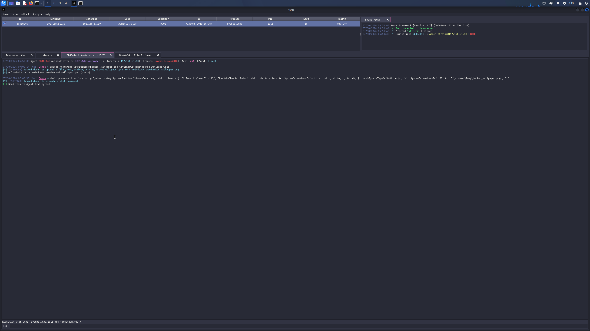

The resulting desktop displayed:

```text
SHOULD'VE SPENT MORE ON CYBERSECURITY
```

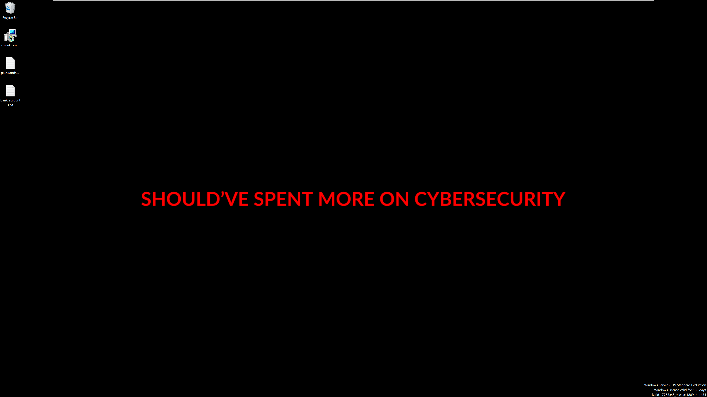

The separate command and result screenshots establish that the wallpaper change was performed through the remote C2 session rather than manually from the hypervisor or local console.

## Tier 1 Detection and Investigation

The Tier 1 investigation began with recent Sysmon process telemetry from `DC01`.

The analyst did not initially search for the known attacker IP, username `hacker`, `WindowsUpdateService` or the literal path of the implant.

### Process-Execution Overview

The first search reviewed process creation on `DC01`:

```spl
index=homelab host=DC01 source="WinEventLog:Microsoft-Windows-Sysmon/Operational" EventID=1
| stats count by Image
| sort - count
```

The purpose of this search was to obtain a broad view of recently executed processes before selecting investigation pivots.

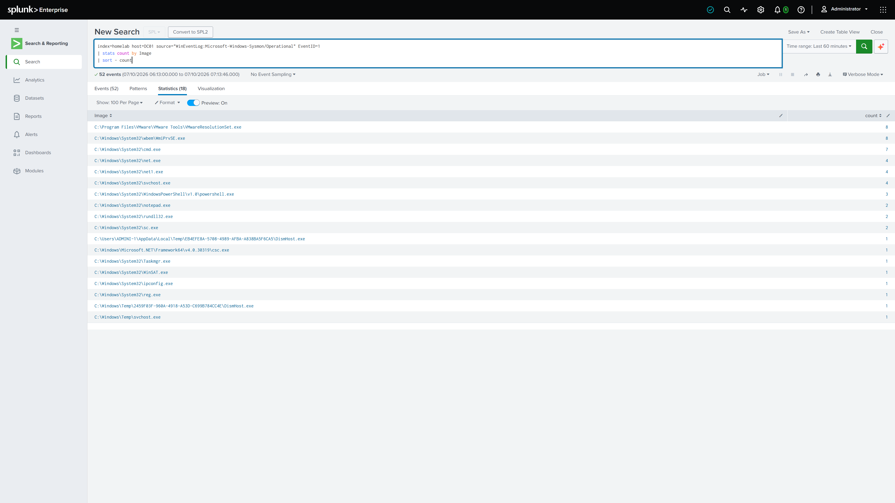

A process count alone does not establish malicious activity. Processes must be evaluated using path, parent process, command line, user, integrity level, network behaviour and surrounding context.

### Hunting for Processes in Suspicious Locations

The investigation then narrowed the process telemetry to executables running from locations commonly abused for payload staging:

```spl
index=homelab host=DC01 source="WinEventLog:Microsoft-Windows-Sysmon/Operational" EventID=1
| where like(Image, "%\\Temp\\%") OR like(Image, "%\\Public\\%") OR like(Image, "%\\AppData\\%")
| table _time, Image, ParentImage, CommandLine, User
| sort - _time
```

The search returned a small number of candidates.

Two `dismhost.exe` events were associated with expected Windows activity.

A third event was significantly more suspicious:

```text
Time:        2026-10-07 06:53:36.096 UTC
Image:       C:\Windows\Temp\svchost.exe
ParentImage: C:\Windows\explorer.exe
User:        BLUETEAM\Administrator
```

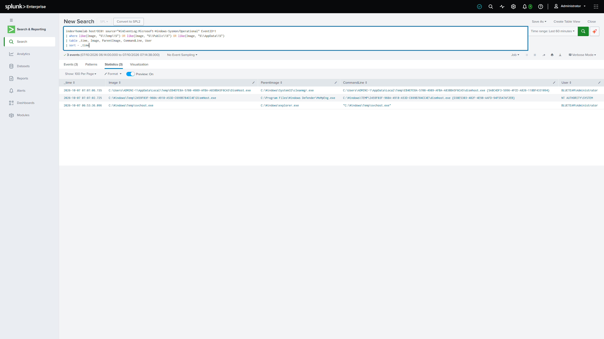

The executable used the name of a legitimate Windows component but was running from `C:\Windows\Temp` rather than the expected Windows system location.

This provided the first high-value investigative pivot.

### Suspicious Process Context

The process was isolated with:

```spl
index=homelab host=DC01 source="WinEventLog:Microsoft-Windows-Sysmon/Operational" EventID=1
| where Image="C:\\Windows\\Temp\\svchost.exe"
| table _time, Image, ParentImage, CommandLine, User, IntegrityLevel
```

The event showed:

```text
Time:           2026-10-07 06:53:36.096 UTC
Image:          C:\Windows\Temp\svchost.exe
ParentImage:    C:\Windows\explorer.exe
User:           BLUETEAM\Administrator
IntegrityLevel: High
```

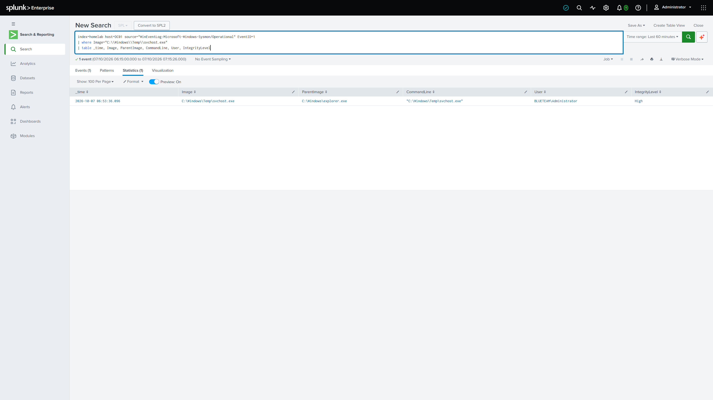

Several characteristics increased the risk:

- the filename imitated a legitimate Windows binary;
- the executable ran from `C:\Windows\Temp`;
- its parent was `explorer.exe`;
- it ran as the domain Administrator account;
- it executed with High integrity.

At this stage the evidence established highly suspicious execution but did not, by itself, prove C2 activity.

The investigation therefore pivoted to network telemetry associated with the same process.

### Process-Associated Network Connection

Sysmon Event ID `3` was searched for connections generated by the discovered process:

```spl
index=homelab host=DC01 source="WinEventLog:Microsoft-Windows-Sysmon/Operational" EventID=3
| where Image="C:\\Windows\\Temp\\svchost.exe"
| table _time, Image, SourceIp, DestinationIp, DestinationPort, Protocol
```

One relevant connection was identified:

```text
Time:            2026-10-07 06:53:38.588 UTC
Image:           C:\Windows\Temp\svchost.exe
SourceIp:        192.168.51.10
DestinationIp:   192.168.52.10
DestinationPort: 8080
Protocol:        tcp
```

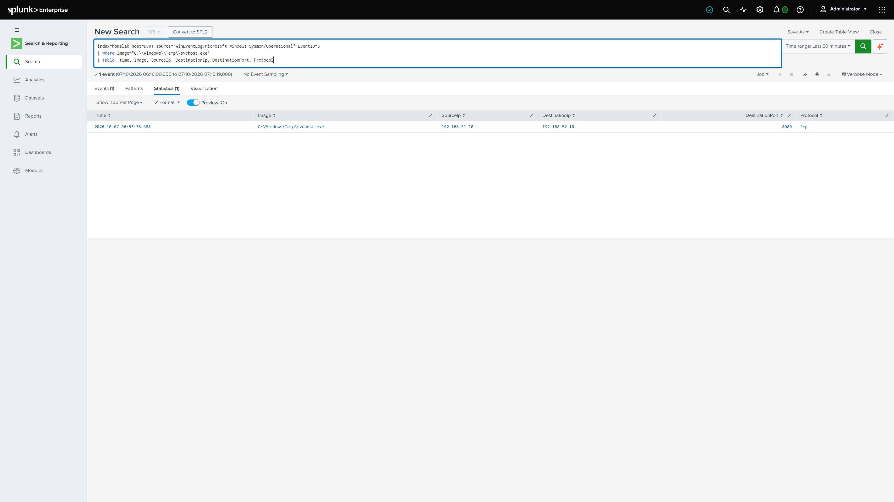

This directly associated the suspicious executable with an outbound connection from the Domain Controller to `192.168.52.10:8080`.

The combination of abnormal process location and process-attributed network communication substantially increased confidence that the process represented active compromise.

### Registry Persistence

The investigation next searched Sysmon Registry telemetry for suspicious Run-key activity:

```spl
index=homelab host=DC01 source="WinEventLog:Microsoft-Windows-Sysmon/Operational" EventID=13
| search "WindowsUpdateService"
| table _time, TargetObject, Details, User
```

One relevant Event ID `13` was recorded at:

```text
2026-10-07 06:57:39.143 UTC
```

The event showed:

```text
TargetObject:
HKLM\SOFTWARE\Microsoft\Windows\CurrentVersion\Run\WindowsUpdateService

Details:
C:\Windows\Temp\svchost.exe

User:
BLUETEAM\Administrator
```

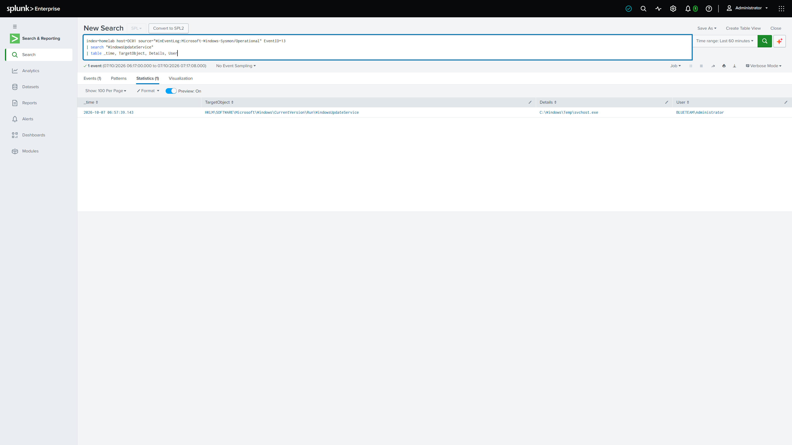

This correlated the same suspicious executable with a system-wide logon persistence mechanism.

The value name `WindowsUpdateService` is not inherently malicious. Its significance comes from the fact that it references the already suspicious binary executing from `C:\Windows\Temp`.

### Unauthorized Domain Account Creation

Windows Security logs were searched for Event ID `4720`:

```spl
index=homelab host=DC01 source="WinEventLog:Security" EventID=4720
| table _time, TargetUserName, SubjectUserName, Computer
```

One relevant event was identified:

```text
Time:            2026-10-07 06:58:53.044 UTC
TargetUserName:  hacker
SubjectUserName: Administrator
Computer:        DC01.blueteam.test
```

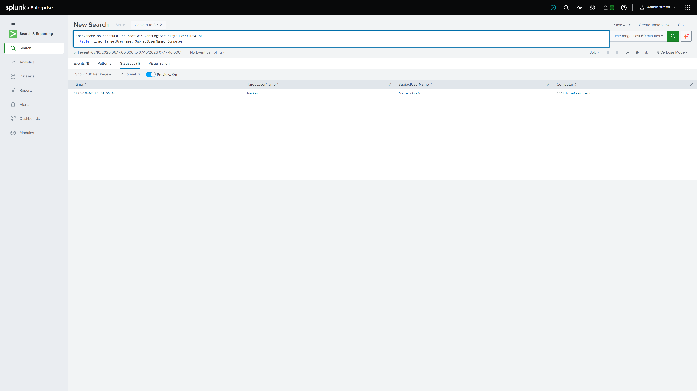

The event established that the `Administrator` security context created a new domain account named `hacker` shortly after execution, C2 communication and persistence had already been identified.

In isolation, Event ID `4720` is not necessarily malicious because administrators legitimately create domain accounts.

In this timeline, however, its proximity to confirmed suspicious process and persistence activity made the account creation highly significant.

### Privileged Group Membership Modification

The investigation then searched Event ID `4728` for changes to the `Domain Admins` group:

```spl
index=homelab host=DC01 source="WinEventLog:Security" EventID=4728
| search "Domain Admins"
| table _time, MemberName, TargetUserName, SubjectUserName
```

One event was identified at:

```text
2026-10-07 06:59:19.783 UTC
```

showing:

```text
MemberName:
CN=hacker,CN=Users,DC=blueteam,DC=test

TargetUserName:
Domain Admins

SubjectUserName:
Administrator
```

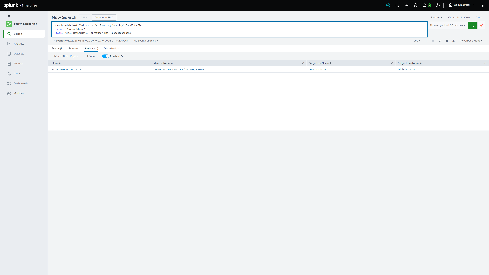

This confirmed that the newly created account was immediately granted Domain Admin privileges.

The sequence:

```text
4720 — account created
        ↓
26 seconds
        ↓
4728 — account added to Domain Admins
```

is considerably more suspicious than either event considered independently.

Because the original C2 process was already executing as `BLUETEAM\Administrator`, this change is interpreted primarily as **privileged persistence / account manipulation**, not as proof that the current attacker session newly escalated from standard-user privileges.

### Independent Firewall Correlation

The endpoint evidence identified communication from:

```text
192.168.51.10
```

to:

```text
192.168.52.10:8080
```

The investigation then pivoted to pfSense to determine whether the network-control plane independently recorded the same traffic:

```spl
index=pfsense sourcetype="pfsense:filterlog" "192.168.51.10" "192.168.52.10" "8080" action=pass
| sort - _time
```

pfSense recorded permitted TCP traffic at:

```text
2026-10-07 06:53:37 UTC
```

from:

```text
192.168.51.10
```

to:

```text
192.168.52.10:8080
```

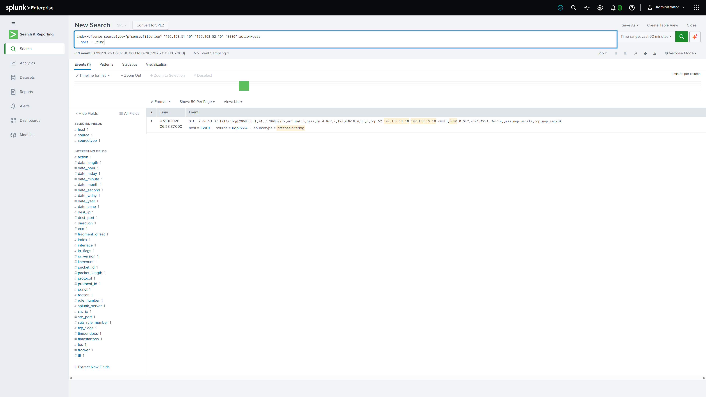

The timing closely matched the Sysmon network event at `06:53:38.588`.

The two sources answer different questions:

```text
Sysmon Event ID 3
→ identifies the process responsible for the connection

pfSense filterlog
→ independently confirms that the network traffic traversed the firewall
```

Together they provide stronger evidence than either source alone.

The firewall event does not reveal the application-layer contents of the connection and therefore cannot independently prove which commands or files travelled through it.

## Timeline

> Event timestamps are UTC.

| Time | Event | Evidence source | Investigative significance |
| --- | --- | --- | --- |
| `06:53:36.096` | `C:\Windows\Temp\svchost.exe` executed as `BLUETEAM\Administrator` with High integrity | Sysmon Event ID `1` | Initial confirmed suspicious process execution |
| `06:53:37` | TCP traffic from `192.168.51.10` to `192.168.52.10:8080` permitted | pfSense `filterlog` | Independent network-path confirmation |
| `06:53:38.588` | `C:\Windows\Temp\svchost.exe` connects to `192.168.52.10:8080` | Sysmon Event ID `3` | Associates the suspicious process with the C2 destination |
| `06:57:39.143` | `WindowsUpdateService` Run value points to the suspicious executable | Sysmon Event ID `13` | Persistence established |
| `06:58:53.044` | Domain account `hacker` created | Windows Security Event ID `4720` | Unauthorized identity created |
| `06:59:19.783` | `hacker` added to `Domain Admins` | Windows Security Event ID `4728` | Persistent privileged domain access established |
| `~07:02` | SAM hive copied to `C:\Windows\Temp\SAM_copy` | Controlled attack / Havoc console | Credential-access behaviour |
| `~07:06` | `passwords.txt`, `bank_accounts.txt` and `SAM_copy` transferred to attacker system | Controlled attack / Havoc console | Controlled exfiltration |
| `~07:08` | Wallpaper remotely changed through C2 | Controlled attack / Havoc console and endpoint result | Demonstrates continued remote control and impact |

The first six entries were reconstructed from defender telemetry.

The final controlled actions are included to document the complete laboratory scenario but were not independently reconstructed from SIEM telemetry before the Tier 1 escalation decision.

## Scope, Entities and Indicators

### Confirmed Tier 1 Scope

The Tier 1 investigation confirmed compromise of:

```text
System:       DC01
Role:         Active Directory Domain Controller
IP address:   192.168.51.10
User context: BLUETEAM\Administrator
```

Confirmed malicious or attacker-controlled artifacts on `DC01` included:

```text
C:\Windows\Temp\svchost.exe

HKLM\SOFTWARE\Microsoft\Windows\CurrentVersion\Run\WindowsUpdateService

Domain account:
hacker

Privileged group:
Domain Admins

C2 destination:
192.168.52.10:8080
```

The controlled attack additionally demonstrated:

- collection of the SAM hive;
- exfiltration of `SAM_copy`;
- exfiltration of two synthetic test documents;
- remote wallpaper modification.

### Scope Limitation

The Tier 1 case does **not** claim that the wider environment was unaffected.

At the point of escalation, the confirmed compromised asset was `DC01`.

A production Tier 2 / CSIRT investigation would need to determine whether:

- the attacker accessed `CLIENT01` or `CLIENT02`;
- the newly created account authenticated elsewhere;
- other persistence mechanisms were created;
- additional credentials were accessed;
- other C2 destinations were used;
- the same implant or related artifacts existed on other systems;
- lateral movement occurred;
- additional data was collected or exfiltrated.

That broader scoping is intentionally outside the Tier 1 stop condition for this incident.

### Relevant Indicators and Observables

| Observable | Role | Defensive treatment |
| --- | --- | --- |
| `C:\Windows\Temp\svchost.exe` | Havoc implant path | High-value incident-specific IOC; hunt across endpoints |
| `192.168.52.10:8080` | Lab C2 destination | Incident-specific network IOC |
| `WindowsUpdateService` | Registry persistence value | Hunt in combination with path and Run-key context |
| `HKLM\SOFTWARE\Microsoft\Windows\CurrentVersion\Run` | Persistence location | Behavioural monitoring target; legitimate software also uses this key |
| `hacker` | Attacker-created domain account | Incident-specific identity IOC |
| `SAM_copy` | Staged copy of SAM hive | Incident artifact |
| `passwords.txt` | Synthetic exfiltrated test file | Lab-specific artifact |
| `bank_accounts.txt` | Synthetic exfiltrated test file | Lab-specific artifact |

The literal username, IP addresses, filenames and Registry value are specific to this controlled environment.

The transferable detection value lies primarily in the behaviour and correlations rather than in these exact strings.

## Verdict and Severity

### Verdict

**True Positive — confirmed compromise**

The defender-side evidence independently confirms a malicious compromise pattern on `DC01`:

```text
abnormal executable
→ elevated execution
→ outbound network connection
→ persistence
→ unauthorized account creation
→ privileged-group modification
```

This activity cannot reasonably be explained as an isolated benign process anomaly.

The controlled attack evidence further confirms that the suspicious process was the Havoc implant used to generate the scenario.

### Severity

**Critical — lab assessment**

Critical severity is justified by the combination of:

- confirmed compromise of an Active Directory Domain Controller;
- execution as `BLUETEAM\Administrator`;
- High-integrity process execution;
- active C2 communication;
- persistent execution through an `HKLM` Run key;
- creation of an unauthorized domain account;
- assignment of that account to `Domain Admins`;
- credential-access behaviour involving the SAM hive;
- controlled data exfiltration;
- continued remote control demonstrated through system modification.

Any one of these findings would require investigation.

Their combination on the organisation's identity infrastructure substantially increases both potential impact and urgency.

The exact organisation-wide impact remains unknown at Tier 1 because broader scoping is deferred to Tier 2 / CSIRT.

## MITRE ATT&CK Mapping

| Technique | Status | Rationale |
| --- | --- | --- |
| [T1036.005 — Masquerading: Match Legitimate Resource Name or Location](https://attack.mitre.org/techniques/T1036/005/) | **Mapped** | The implant used the trusted-looking filename `svchost.exe` while executing from the abnormal path `C:\Windows\Temp`. |
| [T1033 — System Owner/User Discovery](https://attack.mitre.org/techniques/T1033/) | **Mapped** | The compromised user context was enumerated through the C2 session. |
| [T1016 — System Network Configuration Discovery](https://attack.mitre.org/techniques/T1016/) | **Mapped** | Network configuration was inspected through `ipconfig`. |
| [T1087.002 — Account Discovery: Domain Account](https://attack.mitre.org/techniques/T1087/002/) | **Mapped** | Domain accounts were enumerated. |
| [T1069.002 — Permission Groups Discovery: Domain Groups](https://attack.mitre.org/techniques/T1069/002/) | **Mapped** | Membership of `Domain Admins` was queried. |
| [T1071.001 — Application Layer Protocol: Web Protocols](https://attack.mitre.org/techniques/T1071/001/) | **Mapped** | The Havoc HTTP listener was used for C2 communication over TCP/8080. |
| [T1547.001 — Boot or Logon Autostart Execution: Registry Run Keys / Startup Folder](https://attack.mitre.org/techniques/T1547/001/) | **Mapped** | `WindowsUpdateService` was created under the `HKLM\...\Run` key and pointed to the implant. |
| [T1136.002 — Create Account: Domain Account](https://attack.mitre.org/techniques/T1136/002/) | **Mapped** | The attacker created the domain account `hacker`. |
| [T1098.007 — Account Manipulation: Additional Local or Domain Groups](https://attack.mitre.org/techniques/T1098/007/) | **Mapped** | The attacker-controlled account was added to the `Domain Admins` domain group. |
| [T1003.002 — OS Credential Dumping: Security Account Manager](https://attack.mitre.org/techniques/T1003/002/) | **Mapped with limitation** | The SAM hive was copied for credential-access purposes. No subsequent hash extraction or credential use was demonstrated. |
| [T1005 — Data from Local System](https://attack.mitre.org/techniques/T1005/) | **Mapped** | Files stored on the compromised system were collected through the C2 session. |
| [T1041 — Exfiltration Over C2 Channel](https://attack.mitre.org/techniques/T1041/) | **Mapped** | Controlled files were transferred from `DC01` to the attacker through the established Havoc channel. |
| [T1491.001 — Defacement: Internal Defacement](https://attack.mitre.org/techniques/T1491/001/) | **Mapped** | The desktop wallpaper of the compromised internal server was remotely replaced. |

The ATT&CK mapping describes observed behaviour.

It does not imply that every mapped technique was independently detected by the Tier 1 telemetry. For example, the controlled exfiltration and wallpaper change are documented primarily from the attack-simulation evidence.

`T1110.002 — Password Cracking`, `T1110.003 — Password Spraying`, `T1078 — Valid Accounts` and `T1003.003 — NTDS` are discussed above only as possible credential-access or credential-use follow-ons. They are **not mapped as observed techniques in this incident** because those actions were not performed.

## Response and Escalation

### Tier 1 Decision

**Escalate immediately to Tier 2 / CSIRT.**

The Tier 1 analyst had sufficient evidence to establish:

- a Domain Controller was compromised;
- the suspicious process was executing with elevated privileges;
- active outbound C2 existed;
- persistence had been established;
- an unauthorized domain account had been created;
- the account had been granted Domain Admin privileges.

At that point, continuing indefinitely with Tier 1 triage would not be appropriate.

The remaining tasks require coordinated incident-response work involving broader scope, containment, credential impact, Active Directory integrity, eradication and recovery.

### Tier 2 / CSIRT Handoff

A concise handoff would contain:

```text
INCIDENT
Confirmed active compromise of DC01, the blueteam.test Domain Controller.

SEVERITY
Critical.

AFFECTED ASSET
DC01 / 192.168.51.10

COMPROMISED CONTEXT
BLUETEAM\Administrator
High integrity

MALICIOUS PROCESS
C:\Windows\Temp\svchost.exe

C2
192.168.51.10 → 192.168.52.10:8080/TCP

PERSISTENCE
HKLM\SOFTWARE\Microsoft\Windows\CurrentVersion\Run\WindowsUpdateService
→ C:\Windows\Temp\svchost.exe

IDENTITY IMPACT
Unauthorized domain account: hacker
Added to: Domain Admins

CREDENTIAL-ACCESS EVIDENCE
SAM hive copied to C:\Windows\Temp\SAM_copy

ADDITIONAL CONTROLLED-SCENARIO IMPACT
Synthetic files exfiltrated through C2
Remote wallpaper modification

RECOMMENDED PRIORITIES
1. Preserve volatile and relevant forensic evidence.
2. Contain the active C2 channel.
3. Disable or otherwise contain the attacker-created privileged account.
4. Determine whether DC01 should be isolated or segmented while maintaining required identity-service availability.
5. Hunt for the implant, persistence mechanism, account and C2 indicators across the environment.
6. Review authentication activity performed by both Administrator and hacker.
7. Determine whether additional credential stores, including Active Directory credential material, were accessed.
8. Scope possible lateral movement and additional affected hosts.
9. Rotate or revoke affected privileged credentials according to the confirmed scope.
10. Eradicate persistence and malicious artifacts only after required evidence is preserved.
11. Assess whether recovery requires rebuilding or restoring the Domain Controller from a trusted state.
```

### Actions Performed at Tier 1

No production-style remediation was performed as part of the Tier 1 investigation.

This was intentional.

The objective of the case was to demonstrate the point at which a Tier 1 analyst has enough evidence to:

```text
confirm compromise
→ assign severity
→ preserve the evidence
→ provide a useful handoff
→ escalate
```

rather than attempting to perform the entire incident-response lifecycle alone.

## Detection Opportunities

### 1. Trusted Windows Process Names in Unexpected Paths

The filename alone should not determine legitimacy.

For example:

```text
svchost.exe
```

is expected on Windows.

The stronger behavioural signal is:

```text
trusted-looking filename
+
unexpected execution path
+
unexpected parent
+
elevated context
+
network activity
```

A useful hunt could identify executable images with common Windows binary names running from locations such as:

```text
C:\Windows\Temp
C:\Users\Public
user AppData directories
other user-writable paths
```

The path alone should not automatically classify a process as malicious because legitimate installers and software can also use temporary directories.

### 2. Process and Network Correlation

Sysmon Event ID `3` associated the outbound connection directly with:

```text
C:\Windows\Temp\svchost.exe
```

This is considerably stronger than detecting an IP address or TCP port without process context.

High-value correlation could combine:

```text
suspicious process creation
→ outbound network connection
→ unusual destination / port
```

### 3. Registry Run-Key Persistence

Monitor creation or modification of values under locations including:

```text
HKLM\SOFTWARE\Microsoft\Windows\CurrentVersion\Run

HKCU\SOFTWARE\Microsoft\Windows\CurrentVersion\Run
```

Confidence should increase when the resulting value points to:

- a temporary directory;
- a user-writable path;
- a newly created executable;
- a binary masquerading as a Windows component;
- an artifact already involved in suspicious network activity.

### 4. Domain Account Creation Followed by Privileged-Group Addition

Event ID `4720` is useful for new account creation.

Event ID `4728` is useful for additions to security-enabled global groups.

Either event can occur legitimately.

A much stronger signal is the sequence:

```text
new domain account created
→ shortly afterwards
→ same account added to Domain Admins
```

especially when both actions are performed by an account already associated with suspicious endpoint activity.

### 5. Critical-Asset Context

The same process behaviour should not necessarily receive identical priority on every endpoint.

Suspicious execution and C2 on an ordinary workstation is serious.

The same evidence on an Active Directory Domain Controller has significantly greater potential impact because the system participates in central identity and authentication.

Asset criticality should therefore influence triage severity.

### 6. Credential-Store Access

This exercise copied the SAM hive but did not generate defender telemetry specifically proving the file copy.

A production environment should consider additional auditing or EDR visibility for access to sensitive credential stores such as:

```text
SAM
SYSTEM
SECURITY
NTDS.dit
LSASS
```

Detection should distinguish between ordinary system access, backup/security tooling and unusual access associated with suspicious processes or users.

### 7. Endpoint and Firewall Correlation

The pfSense log did not identify which Windows process initiated the traffic.

Sysmon did.

Sysmon did not independently prove how the network control point handled the traffic.

pfSense did.

The correlation:

```text
endpoint process telemetry
+
network-control telemetry
```

provided stronger evidence than relying on either source alone.

## Lessons Learned

### A Legitimate Filename Is Not a Legitimacy Verdict

`svchost.exe` is a legitimate Windows filename.

`C:\Windows\Temp\svchost.exe` launched from `explorer.exe` and communicating with an attacker-network system is a very different behavioural context.

Path, parent process, user, integrity level and network activity matter more than the filename in isolation.

### Follow the Evidence, Not the Known Lab Answer

Because the scenario was intentionally generated, the attacker IP, process path and account name were already known to the lab operator.

Searching for those values immediately would have produced the answer but would not demonstrate a realistic SOC workflow.

The more defensible investigation path was:

```text
review process activity
→ identify suspicious locations
→ discover C:\Windows\Temp\svchost.exe
→ inspect process context
→ pivot to network telemetry
→ pivot to persistence
→ inspect account changes
→ independently validate network traffic
```

Each new search was based on evidence discovered during the previous step.

### Identity Changes Can Be More Important Than the Malware Itself

The implant was an obvious technical indicator, but creation of an additional Domain Admin account materially changed the incident.

Even if the original executable were removed, the attacker-controlled account could provide a separate path back into the environment.

Endpoint compromise therefore cannot be assessed only by removing the suspicious process.

### Account Creation and Group Membership Must Be Interpreted Together

Event ID `4720` alone can represent routine administration.

Event ID `4728` alone can also represent legitimate privileged-access management.

A newly created account being added to `Domain Admins` seconds later, during an already confirmed compromise, is substantially higher-confidence malicious activity.

### SAM Collection Must Not Be Overstated

The scenario copied the SAM hive.

That supports credential-access behaviour and is security-relevant.

It does not prove that password hashes were successfully extracted, cracked or reused.

A possible next stage would be hash extraction followed by offline password cracking (`T1110.002`) and, separately, credential attacks such as password spraying (`T1110.003`) or subsequent use of valid credentials (`T1078`). Those actions were intentionally left outside this Tier 1 incident.

It also does not establish theft of Active Directory domain credentials. On a Domain Controller, `NTDS.dit` rather than the local SAM hive is the key Active Directory credential database; accessing it would represent the separate `T1003.003 — NTDS` credential-dumping path, which was not performed.

Precise reporting is preferable to making the incident sound more severe than the evidence supports.

### Firewall Logs and Endpoint Logs Answer Different Questions

pfSense confirmed that traffic traversed the firewall.

It did not identify the Windows process or reveal the contents of the C2 session.

Sysmon associated the connection with the suspicious process.

Neither source alone told the complete story.

### Confirmed Scope Is Not the Same as Complete Scope

Tier 1 confirmed that `DC01` was compromised.

Tier 1 did not prove that `CLIENT01`, `CLIENT02` or other identities were unaffected.

The correct conclusion at escalation is therefore:

```text
Confirmed compromised asset: DC01
Broader environment scope: pending Tier 2 / CSIRT investigation
```

rather than assuming that systems not yet investigated are clean.

### Tier 1 Needs a Stop Condition

Once the investigation had established:

```text
Domain Controller compromise
+
elevated malicious execution
+
active C2
+
persistence
+
unauthorized privileged account
```

the appropriate Tier 1 objective had been achieved.

The next value comes from rapid, accurate escalation with useful evidence and pivots, not from keeping the incident indefinitely at Tier 1.

A strong Tier 1 handoff should allow Tier 2 / CSIRT to continue immediately without repeating the initial investigation.
