# INC-006 — Domain Controller Incident Response: Containment, Forensics, Scope and Recovery

## Legal and Ethical Notice

> **Authorised-lab use only.** All activity documented in this incident was performed against systems that I own and control inside an isolated homelab for defensive-security training and portfolio development.
>
> `INC-006` continues the controlled compromise documented in `INC-005` and focuses on the Tier 2 / CSIRT response: containment, evidence preservation, forensic analysis, environment scoping, eradication and recovery.
>
> The report is intended to demonstrate defensive incident-response methodology. It is not a guide for compromising third-party systems or deploying command-and-control infrastructure.

## Contents

- [Legal and Ethical Notice](#legal-and-ethical-notice)
- [Case Overview](#case-overview)
- [Executive Summary](#executive-summary)
- [Methodology](#methodology)
- [Tier 2 Handoff and Initial State](#tier-2-handoff-and-initial-state)
- [Environment and Evidence Sources](#environment-and-evidence-sources)
- [Network Containment](#network-containment)
- [Forensic Evidence Preservation](#forensic-evidence-preservation)
- [Identity Containment](#identity-containment)
- [Offline Analysis of the Targeted File Collection with Autopsy](#offline-analysis-of-the-targeted-file-collection-with-autopsy)
- [Memory Analysis with Volatility](#memory-analysis-with-volatility)
- [IOC Sweep and Scope Investigation](#ioc-sweep-and-scope-investigation)
- [Eradication](#eradication)
- [Recovery and Post-Eradication Validation](#recovery-and-post-eradication-validation)
- [Timeline](#timeline)
- [Indicators and Preserved Evidence](#indicators-and-preserved-evidence)
- [Verdict, Severity and Scope](#verdict-severity-and-scope)
- [MITRE ATT&CK Mapping](#mitre-attck-mapping)
- [Forensic and Production Limitations](#forensic-and-production-limitations)
- [Response Assessment](#response-assessment)
- [Detection and Response Improvement Opportunities](#detection-and-response-improvement-opportunities)
- [Lessons Learned](#lessons-learned)
- [Case Closure](#case-closure)

## Case Overview

| Field | Value |
| --- | --- |
| Case ID | `INC-006` |
| Status | Closed — homelab exercise |
| Incident category | Domain Controller compromise / C2 response |
| Response role | Tier 2 / CSIRT |
| Analysis date | 7 October 2026 |
| Environment | `blueteam.test` homelab |
| Confirmed compromised system | `DC01` |
| Asset role | Active Directory Domain Controller |
| Operating system | Windows Server 2019 |
| Host IP | `192.168.51.10` |
| Compromised security context | `BLUETEAM\Administrator` |
| Malicious process | `C:\Windows\Temp\svchost.exe` |
| Malicious process SHA-256 | `c1896c4748e46991f7620fac4d891704b5c1c5e18e86f0b60c7cdaaa682dda36` |
| C2 destination | `192.168.52.10:8080/TCP` |
| Registry persistence | `HKLM\SOFTWARE\Microsoft\Windows\CurrentVersion\Run\WindowsUpdateService` |
| Unauthorized account | `hacker` |
| Privileged group | `Domain Admins` |
| Credential-access artifact | `C:\Windows\Temp\SAM_copy` |
| SIEM | Splunk Enterprise |
| Network control / telemetry | pfSense |
| Targeted file acquisition | FTK Imager |
| Memory acquisition | WinPmem |
| Memory acquisition state | Post-containment / pre-eradication |
| Targeted file analysis | Autopsy |
| Memory analysis | Volatility 3 (via Volatility Workbench) |
| Additional hosts scoped | `CLIENT01`, `CLIENT02` |
| Verdict | True Positive — Confirmed Compromise |
| Lab severity | Critical |
| Final disposition | Contained, eradicated and recovered within the homelab |

## Executive Summary

`INC-006` continues directly from the Tier 1 escalation in `INC-005`. At handoff, `DC01` — the `blueteam.test` Domain Controller — was already a confirmed compromise rated **Critical**. `C:\Windows\Temp\svchost.exe` was running as `BLUETEAM\Administrator` with High integrity, communicating with `192.168.52.10:8080` and persisting through `WindowsUpdateService`; the attacker-created `hacker` account had also been added to `Domain Admins`.

Tier 2 / CSIRT contained the C2 path first. The previous narrow allow rule was disabled, an explicit block was placed above broader allow rules, the existing pfSense state was terminated, and subsequent callbacks were observed as blocked. The malicious process was intentionally left running until the required evidence had been preserved.

Evidence preservation used two paths: a targeted live-file collection with FTK Imager and a 5 GiB WinPmem memory image. The first pre-containment RAM attempt had produced a zero-byte file and was only discovered later, so the valid memory image represents a **post-containment, pre-eradication** state. The valid image was hashed before and after transfer, and the targeted files were individually hashed before analysis.

Autopsy reviewed the preserved file artifacts, while Volatility independently correlated PID `2016` (`svchost.exe`) with parent `explorer.exe`, the abnormal path `C:\Windows\Temp\svchost.exe`, and a TCP object to `192.168.52.10:8080`. Before eradication, the known process, C2, persistence and identity indicators were hunted across `DC01`, `CLIENT01` and `CLIENT02`; the incident-specific indicators were identified on `DC01` only within the reviewed telemetry and time window.

Eradication removed the malicious process, Run-key persistence, attacker-created Domain Admin account, malicious executable, `SAM_copy` and original attacker-supplied wallpaper file. After reboot, the primary compromise mechanisms remained absent and core Domain Controller services were operational. Validation did uncover one residual condition: Windows retained wallpaper configuration/cache state after the original image had been deleted. That residual state was investigated, remediated and revalidated.

| Outcome | Result |
| --- | --- |
| Network containment | C2 path blocked; existing state terminated; reconnections blocked |
| Evidence preservation | Targeted files + valid post-containment memory image preserved and hashed |
| Forensic corroboration | Autopsy reviewed preserved artifacts; Volatility corroborated the malicious process and C2 relationship |
| Scope | Confirmed compromise on `DC01`; no matching incident-specific IOCs identified on `CLIENT01` / `CLIENT02` in reviewed telemetry |
| Eradication | Process, persistence, malicious account and incident artifacts removed |
| Recovery | Domain Controller services validated; residual wallpaper state remediated |
| Post-recovery C2 check | `0 events` from `DC01` to `192.168.52.10:8080` from the reboot reference time onward |
| Verdict / severity | **True Positive — Confirmed Compromise / Critical** |

> **Production caveat:** functional recovery in this isolated homelab is not equivalent to declaring a production Domain Controller trustworthy after compromise. A real incident could require broader privileged-credential and Active Directory forest recovery actions.

## Methodology

This case is the Tier 2 / CSIRT continuation of `INC-005`, not a second detection exercise. Tier 1 stopped once the compromise was confirmed and a defensible handoff existed; `INC-006` covers containment, evidence preservation, forensic analysis, scoping, eradication and recovery.

For this homelab, **Tier 2 / CSIRT** is a combined response role. In a production organisation, SOC Tier 2, DFIR and CSIRT responsibilities may be split across different teams.

### Response Sequence

```text
Tier 1 handoff
→ initial pre-containment RAM acquisition attempted
→ confirm active C2 path
→ contain network communication
→ preserve incident-specific files
→ discover first RAM image is invalid
→ acquire and validate new RAM image
→ contain attacker-created privileged identity
→ analyse preserved files and memory offline
→ scope known IOCs across the environment
→ eradicate confirmed malicious mechanisms
→ reboot and recover
→ validate endpoint, identity, services and network
```

Containment and eradication were deliberately separated. Blocking the C2 path did not immediately destroy the malicious process, persistence or attacker-created privileged account, which allowed additional evidence to be preserved first.

The sequence above reflects what actually happened, including the failed first memory acquisition. It is **not** presented as the ideal forensic order: once an invalid volatile-memory acquisition is discovered, reacquiring RAM would normally take priority over further non-volatile collection where operational conditions permit.

### Evidence Model

| Source | Primary question answered |
| --- | --- |
| Splunk / Sysmon | What process, Registry and network activity occurred? |
| Windows Security | What identity changes occurred? |
| pfSense | Was the C2 path active, and was containment effective? |
| FTK Imager | Which known incident files were preserved from the live volume? |
| WinPmem | What volatile process and socket state remained? |
| Autopsy | What did the preserved file collection contain? |
| Volatility | What process relationships and network objects were recoverable from RAM? |

> **Memory limitation:** the first pre-containment dump was zero bytes and rejected. The valid image was acquired after network containment but before process termination, persistence removal, account deletion or reboot. The report therefore never presents it as a pre-containment snapshot.

## Tier 2 Handoff and Initial State

The Tier 2 handoff from `INC-005` contained the following confirmed findings:

```text
Affected system:
DC01 / 192.168.51.10
Active Directory Domain Controller

Compromised context:
BLUETEAM\Administrator
High integrity

Malicious executable:
C:\Windows\Temp\svchost.exe

SHA-256:
c1896c4748e46991f7620fac4d891704b5c1c5e18e86f0b60c7cdaaa682dda36

C2:
192.168.51.10 → 192.168.52.10:8080/TCP

Persistence:
HKLM\SOFTWARE\Microsoft\Windows\CurrentVersion\Run\WindowsUpdateService
→ C:\Windows\Temp\svchost.exe

Unauthorized domain identity:
hacker
→ Domain Admins

Credential-access artifact:
C:\Windows\Temp\SAM_copy

Additional controlled impact:
synthetic file exfiltration through C2
remote wallpaper modification
```

Controlled exfiltration of the synthetic files and `SAM_copy` had already been confirmed during `INC-005` using attacker-side ground-truth evidence. The Tier 2 investigation does not attempt to infer those file contents from pfSense because firewall telemetry confirms the network path but does not expose the application-layer contents transferred through the C2 session.

Initial access / root cause is not reconstructed in `INC-006`. Payload staging on `DC01` was a controlled laboratory precondition inherited from `INC-005`, so this case begins at the confirmed-compromise handoff rather than claiming a real-world delivery vector that did not occur.

## Environment and Evidence Sources

### Systems

| System | Role | IP address | Relevance to INC-006 |
| --- | --- | --- | --- |
| `DC01` | Windows Server 2019 / Domain Controller | `192.168.51.10` | Confirmed compromised host |
| `CLIENT01` | Windows 10 workstation | `192.168.51.20` | Scope target |
| `CLIENT02` | Windows 10 workstation | `192.168.51.30` | Scope target |
| `KALI01` | Controlled attacker / C2 system | `192.168.52.10` | Known C2 destination |
| `FW01` | pfSense firewall | `192.168.51.254` / `192.168.52.254` | Network containment and telemetry |
| Windows 11 host | Analyst workstation | Host system | Offline Autopsy and Volatility analysis |

### Evidence and Analysis Sources

| Source / tool | Evidence or purpose |
| --- | --- |
| Splunk Enterprise | Sysmon, Windows Security and pfSense hunting / validation |
| Sysmon Event ID `1` | Process creation |
| Sysmon Event ID `3` | Process-associated network connection |
| Sysmon Event ID `13` | Registry persistence |
| Windows Security `4720` | Domain account creation |
| Windows Security `4728` | Domain group membership modification |
| pfSense `filterlog` | C2 allow/block telemetry |
| pfSense state table | Existing stateful C2 connection |
| FTK Imager | Targeted live-file acquisition from `DC01` |
| PowerShell `Get-FileHash` | SHA-256 integrity verification |
| WinPmem | Memory acquisition |
| Autopsy | Offline analysis of the targeted file collection |
| Volatility | Process, command-line, process-tree and network-object analysis from RAM |

## Network Containment

The containment objective was to stop communication with the known C2 endpoint **without yet destroying endpoint evidence**.

### 1. Confirm the Pre-Containment C2 Path

```spl
index=pfsense sourcetype="pfsense:filterlog" "192.168.51.10" "192.168.52.10" "8080" earliest=-4h
| table _time, src_ip, src_port, dest_ip, dest_port, protocol, action
| sort - _time
```

The relevant permitted path was:

```text
192.168.51.10 / DC01  →  192.168.52.10 / KALI01  →  8080/TCP  →  pass
```


### 2. Preserve and Disable the Prior Allow Rule

The narrow laboratory allow rule used during `INC-005` was retained as configuration evidence but disabled rather than deleted.

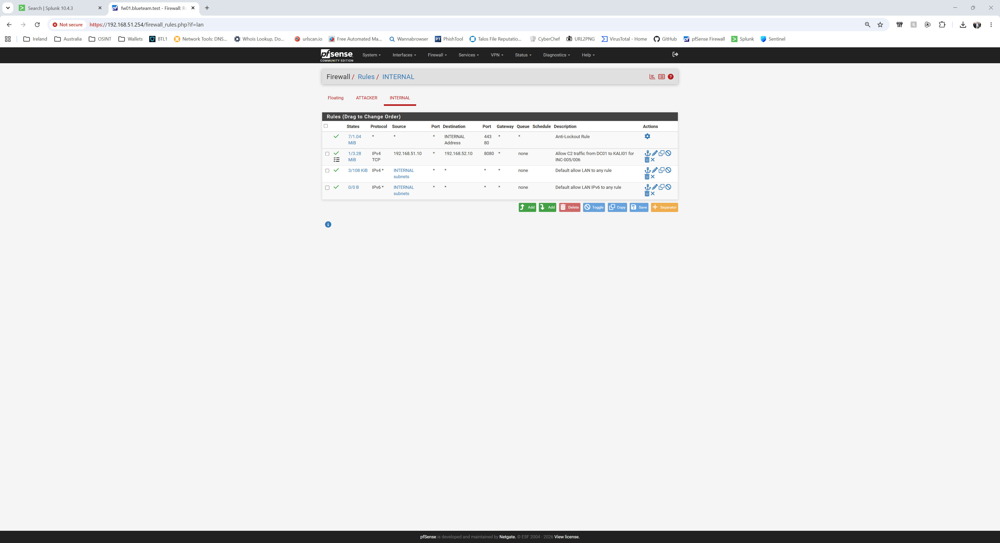

### 3. Apply an Explicit Block

The replacement rule on the INTERNAL interface was:

```text
Action:       Block
Protocol:     TCP
Source:       192.168.51.10
Destination:  192.168.52.10
Port:         8080
Logging:      Enabled
```

It was positioned above broader allow rules.

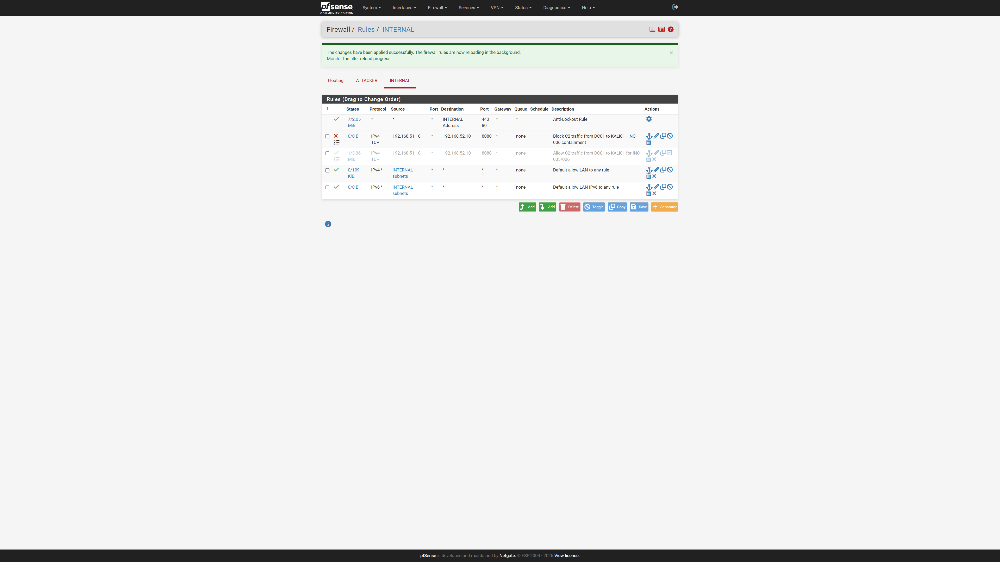

### 4. Terminate the Existing Stateful Session

Because pfSense is stateful, the existing C2 state was removed individually after the block rule was applied. New attempts were then evaluated against the new rule:

```spl
index=pfsense sourcetype="pfsense:filterlog" "192.168.51.10" "192.168.52.10" "8080" earliest=-15m
| table _time, src_ip, src_port, dest_ip, dest_port, protocol, action
| sort - _time
```

The important result was repeated `action=block` events from the compromised host.

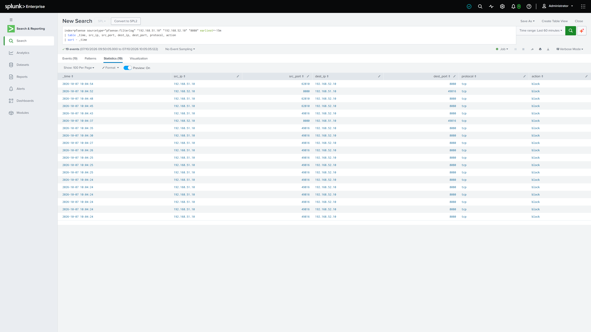

### Containment Result

| Control | State |
| --- | --- |
| C2 network path | Contained |
| Existing stateful session | Terminated |
| New callbacks | Blocked |
| Malicious process | Still running |
| Registry persistence | Still present |
| Attacker-created privileged account | Still present |
| Endpoint eradication | Not yet performed |

The blocked callbacks proved both that containment was working and that the endpoint component was still active. At case closure, the explicit block remained enabled and the earlier laboratory allow rule remained disabled.

## Forensic Evidence Preservation

A full-disk forensic image of `DC01` was **not** acquired. The exercise used a targeted live-file collection because Tier 1 had already identified the incident-specific artifacts required for this controlled investigation. This is a documented scope limitation, not a claim that no other disk artifacts existed.

### Targeted File Collection

FTK Imager was run as Administrator against the live `C:` volume. Five files were exported without renaming them:

| Original location | Preserved files |
| --- | --- |
| `C:\Users\Administrator\Desktop` | `passwords.txt.txt`, `bank_accounts.txt.txt` |
| `C:\Windows\Temp` | `svchost.exe`, `SAM_copy`, `hacked_wallpaper.png` |

The doubled `.txt` extensions were preserved exactly as observed on disk.

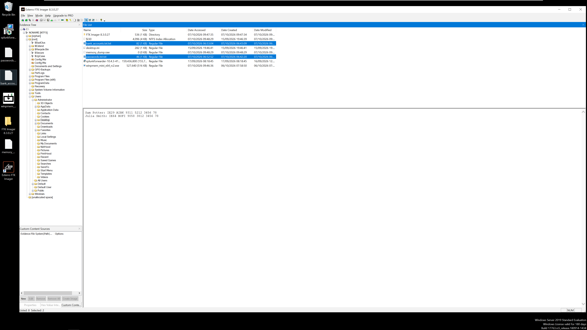

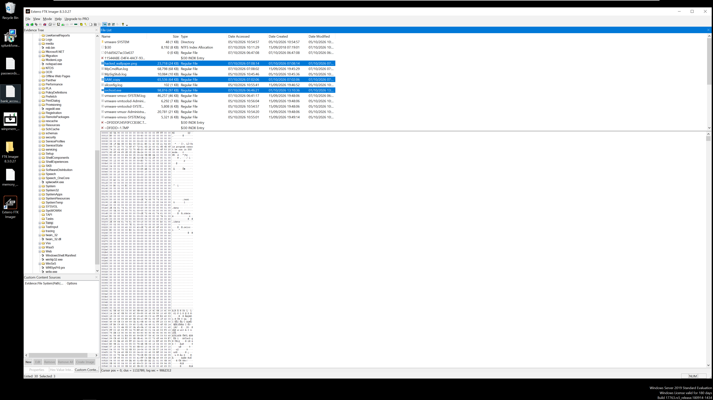

The evidence set was organised as:

```text
Targeted_Collection\
├── Desktop\
│   ├── passwords.txt.txt
│   └── bank_accounts.txt.txt
└── WindowsTemp\
    ├── svchost.exe
    ├── SAM_copy
    └── hacked_wallpaper.png
```

### File Integrity

```powershell
Get-ChildItem "E:\INC-006_Evidence\Targeted_Collection" -Recurse -File |
    Get-FileHash -Algorithm SHA256
```

| Preserved file | SHA-256 |
| --- | --- |
| `bank_accounts.txt.txt` | `3F9ED26AD5447F85BD7A26660CC029B92DDEF8A25006BBD64EC28B519096F8E8` |
| `passwords.txt.txt` | `80057FA6D8043C062ABD9CFA93D103C35A8AC194EB0345662FCBA38069E2C97B` |
| `hacked_wallpaper.png` | `7DF654A65423F7489C571B755EDF26BF800399C9C6CCD05A42D9E69C69A1B7D0` |
| `SAM_copy` | `AA7FE5C7A44379F9096E46011231072DF29280FCC15FFA4E491A69DE6424CEF7` |
| `svchost.exe` | `c1896c4748e46991f7620fac4d891704b5c1c5e18e86f0b60c7cdaaa682dda36` |

The `svchost.exe` hash matched the sample already identified in `INC-005`.

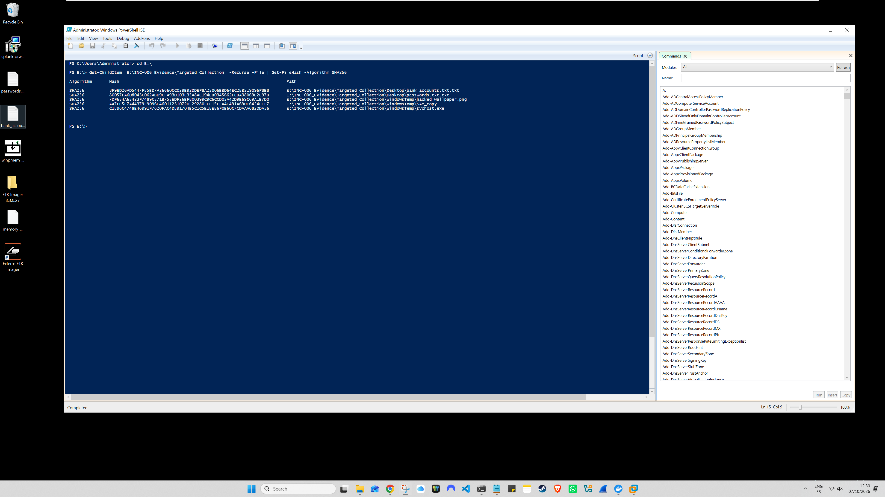

### Valid Memory Acquisition

The first pre-containment WinPmem attempt was later found to be a zero-byte file and was rejected. A second acquisition was completed after network containment but before endpoint eradication:

```powershell
C:\Users\Administrator\Desktop\winpmem_mini_x64_rc2.exe C:\Users\Administrator\Desktop\memory_dump.raw
```

```text
File:       memory_dump.raw
Size:       5,368,709,120 bytes (~5 GiB)
SHA-256:    7475A9735189D8D3F121EC5321F846E63F48688540F0350233EA88AEE8346103
```

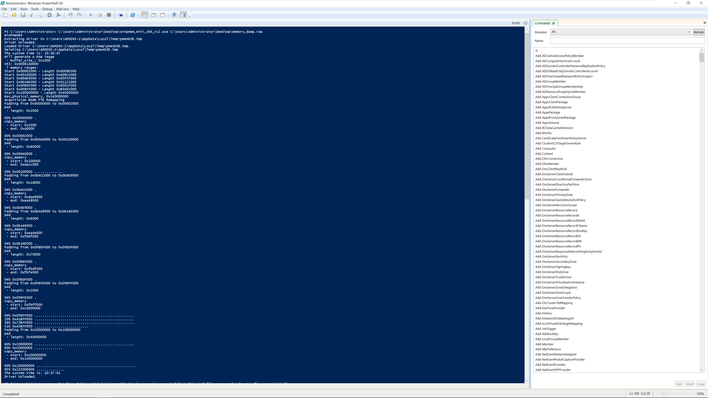

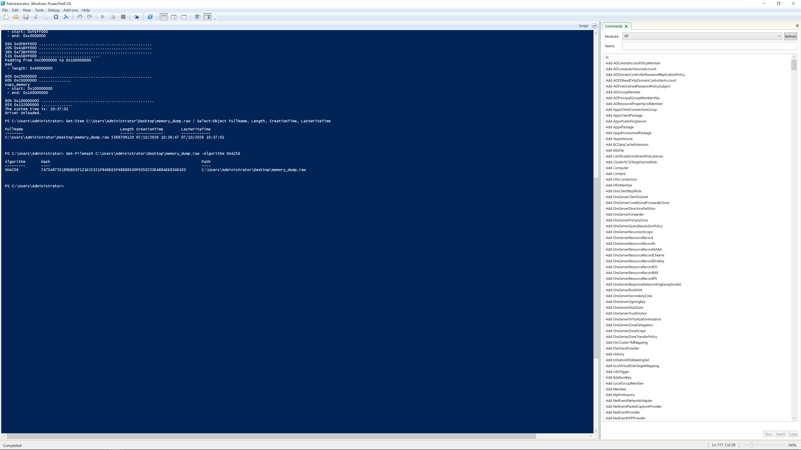

The image was copied off `DC01` and hashed again. The copied hash matched the source image exactly.

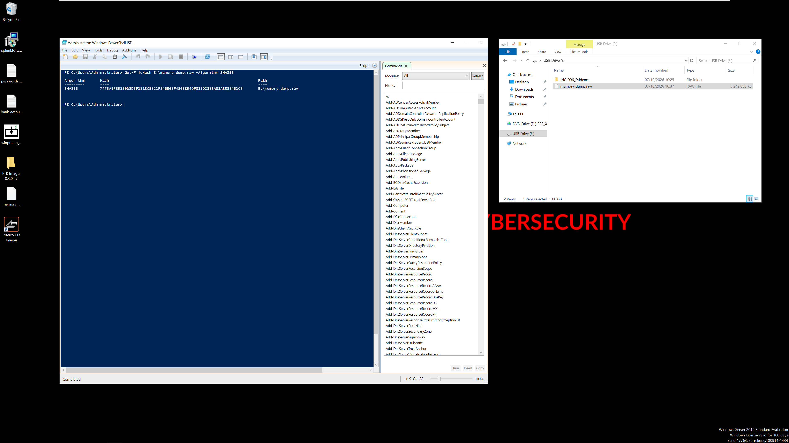

> **Integrity sequence:** valid source image → SHA-256 → transfer → SHA-256 → hashes match.

The preserved evidence was then moved to the Windows 11 analysis host for offline analysis.

## Identity Containment

Once the incident-specific disk and memory evidence had been preserved and the C2 path had been blocked, the attacker-created privileged account was contained.

The account was first reviewed:

```powershell
net user hacker /domain
```

It was then disabled:

```powershell
net user hacker /active:no /domain
```

A second query confirmed:

```text
Account active    No
```

The account was **not yet deleted** at this phase. Deletion was deferred until eradication so that containment remained distinguishable from destructive remediation.

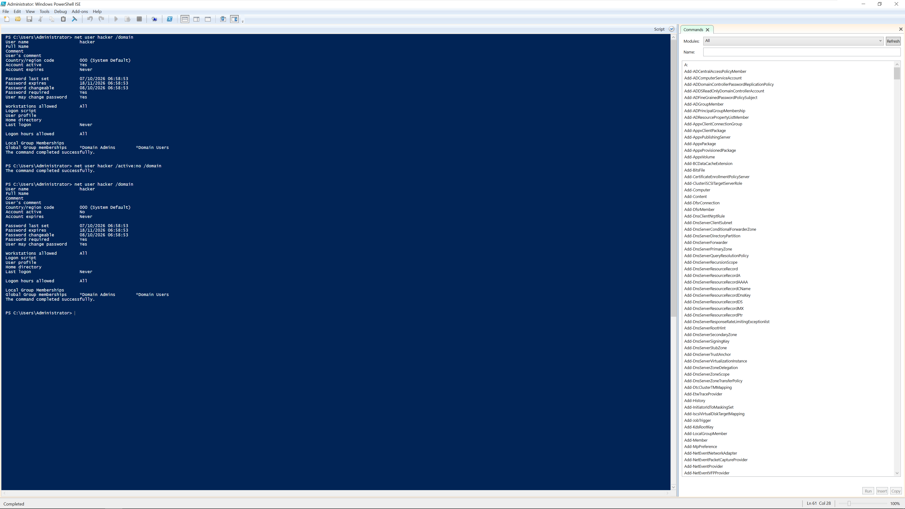

This containment order reflects the controlled lab workflow. In a production incident, an attacker-created `Domain Admins` account would normally require immediate coordinated containment once essential volatile evidence, service-availability requirements and response constraints had been considered.

## Offline Analysis of the Targeted File Collection with Autopsy

The five-file collection was added to a new Autopsy case as **Logical Files**. Autopsy was used to inspect file type, metadata and content without executing the preserved sample. Because logical-file copying can alter or omit some filesystem timestamp context, original paths were taken from the live FTK acquisition rather than inferred solely from Autopsy.

### Artifact Review

| Artifact | Autopsy finding | Interpretation |
| --- | --- | --- |
| `SAM_copy` | Windows Registry hive / binary artifact | Preserved copied SAM hive; no credential extraction or cracking performed |
| `passwords.txt.txt` | `text/plain` | Synthetic laboratory credentials |
| `bank_accounts.txt.txt` | `text/plain` | Synthetic laboratory banking data |
| `svchost.exe` | `application/x-msdownload`, 98,816 bytes | Preserved malicious executable; not executed during analysis |
| `hacked_wallpaper.png` | Image artifact | Attacker-supplied visual modification source |

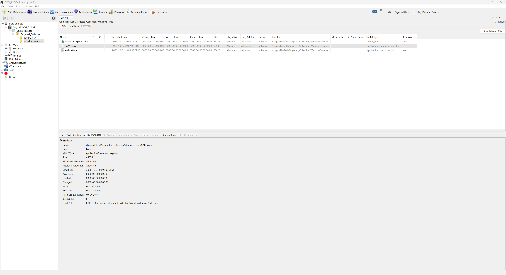

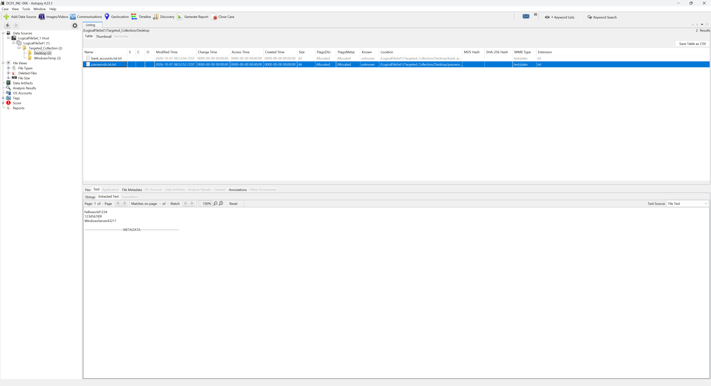

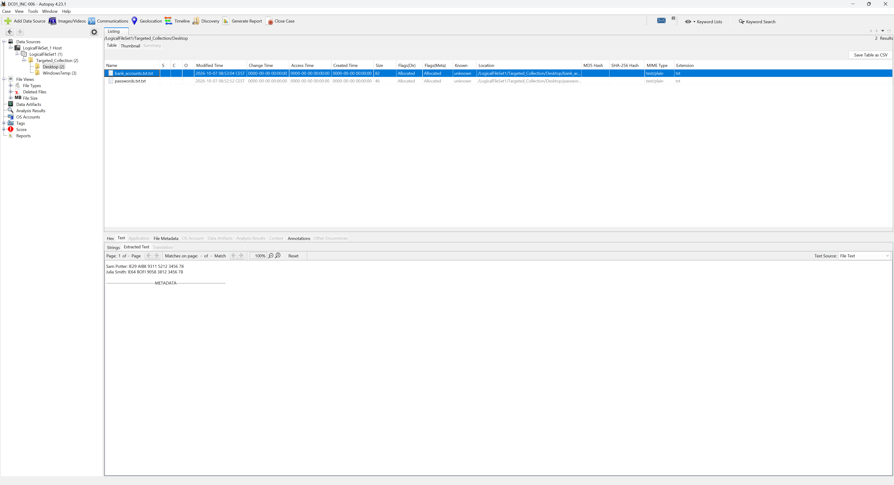

The authoritative hash used to correlate the executable remained the PowerShell SHA-256:

```text
c1896c4748e46991f7620fac4d891704b5c1c5e18e86f0b60c7cdaaa682dda36
```

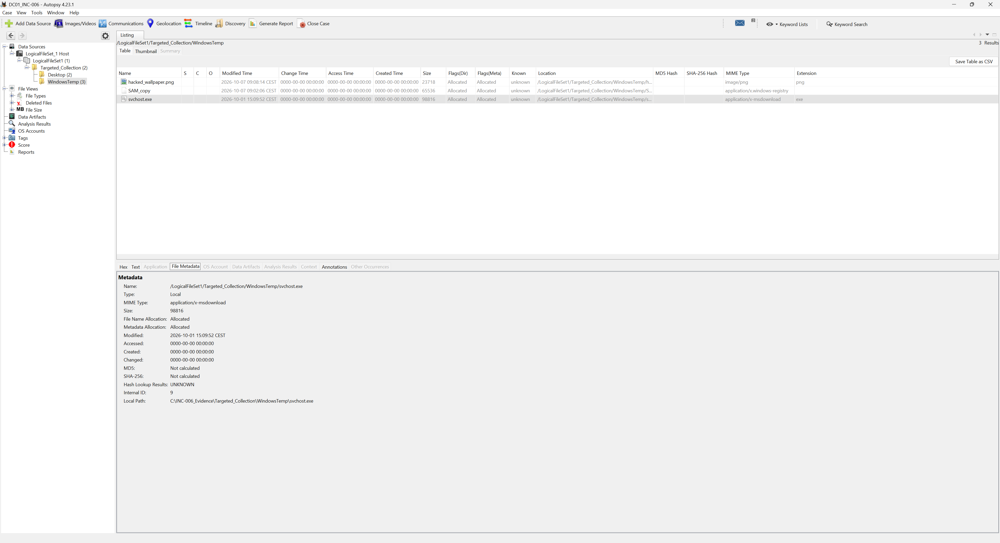

The wallpaper did not require a separate Autopsy screenshot because later recovery evidence shows both its effect and the residual Windows profile state it created.

## Memory Analysis with Volatility

The valid image represents a **post-containment, pre-eradication** state:

```text
Network block: applied
Existing pfSense C2 state: terminated
Malicious process: present
Registry persistence: present
hacker account: present and enabled at acquisition
Endpoint reboot: not yet performed
```

### Process Correlation

The process-focused plugins used were:

```text
windows.pslist.PsList
windows.pstree.PsTree
windows.cmdline.CmdLine
windows.psscan.PsScan
```

They consistently recovered the same suspicious process:

```text
PID:          2016
Process:      svchost.exe
PPID:         1484
Parent:       explorer.exe
Session:      1
Create Time:  2026-10-07 06:53:36 UTC
Path:         C:\Windows\Temp\svchost.exe
Command line: "C:\Windows\Temp\svchost.exe"
```

Many legitimate `svchost.exe` processes also existed. The malicious classification depends on the combined evidence — abnormal path, `explorer.exe` parent, PID/PPID, command line, prior Sysmon telemetry and C2 correlation — not the filename alone.

PsList and PsScan both recovered PID `2016`, so the available memory evidence does not indicate that the process was hidden from the normal active-process list.

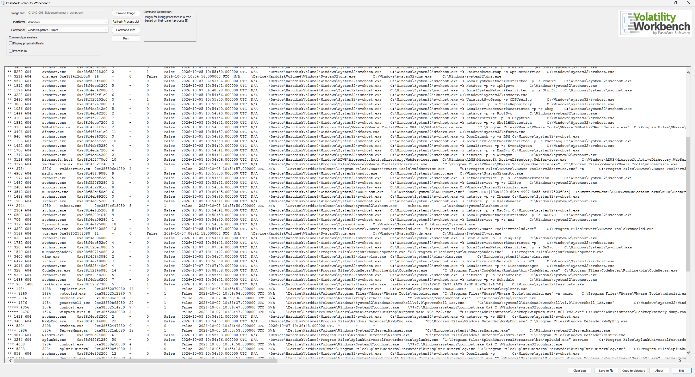

### Network Object Correlation

`windows.netscan.NetScan` associated the same PID with:

```text
TCPv4
192.168.51.10:63034 → 192.168.52.10:8080
State: CLOSED
PID:   2016
Owner: svchost.exe
```

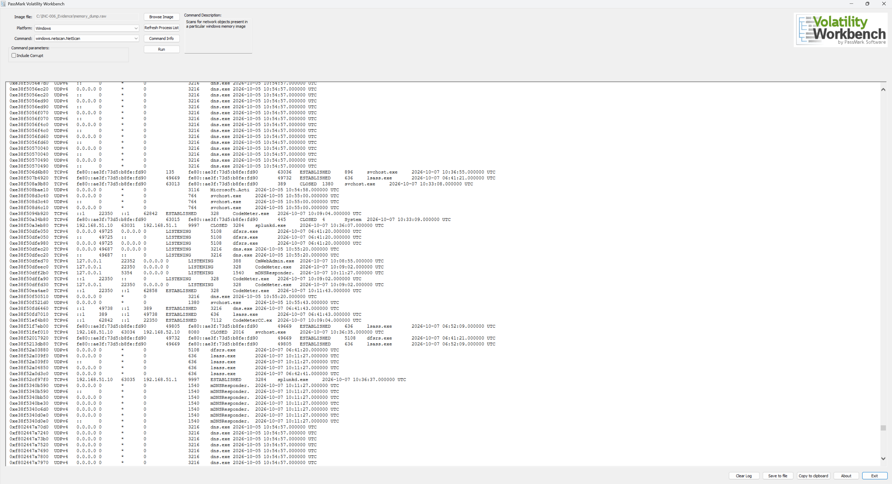

The `CLOSED` state is consistent with acquisition after the pfSense block and state termination, but Volatility alone does not establish why the socket reached that state. The important result is the memory-based correlation between PID `2016` and the same C2 endpoint already established by Sysmon and pfSense.

### Memory Finding

| Source | Corroboration |
| --- | --- |
| PsList | PID `2016` present |
| PsTree | `explorer.exe` → `svchost.exe` relationship and abnormal path |
| CmdLine | `"C:\Windows\Temp\svchost.exe"` recovered |
| PsScan | Same PID / PPID relationship recovered |
| NetScan | PID `2016` linked to `192.168.52.10:8080` |
| FileScan | References to `\Windows\Temp\svchost.exe` recovered |

`SAM_copy` and `hacked_wallpaper.png` did not need to be reconstructed from RAM because both had already been preserved directly from disk.

## IOC Sweep and Scope Investigation

Scoping was performed **before eradication** across `DC01`, `CLIENT01` and `CLIENT02`. A six-hour window covered the relevant `INC-005` / `INC-006` activity at the time of the hunt.

### Hunt 1 — Malicious Executable Path

```spl
index=homelab (host=DC01 OR host=CLIENT01 OR host=CLIENT02)
source="WinEventLog:Microsoft-Windows-Sysmon/Operational"
EventID=1 Image="C:\\Windows\\Temp\\svchost.exe" earliest=-6h
| table _time, host, Image, ParentImage, CommandLine, User, IntegrityLevel
| sort - _time
```

**Result:** known execution on `DC01`; no matching execution on `CLIENT01` or `CLIENT02` in the reviewed telemetry.


### Hunt 2 — Known C2 Endpoint

```spl
index=homelab (host=DC01 OR host=CLIENT01 OR host=CLIENT02)
source="WinEventLog:Microsoft-Windows-Sysmon/Operational"
EventID=3 DestinationIp="192.168.52.10" DestinationPort=8080 earliest=-6h
| table _time, host, Image, SourceIp, DestinationIp, DestinationPort, Protocol
| sort - _time
```

**Result:** known connection on `DC01`; no equivalent connection from `CLIENT01` or `CLIENT02` in the reviewed data.

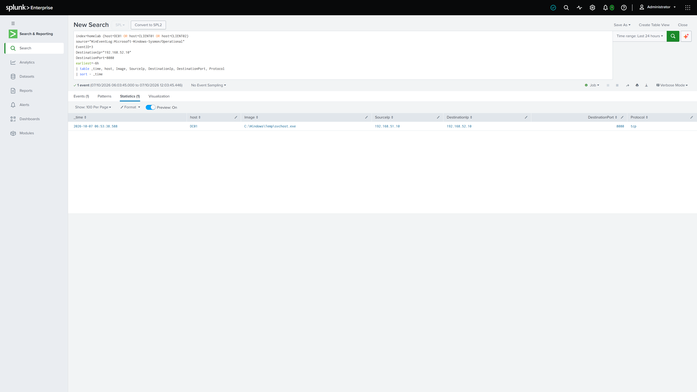

### Hunt 3 — Registry Persistence

```spl
index=homelab (host=DC01 OR host=CLIENT01 OR host=CLIENT02)
source="WinEventLog:Microsoft-Windows-Sysmon/Operational"
EventID=13 "WindowsUpdateService" earliest=-6h
| table _time, host, TargetObject, Details, User
| sort - _time
```

**Result:** `WindowsUpdateService` persistence identified on `DC01` only.

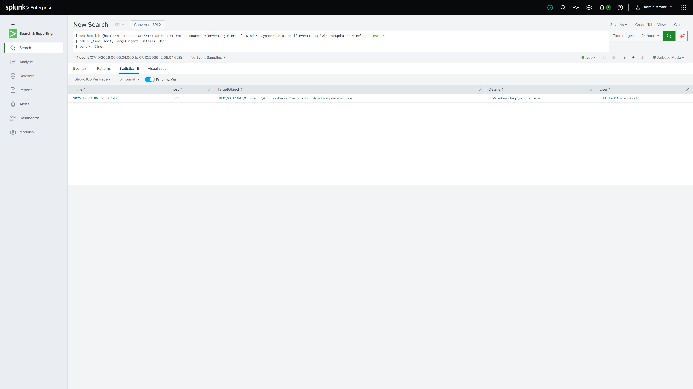

### Hunt 4 — Attacker-Created Account Activity

```spl
index=homelab source="WinEventLog:Security" "hacker"
(EventID=4624 OR EventID=4625 OR EventID=4672 OR EventID=4720 OR EventID=4728 OR EventID=4768 OR EventID=4769 OR EventID=4776)
earliest=-6h
| table _time, host, EventID, SubjectUserName, TargetUserName, MemberName, AccountName, WorkstationName, IpAddress
| sort - _time
```

**Result:** Event ID `4720` confirmed creation of `hacker`; Event ID `4728` confirmed its addition to `Domain Admins`. No additional authentication-related events for `hacker` were identified among the queried Security event types and reviewed time window.

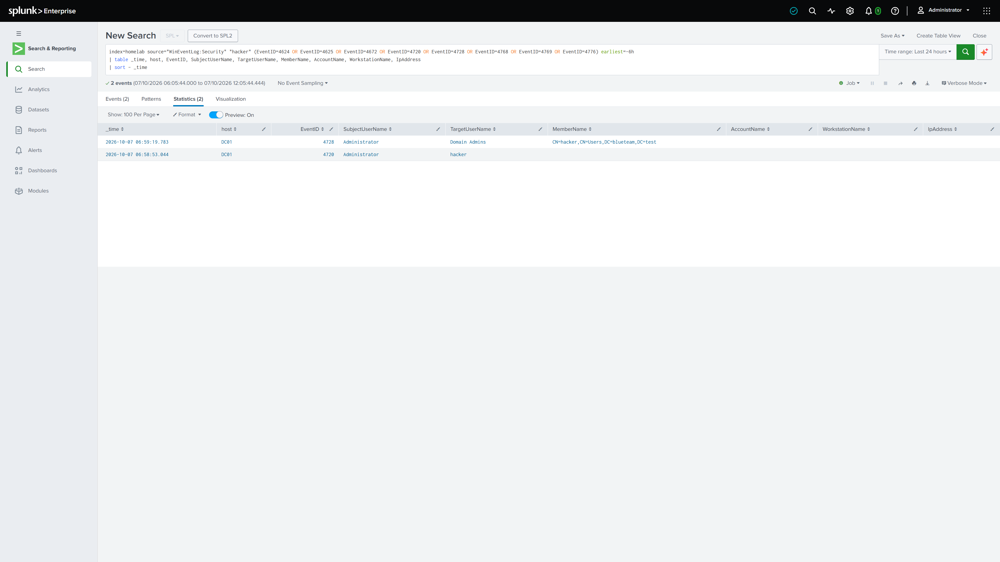

### Scope Conclusion

| IOC / behaviour | DC01 | CLIENT01 | CLIENT02 |
| --- | --- | --- | --- |
| `C:\Windows\Temp\svchost.exe` | Identified | Not identified | Not identified |
| `192.168.52.10:8080` | Identified | Not identified | Not identified |
| `WindowsUpdateService` Run key | Identified | Not identified | Not identified |
| `hacker` account creation / privilege change | Identified | Not identified | Not identified |

> **Defensible scope statement:** Within the telemetry and incident-specific indicators investigated, confirmed compromise was identified on `DC01`. No evidence of the same incident-specific IOCs was identified on `CLIENT01` or `CLIENT02`.

This does **not** prove that the two clients were free of compromise; the scope search was IOC-driven and time-bounded.

## Eradication

Destructive remediation began only after evidence preservation, offline analysis and environment scoping were complete.

### Process and Persistence

The executable was revalidated by path and SHA-256 before PID `2016` was terminated. The Run value was then removed:

```powershell
Stop-Process -Id 2016 -Force
```

```powershell
reg delete "HKLM\Software\Microsoft\Windows\CurrentVersion\Run" /v WindowsUpdateService /f
```

Follow-up checks no longer returned the malicious process or Registry value.

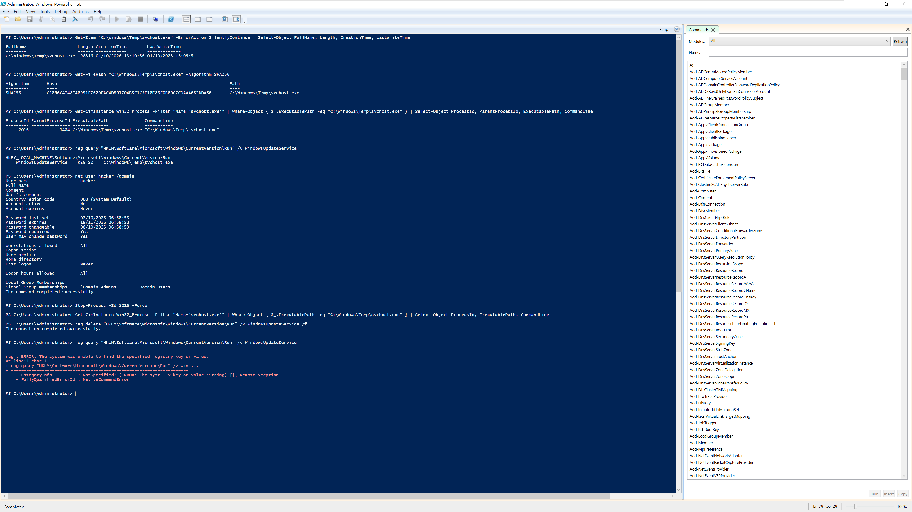

### Attacker-Created Privileged Account

The already-disabled account was removed from `Domain Admins` and then deleted:

```powershell
net group "Domain Admins" hacker /delete /domain
net user hacker /delete /domain
```

Validation confirmed that `hacker` no longer existed and no longer appeared in the privileged group.


### Incident Artifacts

```powershell
Remove-Item "C:\Windows\Temp\svchost.exe" -Force
Remove-Item "C:\Windows\Temp\SAM_copy" -Force
Remove-Item "C:\Windows\Temp\hacked_wallpaper.png" -Force
```

`Test-Path` returned `False` for all three paths.

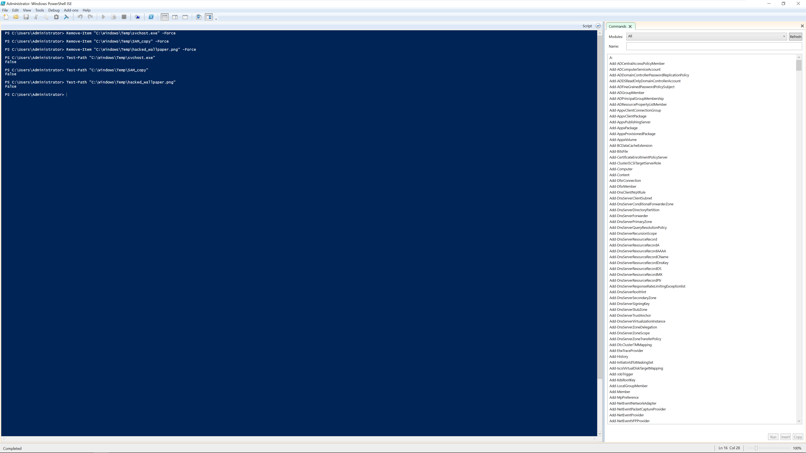

The synthetic `passwords.txt.txt` and `bank_accounts.txt.txt` files were not deleted as malware; they were benign lab data used by the scenario.

> **Production limitation:** `BLUETEAM\Administrator` was not rotated in the homelab because compromise/reuse of that credential was outside the controlled scenario. A production Domain Controller compromise under a Domain Admin context would require explicit privileged-credential exposure assessment and appropriate rotation or revocation.

## Recovery and Post-Eradication Validation

`DC01` was rebooted at approximately **12:22 UTC / 14:22 CEST** on 7 October 2026. The exact boot-completion minute was not recorded, so `12:22 UTC` is used only as the conservative reboot reference time for later validation.

### Primary Post-Reboot Checks

After the server returned to service, validation confirmed:

| Check | Result |
| --- | --- |
| `C:\Windows\Temp\svchost.exe` process | Not running |
| `C:\Windows\Temp\svchost.exe` file | Absent |
| `C:\Windows\Temp\SAM_copy` | Absent |
| `C:\Windows\Temp\hacked_wallpaper.png` | Absent |
| `WindowsUpdateService` Run value | Absent |
| `hacker` domain account | Absent |

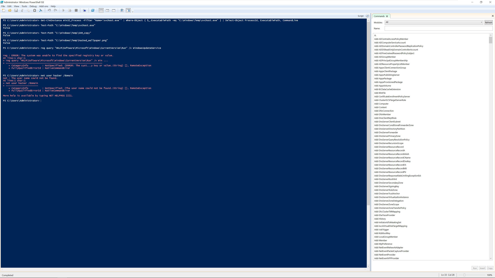

The primary compromise mechanisms had not recreated themselves after reboot.

### Residual Wallpaper Finding

The desktop still displayed the attacker-supplied wallpaper even though the original `hacked_wallpaper.png` file had been deleted.

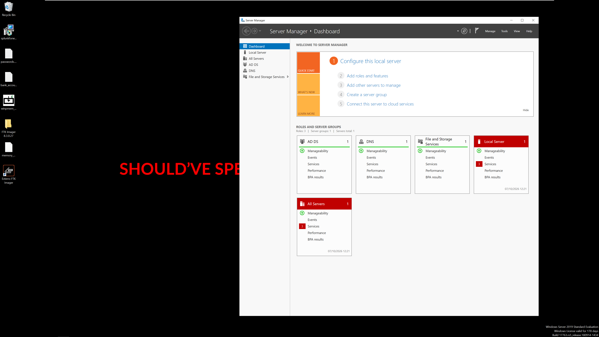

Investigation showed that the Administrator profile still referenced the deleted source path and retained Windows-generated transformed/cache state:

```text
HKCU\Control Panel\Desktop\WallPaper
→ C:\Windows\Temp\hacked_wallpaper.png

%APPDATA%\Microsoft\Windows\Themes\TranscodedWallpaper
%APPDATA%\Microsoft\Windows\Themes\CachedFiles\
```

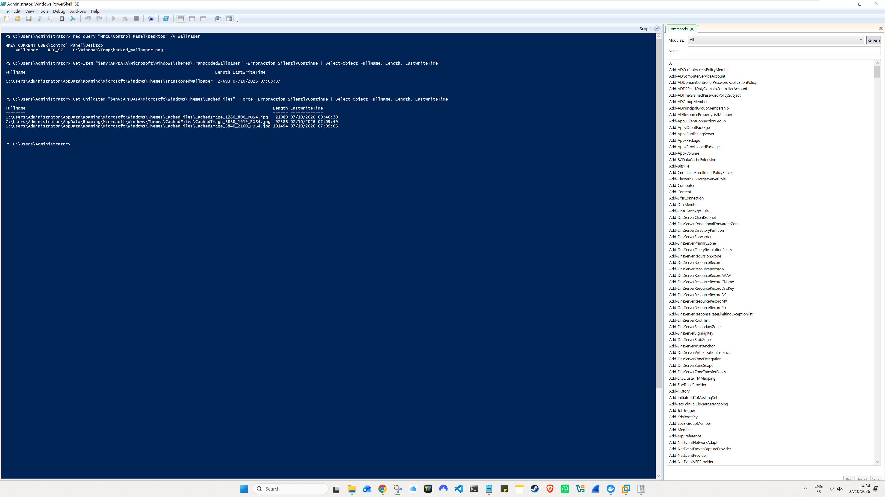

The stale Registry reference was cleared and the derived `TranscodedWallpaper` / existing cached wallpaper state was removed. After the shell/session refreshed, Windows generated a new `CachedImage` for the benign black replacement background. That regenerated image was manually reviewed and did not contain the attacker-supplied wallpaper.

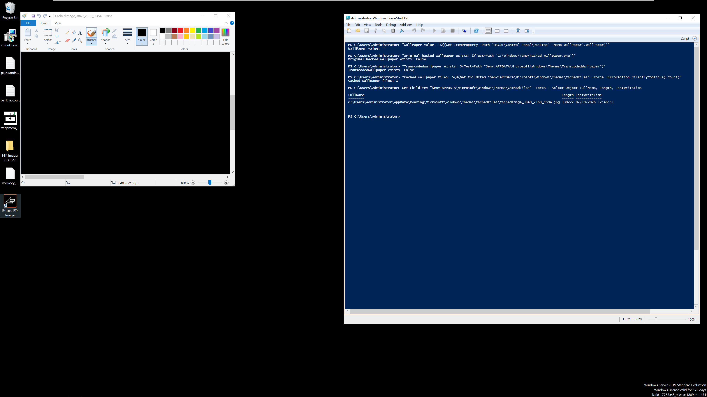

> The relevant question was not whether *any* `CachedImage` existed, but whether Windows still retained the attacker-supplied visual state. The newly generated benign cache was therefore not treated as an IOC.

### Domain Controller Functional Validation

```powershell
Get-Service NTDS,DNS,Netlogon | Select-Object Name, Status
```

```text
DNS       Running
Netlogon  Running
NTDS      Running
```

`nltest /dsgetdc:blueteam.test` also returned `DC01.blueteam.test` at `192.168.51.10`.


### Post-Recovery C2 Validation

```spl
index=pfsense sourcetype="pfsense:filterlog"
src_ip="192.168.51.10"
dest_ip="192.168.52.10"
dest_port=8080
earliest="10/07/2026:12:22:00"
latest=now
| table _time, src_ip, src_port, dest_ip, dest_port, protocol, action
| sort _time
```

Result:

```text
0 events
```

No new callbacks or connection attempts from `DC01` to the known C2 endpoint were observed from the reboot reference time onward.

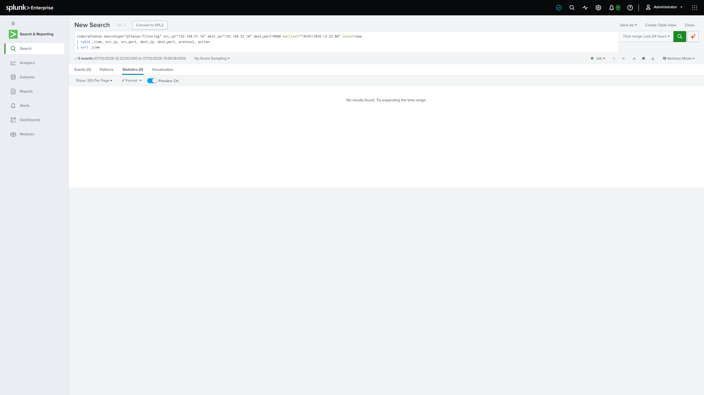

### Recovery Result

| Recovery check | Final state |
| --- | --- |
| Malicious process / executable | Absent |
| `SAM_copy` | Absent |
| Run-key persistence | Absent |
| Attacker-created privileged account | Absent |
| Attacker-supplied wallpaper source | Absent |
| Residual wallpaper state | Remediated |
| `NTDS`, `DNS`, `Netlogon` | Running |
| Domain Controller discovery | Successful |
| C2 activity after reboot reference | None observed |

**Homelab recovery validation: Successful.**

## Timeline

> Timestamps below are UTC unless otherwise stated. The early compromise events were established in `INC-005`; `INC-006` continues from the Tier 1 escalation into containment and recovery.

| Time | Event | Evidence / significance |
| --- | --- | --- |
| `06:53:36.096` | `C:\Windows\Temp\svchost.exe` executes as `BLUETEAM\Administrator` | Inherited Tier 1 Sysmon evidence |
| `06:53:37` | pfSense permits traffic from `192.168.51.10` to `192.168.52.10:8080` | Inherited Tier 1 network evidence |
| `06:53:38.588` | Sysmon associates the malicious executable with `192.168.52.10:8080` | Inherited Tier 1 process/network correlation |
| `06:57:39.143` | `WindowsUpdateService` Run-key persistence created | Inherited Tier 1 Sysmon evidence |
| `06:58:53.044` | Domain account `hacker` created | Windows Security `4720` |
| `06:59:19.783` | `hacker` added to `Domain Admins` | Windows Security `4728` |
| `~07:02` | `SAM_copy` created | Controlled-scenario evidence from `INC-005` |
| `~07:06` | Synthetic files and `SAM_copy` transferred over C2 | Controlled attacker-side ground truth from `INC-005` |
| `~07:08` | Wallpaper remotely modified | Controlled scenario |
| Before containment | Initial WinPmem acquisition attempted; resulting file later found to be 0 bytes and rejected | Volatile-evidence acquisition limitation |
| Later, 7 Oct | Tier 2 reconfirms the C2 network path | pfSense / Splunk |
| Later, 7 Oct | Existing allow rule disabled; explicit C2 block rule applied | pfSense |
| Later, 7 Oct | Existing stateful C2 session terminated | pfSense state table |
| Later, 7 Oct | Reconnection attempts observed as blocked | pfSense / Splunk |
| Later, 7 Oct | Targeted file collection exported from the live volume and hashed | FTK Imager / PowerShell |
| Later, 7 Oct | Valid 5 GiB memory image acquired and SHA-256 verified | WinPmem / PowerShell |
| Later, 7 Oct | `hacker` disabled | Identity containment |
| Later, 7 Oct | Autopsy and Volatility analysis completed | Offline forensic analysis |
| Later, 7 Oct | IOC sweep performed across `DC01`, `CLIENT01`, `CLIENT02` | Splunk scope investigation |
| Later, 7 Oct | Malicious process, persistence, account and artifacts eradicated | PowerShell / Windows commands |
| `12:19` | Endpoint eradication checks underway; reboot planned | Recovery transition |
| `12:22` | `DC01` reboot initiated | Reboot reference time |
| After `12:22` | `DC01` returned to service and post-reboot validation began | Recovery validation |
| After `12:22` | Residual wallpaper state identified despite source file removal | Post-reboot validation |
| After `12:22` | Residual Registry / transformed / cached wallpaper state remediated | Additional remediation |
| After `12:22` | `NTDS`, `DNS`, `Netlogon` validated Running; `nltest` resolves `DC01` | Domain Controller recovery validation |
| After `12:22` | No new `DC01 → 192.168.52.10:8080` events observed | Final network validation |

## Indicators and Preserved Evidence

### Confirmed Incident Indicators

| Indicator | Value | Role |
| --- | --- | --- |
| Compromised host | `DC01` | Confirmed affected system |
| Host IP | `192.168.51.10` | Victim address |
| Malicious executable | `C:\Windows\Temp\svchost.exe` | Havoc Demon implant used in the controlled scenario |
| SHA-256 | `c1896c4748e46991f7620fac4d891704b5c1c5e18e86f0b60c7cdaaa682dda36` | Executable correlation hash |
| C2 IP | `192.168.52.10` | Controlled attacker/C2 system |
| C2 port | `8080/TCP` | C2 listener port |
| C2 endpoint | `192.168.52.10:8080` | Incident-specific network IOC |
| Persistence value | `WindowsUpdateService` | Attacker-created Run value |
| Persistence path | `HKLM\SOFTWARE\Microsoft\Windows\CurrentVersion\Run\WindowsUpdateService` | Registry persistence |
| Persistence target | `C:\Windows\Temp\svchost.exe` | Executable launched by persistence |
| Unauthorized account | `hacker` | Attacker-created domain identity |
| Privileged group | `Domain Admins` | Privileged access established for `hacker` |
| Credential-access artifact | `C:\Windows\Temp\SAM_copy` | Copied SAM hive |
| Wallpaper source | `C:\Windows\Temp\hacked_wallpaper.png` | Attacker-supplied modification artifact |

### Additional Incident Artifacts

The following files were part of the controlled scenario but should not all be interpreted as malware IOCs:

```text
passwords.txt.txt
bank_accounts.txt.txt
```

These are synthetic user data files.

Residual wallpaper artifacts identified during validation included:

```text
HKCU\Control Panel\Desktop\WallPaper
%APPDATA%\Microsoft\Windows\Themes\TranscodedWallpaper
%APPDATA%\Microsoft\Windows\Themes\CachedFiles\
```

These became relevant because Windows-generated profile state derived from the attacker-supplied image persisted after the original source image had been deleted.

### Preserved Memory Evidence

```text
File:
memory_dump.raw

Size:
5,368,709,120 bytes
≈ 5 GiB

SHA-256:
7475A9735189D8D3F121EC5321F846E63F48688540F0350233EA88AEE8346103
```

### Preserved Targeted File Collection

```text
passwords.txt.txt
bank_accounts.txt.txt
svchost.exe
SAM_copy
hacked_wallpaper.png
```

Individual SHA-256 hashes were calculated before analysis and are listed in the evidence-preservation section above. The preserved `svchost.exe` matched the hash already identified during `INC-005`.

## Verdict, Severity and Scope

### Verdict

**True Positive — Confirmed Compromise**

Tier 1 had already confirmed the compromise; Tier 2 added independent forensic corroboration and completed response actions. The supported chain is:

```text
malicious executable on Domain Controller
→ elevated execution as BLUETEAM\Administrator
→ C2 communication
→ Registry persistence
→ unauthorized domain account
→ Domain Admin membership
→ SAM-copy activity
→ controlled exfiltration
→ remote system modification
```

Volatility additionally linked PID `2016` and `C:\Windows\Temp\svchost.exe` to the known C2 endpoint.

### Severity

**Critical — lab assessment**

The severity remains Critical despite successful containment and recovery because the incident included:

- compromise of an Active Directory Domain Controller;
- High-integrity execution as `BLUETEAM\Administrator`;
- confirmed C2;
- Registry persistence;
- creation of an unauthorized domain identity;
- addition of that identity to `Domain Admins`;
- credential-access behaviour involving `SAM_copy`;
- controlled exfiltration and remote system modification.

Successful response changes the **current incident state**, not the severity of the compromise that occurred.

### Scope

| Scope item | Finding |
| --- | --- |
| Confirmed compromised system | `DC01` |
| Additional hosts investigated | `CLIENT01`, `CLIENT02` |
| Same process IOC on clients | Not identified in reviewed telemetry |
| Same C2 IOC on clients | Not identified in reviewed telemetry |
| Same persistence IOC on clients | Not identified in reviewed telemetry |
| `hacker` activity on clients | Not identified by the incident-specific hunt |

> No evidence of the same incident-specific indicators was identified on `CLIENT01` or `CLIENT02` within the reviewed telemetry and time window. This is not equivalent to proving those hosts clean.

## MITRE ATT&CK Mapping

The ATT&CK mappings below describe the adversary behaviour confirmed across the underlying compromise and carried into the Tier 2 response. The containment and forensic actions themselves are defensive activities and are not mapped as adversary techniques.

| Technique | Status | Rationale |
| --- | --- | --- |
| [T1036.005 — Masquerading: Match Legitimate Resource Name or Location](https://attack.mitre.org/techniques/T1036/005/) | Mapped | `svchost.exe` used a trusted Windows filename while executing from `C:\Windows\Temp`. |
| [T1071.001 — Application Layer Protocol: Web Protocols](https://attack.mitre.org/techniques/T1071/001/) | Mapped | The controlled Havoc C2 used HTTP-style C2 communication to `192.168.52.10:8080`. |
| [T1547.001 — Boot or Logon Autostart Execution: Registry Run Keys / Startup Folder](https://attack.mitre.org/techniques/T1547/001/) | Mapped | `WindowsUpdateService` was created under the `HKLM` Run key and pointed to the implant. |
| [T1136.002 — Create Account: Domain Account](https://attack.mitre.org/techniques/T1136/002/) | Mapped | The attacker-created domain account `hacker` was confirmed. |
| [T1098.007 — Account Manipulation: Additional Local or Domain Groups](https://attack.mitre.org/techniques/T1098/007/) | Mapped | `hacker` was added to `Domain Admins`. |
| [T1003.002 — OS Credential Dumping: Security Account Manager](https://attack.mitre.org/techniques/T1003/002/) | Partially demonstrated / mapped with limitation | The SAM hive was copied to `SAM_copy` for credential-access purposes; no hash extraction or reuse was demonstrated. |
| [T1005 — Data from Local System](https://attack.mitre.org/techniques/T1005/) | Mapped | Local files were collected through the controlled C2 session. |
| [T1041 — Exfiltration Over C2 Channel](https://attack.mitre.org/techniques/T1041/) | Mapped | Synthetic files and `SAM_copy` were transferred through the C2 channel during `INC-005`. |
| [T1491.001 — Defacement: Internal Defacement](https://attack.mitre.org/techniques/T1491/001/) | Mapped | The internal server wallpaper was remotely modified. |

The report does **not** claim that possession of `SAM_copy` proves successful password-hash extraction, cracking or reuse.

It also does not claim that Active Directory domain credential material from `NTDS.dit` was acquired.

## Forensic and Production Limitations

### Initial Access and Root-Cause Limitation

Initial access was not reconstructed in `INC-006` because payload staging was a controlled laboratory precondition inherited from `INC-005`.

The report therefore begins from a confirmed-compromise handoff and does not claim a phishing, exploitation, drive-by, remote-service or other delivery mechanism that was not actually performed.

### Targeted File Collection Rather Than Full-Disk Imaging

This exercise used a targeted live-file acquisition rather than a full-disk forensic image.

The collection was based on artifacts already identified during the Tier 1 investigation. It preserved the known incident-specific files required for this controlled exercise, but it does not establish the absence of additional artifacts elsewhere on the disk.

A production investigation of a compromised Domain Controller could require complete forensic imaging and acquisition of additional operating-system, Active Directory, EDR and application artifacts depending on incident scope, legal requirements and response objectives.

### Memory Acquisition Timing and Validation

The first pre-containment memory-acquisition attempt produced an invalid zero-byte file. The failure was not identified immediately, so the valid memory image was acquired later in the response than intended, after network containment and targeted file acquisition.

The valid 5 GiB image was acquired **after network containment** but **before**:

- process termination;
- Registry persistence removal;
- attacker-account deletion;
- endpoint reboot.

The memory image therefore represents the post-containment endpoint state and must not be described as a snapshot of the original pre-containment C2 session.

The pre-containment network state is independently supported by Sysmon, pfSense `filterlog` and the firewall state table.

### IOC-Based Scope Limitation

The `CLIENT01` / `CLIENT02` scope investigation searched for the incident-specific process path, C2 destination, Registry persistence and selected `hacker`-related Security events within the available telemetry and time window.

That is meaningful scoping, but it is not equivalent to a complete compromise assessment using every possible behavioural indicator, credential path, authentication event type or persistence mechanism.

### Privileged-Credential Recovery Limitation

The laboratory did not perform a full privileged-credential recovery programme and did not rotate `BLUETEAM\Administrator`.

Credential theft or reuse of that account was not part of the controlled scenario. In a production response to a Domain Controller compromise operating under a Domain Admin context, responders would need to assess potential credential exposure and perform appropriate rotation, revocation and identity-recovery actions based on the confirmed scope.

### Production Domain Controller Recovery Limitation

The recovery performed here represents the controlled workflow used in an isolated homelab.

A production compromise involving a Domain Controller and Domain Admin security context could require substantially broader identity-recovery actions, including:

- privileged credential rotation;
- investigation of use of other privileged accounts;
- assessment of Active Directory integrity;
- review of replication and directory changes;
- Kerberos / service-account considerations;
- forest-wide hunting;
- recovery or rebuild from a trusted state;
- additional Microsoft Active Directory forest-recovery procedures.

Removing the known executable, deleting one attacker-created privileged account and rebooting a production Domain Controller would not, by itself, be sufficient evidence that the environment had been safely recovered.

## Response Assessment

### Actions Completed

| Response objective | Status |
| --- | --- |
| Confirm pre-containment C2 path | Completed |
| Disable prior allow path / apply explicit block | Completed |
| Terminate existing C2 firewall state | Completed |
| Confirm new callbacks blocked | Completed |
| Initial pre-containment memory acquisition | **Failed** — zero-byte image later detected and rejected |
| Immediate validation of first memory image | Not completed at acquisition time — procedural gap documented |
| Preserve and hash incident-specific files | Completed |
| Acquire valid RAM / verify copy integrity | Completed on second acquisition |
| Disable attacker-created privileged identity | Completed |
| Autopsy / Volatility analysis | Completed |
| Scope `DC01`, `CLIENT01`, `CLIENT02` | Completed |
| Terminate malicious process / remove persistence | Completed |
| Remove attacker-created Domain Admin account | Completed |
| Remove malicious executable / `SAM_copy` / source wallpaper | Completed |
| Reboot and validate `DC01` | Completed |
| Detect and remediate residual wallpaper state | Completed |
| Validate Domain Controller services | Completed |
| Validate post-recovery C2 inactivity | Completed |
| Retain explicit C2 block at closure | Completed |
| Privileged credential rotation | Not performed — outside controlled lab scope |

### Exfiltration Assessment

Controlled exfiltration of the synthetic files and `SAM_copy` was confirmed in `INC-005` using attacker-side ground-truth evidence. pfSense independently confirms the network path but **does not** reveal which application-layer files traversed the C2 session.

### Overall Result

```text
Network containment:        Completed
Identity containment:       Completed
Evidence preservation:      Completed
Forensic analysis:          Completed
Scope investigation:        Completed
Eradication:                Completed
Recovery:                   Validated
Post-recovery C2 activity:  None observed
```

## Detection and Response Improvement Opportunities

`INC-006` exposed several improvements that would make future response faster and safer:

| Improvement | Why it matters |
| --- | --- |
| **Validate volatile evidence immediately** | A completed acquisition command is not proof of a usable image. Check existence, non-zero size and hash before moving on. |
| **Treat repeated blocked callbacks as endpoint evidence** | `action=block` proved network containment while showing the implant was still active and trying to reconnect. |
| **Include state-table handling in firewall containment** | A new block rule may not terminate traffic already represented by an established state. |
| **Correlate endpoint, network, persistence and identity signals** | Confidence came from the combined chain, not from any single IOC. |
| **Validate post-eradication system state** | The deleted wallpaper source did not remove the Registry/cache state that kept the visual effect alive. |
| **Track identity recovery separately from endpoint cleanup** | The `hacker` Domain Admin account represented an access path independent of the implant. |

A practical containment playbook for this scenario should therefore include:

```text
block future C2
→ inspect / terminate existing state
→ preserve volatile + non-volatile evidence
→ contain malicious identities
→ eradicate endpoint mechanisms
→ reboot / restore
→ validate both IOC absence and expected system state
```

## Lessons Learned

### 1. Containment Is Not Eradication

Blocking the C2 path stopped communication but did not remove the process. The subsequent blocked callbacks demonstrated that the endpoint component remained active.

### 2. Stateful Firewalls Require State Awareness

A new pfSense rule did not automatically invalidate an already-established session. Effective containment required both the new rule and removal of the existing firewall state.

### 3. Preserve Before You Destroy

The malicious executable, `SAM_copy`, wallpaper source and synthetic target files were collected and hashed before deletion, and RAM was acquired before the malicious process was terminated.

### 4. Memory Timing Changes What RAM Can Prove

The valid image was post-containment, not pre-containment. That timing is consistent with NetScan recovering a `CLOSED` socket and prevents the memory evidence from being overstated.

### 5. Validate Volatile Evidence Immediately

The first WinPmem output was zero bytes. Had file existence and size been checked immediately, RAM could have been reacquired earlier and closer to the original network state.

### 6. A Process Name Is Not an IOC by Itself

Legitimate `svchost.exe` instances were present. The malicious process was identified through the combination of abnormal path, `explorer.exe` parent, PID/PPID, command line, Sysmon telemetry and NetScan correlation.

### 7. Scope Must Be Expressed as Evidence, Not Certainty

`CLIENT01` and `CLIENT02` did not show the known incident-specific indicators in the reviewed telemetry. The defensible statement is **no matching evidence identified**, not **hosts proven clean**.

### 8. Recovery Validation Must Check State, Not Just Files

Deleting `hacked_wallpaper.png` did not restore the desktop because Windows retained profile-level Registry/cache state. Post-reboot validation found the residual condition and drove a second remediation step.

### 9. Identity and Endpoint Remediation Are Separate

Even perfect malware removal would have been insufficient if the attacker-created privileged account had remained in `Domain Admins`. Malicious identities and privileged-credential risk need their own recovery track.

### 10. Domain Controller Recovery Has a Higher Trust Bar

The homelab demonstrated functional recovery, not full production trust restoration. A real Domain Controller compromise could require privileged credential rotation, Active Directory integrity review and recovery/rebuild from a trusted state.

> Failed or incomplete steps were retained in the case record because they materially changed how the evidence and recovery had to be interpreted.

## Case Closure

| Closure item | Final state |
| --- | --- |
| Case | `INC-006` |
| Verdict | **True Positive — Confirmed Compromise** |
| Severity | **Critical** |
| Confirmed compromised host | `DC01` |
| Additional hosts scoped | `CLIENT01`, `CLIENT02` |
| Network / identity containment | Completed |
| Evidence preservation / forensic analysis | Completed |
| Scope investigation | Completed |
| Eradication | Completed |
| Residual wallpaper state | Detected and remediated |
| Domain Controller functional recovery | Validated |
| Post-recovery C2 activity | `0` new events observed from reboot reference time onward |
| Initial access / root cause | Not assessed — controlled staging inherited from `INC-005` |
| Privileged credential rotation | Not performed — outside controlled lab scope |
| Reboot reference time | `2026-10-07 12:22 UTC` |
| Status | **Closed — homelab exercise** |

### Final Assessment

C2 communication, Registry persistence and an unauthorized privileged domain account were confirmed on `DC01` following the Tier 1 escalation from `INC-005`. Tier 2 / CSIRT contained the C2 channel, terminated its existing firewall state, preserved the relevant targeted file and memory evidence, and used Autopsy and Volatility to corroborate the compromised process and related artifacts.

The known indicators were scoped across `DC01`, `CLIENT01` and `CLIENT02` before eradication. The malicious process, persistence, attacker-created Domain Admin account and associated artifacts were removed. Post-reboot validation confirmed functional Domain Controller recovery and also exposed residual wallpaper state, which was separately remediated.

No additional traffic from `DC01` to `192.168.52.10:8080` was observed from the `12:22 UTC` reboot reference time onward. No evidence of the same incident-specific IOCs was identified on `CLIENT01` or `CLIENT02` within the telemetry and time window investigated.

